# Data Preparation
## 1. Import Pustaka yang Dibutuhkan


```python
# Import Pustaka yang Dibutuhkan
# EDA & Visualization
import pandas as pd
import numpy as np
import matplotlib.pyplot as plt
import seaborn as sns

# Merge Dataset
from functools import reduce

# Resampling
from imblearn.combine import SMOTEENN
from collections import Counter

# Standarization
from sklearn.preprocessing import MinMaxScaler

# Splitting, Algorithms
from sklearn.model_selection import train_test_split
from sklearn.neighbors import KNeighborsClassifier
import xgboost as xgb
from sklearn.svm import SVC
from sklearn.ensemble import RandomForestClassifier

# Hyperparameter
from sklearn.model_selection import StratifiedKFold
from sklearn.model_selection import GridSearchCV

# Evaluasi
from sklearn.metrics import classification_report
from sklearn.metrics import accuracy_score
from sklearn.metrics import confusion_matrix
from sklearn.metrics import roc_auc_score, roc_curve

# Feature importance
import eli5
from eli5.sklearn import PermutationImportance
```

## 2. Import Dataset


```python
# Demographics Data
demo_DE = pd.read_csv('Demographics Data/DEMO_L.csv', na_values=' ')
# Examination Data
bp_E = pd.read_csv('Examination Data/BPXO_L.csv', na_values=' ')
body_E = pd.read_csv('Examination Data/BMX_L.csv', na_values=' ')
# Laboratory Data
glyco_L = pd.read_csv('Laboratory Data/GHB_L.csv', na_values=' ')
tchol_L = pd.read_csv('Laboratory Data/TCHOL_L.csv', na_values=' ')
# Questionnaire Data
alcohol_Q = pd.read_csv('Questionnaire Data/ALQ_L.csv', na_values=' ')
bpcl_Q = pd.read_csv('Questionnaire Data/BPQ_L.csv', na_values=' ')
diabetes_Q = pd.read_csv('Questionnaire Data/DIQ_L.csv', na_values=' ')
depress_Q = pd.read_csv('Questionnaire Data/DPQ_L.csv', na_values=' ')
medic_Q= pd.read_csv('Questionnaire Data/MCQ_L.csv', na_values=' ')
smoke_Q = pd.read_csv('Questionnaire Data/SMQ_L.csv', na_values=' ')
```

## 3. Gabung Dataset


```python
df_list =[
    demo_DE, bp_E, body_E, glyco_L, tchol_L, alcohol_Q, 
    bpcl_Q, diabetes_Q, depress_Q, medic_Q, smoke_Q
]
final_df = reduce(lambda df1, df2: pd.merge(df1, df2, on='SEQN', how='outer'), df_list)
```


```python
final_df.shape
```


    (11933, 137)


```python
final_df.head()
```


<div>
<style scoped>
    .dataframe tbody tr th:only-of-type {
        vertical-align: middle;
    }

    .dataframe tbody tr th {
        vertical-align: top;
    }

    .dataframe thead th {
        text-align: right;
    }
</style>
<table border="1" class="dataframe">
  <thead>
    <tr style="text-align: right;">
      <th></th>
      <th>SEQN</th>
      <th>SDDSRVYR</th>
      <th>RIDSTATR</th>
      <th>RIAGENDR</th>
      <th>RIDAGEYR</th>
      <th>RIDAGEMN</th>
      <th>RIDRETH1</th>
      <th>RIDRETH3</th>
      <th>RIDEXMON</th>
      <th>RIDEXAGM</th>
      <th>...</th>
      <th>MCQ230D</th>
      <th>OSQ230</th>
      <th>SMQ020</th>
      <th>SMQ040</th>
      <th>SMD641</th>
      <th>SMD650</th>
      <th>SMD100MN</th>
      <th>SMQ621</th>
      <th>SMD630</th>
      <th>SMAQUEX2</th>
    </tr>
  </thead>
  <tbody>
    <tr>
      <th>0</th>
      <td>130378.0</td>
      <td>12.0</td>
      <td>2.0</td>
      <td>1.0</td>
      <td>43.0</td>
      <td>NaN</td>
      <td>5.0</td>
      <td>6.0</td>
      <td>2.0</td>
      <td>NaN</td>
      <td>...</td>
      <td>NaN</td>
      <td>2.0</td>
      <td>1.0</td>
      <td>3.0</td>
      <td>NaN</td>
      <td>NaN</td>
      <td>NaN</td>
      <td>NaN</td>
      <td>NaN</td>
      <td>1.0</td>
    </tr>
    <tr>
      <th>1</th>
      <td>130379.0</td>
      <td>12.0</td>
      <td>2.0</td>
      <td>1.0</td>
      <td>66.0</td>
      <td>NaN</td>
      <td>3.0</td>
      <td>3.0</td>
      <td>2.0</td>
      <td>NaN</td>
      <td>...</td>
      <td>NaN</td>
      <td>1.0</td>
      <td>1.0</td>
      <td>3.0</td>
      <td>NaN</td>
      <td>NaN</td>
      <td>NaN</td>
      <td>NaN</td>
      <td>NaN</td>
      <td>1.0</td>
    </tr>
    <tr>
      <th>2</th>
      <td>130380.0</td>
      <td>12.0</td>
      <td>2.0</td>
      <td>2.0</td>
      <td>44.0</td>
      <td>NaN</td>
      <td>2.0</td>
      <td>2.0</td>
      <td>1.0</td>
      <td>NaN</td>
      <td>...</td>
      <td>NaN</td>
      <td>1.0</td>
      <td>2.0</td>
      <td>NaN</td>
      <td>NaN</td>
      <td>NaN</td>
      <td>NaN</td>
      <td>NaN</td>
      <td>NaN</td>
      <td>1.0</td>
    </tr>
    <tr>
      <th>3</th>
      <td>130381.0</td>
      <td>12.0</td>
      <td>2.0</td>
      <td>2.0</td>
      <td>5.0</td>
      <td>NaN</td>
      <td>5.0</td>
      <td>7.0</td>
      <td>1.0</td>
      <td>71.0</td>
      <td>...</td>
      <td>NaN</td>
      <td>NaN</td>
      <td>NaN</td>
      <td>NaN</td>
      <td>NaN</td>
      <td>NaN</td>
      <td>NaN</td>
      <td>NaN</td>
      <td>NaN</td>
      <td>NaN</td>
    </tr>
    <tr>
      <th>4</th>
      <td>130382.0</td>
      <td>12.0</td>
      <td>2.0</td>
      <td>1.0</td>
      <td>2.0</td>
      <td>NaN</td>
      <td>3.0</td>
      <td>3.0</td>
      <td>2.0</td>
      <td>34.0</td>
      <td>...</td>
      <td>NaN</td>
      <td>NaN</td>
      <td>NaN</td>
      <td>NaN</td>
      <td>NaN</td>
      <td>NaN</td>
      <td>NaN</td>
      <td>NaN</td>
      <td>NaN</td>
      <td>NaN</td>
    </tr>
  </tbody>
</table>
<p>5 rows × 137 columns</p>
</div>


## 4. Saring Fitur yang Akan Digunakan

Terdapat 5 kelompok data yaitu Demographics Data, Examination Data, Laboratory Data, Questionnaire Data. Setiap kelompok data memiliki berbagai jenis dataset yang berhubungan berdasarkan kelompok terkait, kecuali Demographics Data yang hanya memiliki satu dataset. Dataset-dataset yang berada dalam kelompok tersebut akan dipilih, di dalamnya akan diambil beberapa kolom untuk membentuk dataset baru. Sumber data bisa diakses [disini](https://wwwn.cdc.gov/nchs/nhanes/continuousnhanes/default.aspx?Cycle=2021-2023). Untuk filter/pemilihan kolom dalam setiap datasetnya dapat dilihat sebagai berikut.

Demographics Data:
- DEMO_L: Demographic Variables and Sample Weights
    - RIAGENDR - Gender
    - RIDAGEYR - Age in years at screening
    - RIDRETH3 - Race/Hispanic origin w/ NH Asian</br>
    
Examination Data:
- BPXO_L: Blood Pressure - Oscillometric Measurements
    - BPXOSY1 - Systolic - 1st oscillometric reading
    - BPXODI1 - Diastolic - 1st oscillometric reading
    - BPXOSY2 - Systolic - 2nd oscillometric reading
    - BPXODI2 - Diastolic - 2nd oscillometric reading
    - BPXOSY3 - Systolic - 3rd oscillometric reading
    - BPXODI3 - Diastolic - 3rd oscillometric reading
- BMX_L: Body Measures
    - BMXBMI - Body Mass Index (kg/m**2)</br>
    
Laboratory Data:
- GHB_L: Glycohemoglobin
    - LBXGH - Glycohemoglobin (%)
- TCHOL_L: Cholesterol - Total
    - LBXTC - Total Cholesterol (mg/dL)</br>
    
Questionnaire Data:
- ALQ_L: Alcohol Use
    - ALQ121 - 'Past 12 mos how often drink alc bev' (alkohol)
- BPQ_L: Blood Pressure & Cholesterol
    - BPQ080 - Doctor told you - high cholesterol level
- DIQ_L: Diabetes
    - DIQ010 - 'Doctor told you have diabetes' (diabetes)
- DPQ_L: Mental Health - Depression Screener
    - DPQ020 - Feeling down, depressed, or hopeless
    - DPQ030 - Trouble sleeping or sleeping too much
    - DPQ050 - Poor appetite or overeating
- MCQ_L: Medical Conditions
    - MCQ160l - Ever told you had any liver condition
    - MCQ160m - Ever told you had thyroid problem
    - MCQ220 - Ever told you had cancer or malignancy
- SMQ_L: Smoking - Cigarette Use
    - SMQ020 - 'Smoked at least 100 cigarettes in life' (merokok_100)

Kategori Faktor Risiko:
- Demografi:
    - Umur
    - Jenis Kelamin
    - Ras

    </br>
- Pemeriksaan Medis:
    - Systolic - 1st oscillometric reading
    - Diastolic - 1st oscillometric reading
    - Systolic - 2nd oscillometric reading
    - Diastolic - 2nd oscillometric reading
    - Systolic - 3rd oscillometric reading
    - Diastolic - 3rd oscillometric reading
    - BMI
    - HbA1c
    - Kadar Kolesterol

    </br>
- Kesehatan Mental:
    - Sedih, Depersi, atau Putus Asa
    - Gangguan Tidur
    - Kelelahan
    - Gannguan Makan

    </br>
- Riwayat Medis:
    - Kolesterol Tinggi
    - Tiroid
    - Liver
    - Kanker

    </br>
- Gaya Hidup:
    - Konsumsi Alkohol
    - Merokok


```python
# saring fitur dengan memasukkan fitur yang akan digunakan
# ke dalam satu dataset bernama df

# Column Subsetting
df = final_df[[
    'SEQN', # fitur identifikasi
    'RIAGENDR','RIDAGEYR','RIDRETH3',
    'BPXOSY1','BPXODI1','BPXOSY2','BPXODI2','BPXOSY3','BPXODI3',
    'BMXBMI',
    'LBXGH',
    'LBXTC',
    'ALQ121',
    'BPQ080',
    'DIQ010',
    'DPQ020','DPQ030','DPQ050',
    'MCQ160L','MCQ160M','MCQ220',
    'SMQ020'
]]
```


```python
df.shape
```


    (11933, 23)


## 5. Drop Nilai Null


```python
# Hitung jumlah nilai null per fitur
null_counts = df.isnull().sum()

# Hitung persentase null per fitur
null_percent = (null_counts / len(df)) * 100

# Ambil hanya fitur yang memiliki null
null_percent = null_percent[null_percent > 0]

# Plot
plt.figure(figsize=(14, 8))
bars = plt.bar(null_percent.index, null_percent.values, color='steelblue')
# Tambahkan nilai persentase di atas tiap bar
for bar in bars:
    height = bar.get_height()
    plt.text(bar.get_x() + bar.get_width() / 2, height + 1,
             f'{height:.2f}', ha='center', fontsize=10)
# Garis horizontal putus-putus di 50%
plt.axhline(y=50, color='red', linestyle='--', linewidth=1.5)
# Label dan tampilan
plt.xticks(rotation=45, ha='right')
plt.ylabel('Persentase (%)')
plt.title('Persentase Nilai Null per Fitur')
plt.show()
```


    
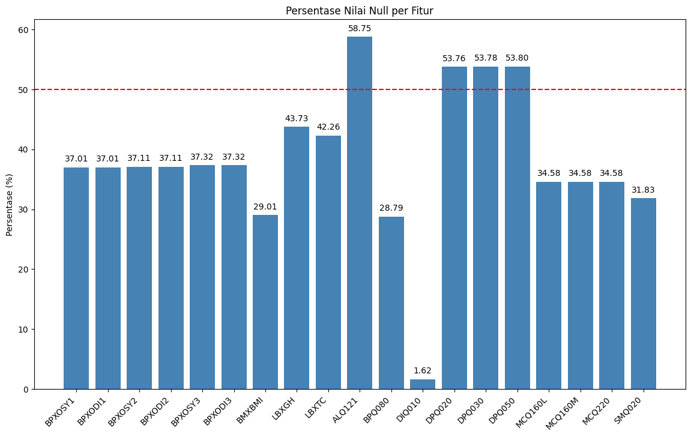
    


```python
# lihat jumlah Null tiap fitur
df.isnull().sum()
```


    SEQN           0
    RIAGENDR       0
    RIDAGEYR       0
    RIDRETH3       0
    BPXOSY1     4416
    BPXODI1     4416
    BPXOSY2     4428
    BPXODI2     4428
    BPXOSY3     4453
    BPXODI3     4453
    BMXBMI      3462
    LBXGH       5218
    LBXTC       5043
    ALQ121      7011
    BPQ080      3435
    DIQ010       193
    DPQ020      6415
    DPQ030      6417
    DPQ050      6420
    MCQ160L     4126
    MCQ160M     4127
    MCQ220      4126
    SMQ020      3798
    dtype: int64


```python
# drop nilai null dengan fungsi dropna()
df = df.dropna(ignore_index=True)
```


```python
# dimensi dataset setelah Null dihilangkan
df.shape
```


    (4268, 23)


## 6. Drop Fitur Identifikasi (SEQN)


```python
# drop fitur identifikasi
df = df.drop(columns='SEQN', axis=1)
```

## 7. Menetapkan Tipe Data Fitur


```python
# lihat tipe data tiap fitur
df.info()
```

    <class 'pandas.core.frame.DataFrame'>
    RangeIndex: 4268 entries, 0 to 4267
    Data columns (total 22 columns):
     #   Column    Non-Null Count  Dtype  
    ---  ------    --------------  -----  
     0   RIAGENDR  4268 non-null   float64
     1   RIDAGEYR  4268 non-null   float64
     2   RIDRETH3  4268 non-null   float64
     3   BPXOSY1   4268 non-null   float64
     4   BPXODI1   4268 non-null   float64
     5   BPXOSY2   4268 non-null   float64
     6   BPXODI2   4268 non-null   float64
     7   BPXOSY3   4268 non-null   float64
     8   BPXODI3   4268 non-null   float64
     9   BMXBMI    4268 non-null   float64
     10  LBXGH     4268 non-null   float64
     11  LBXTC     4268 non-null   float64
     12  ALQ121    4268 non-null   float64
     13  BPQ080    4268 non-null   float64
     14  DIQ010    4268 non-null   float64
     15  DPQ020    4268 non-null   float64
     16  DPQ030    4268 non-null   float64
     17  DPQ050    4268 non-null   float64
     18  MCQ160L   4268 non-null   float64
     19  MCQ160M   4268 non-null   float64
     20  MCQ220    4268 non-null   float64
     21  SMQ020    4268 non-null   float64
    dtypes: float64(22)
    memory usage: 733.7 KB
    


```python
# 1. Fitur numerik dengan 'int64'
# 2. Fitur katagori dengan 'category'
# 3. Fitur numerik non-integer diubah dengan 'float64'
# 4. Semua fitur otomatis bertipe float setelah proses import,
# sehingga fitur katagori yang semuanya bernilai angka/numerik perlu
# dibulatkan terlebih dahulu dengan int64 sebelum diubah ke dalam fitur
# kategori.

# Demographic Variables and Sample Weights
df['RIAGENDR'] = df['RIAGENDR'].astype('int64').astype('category')
df['RIDAGEYR'] = df['RIDAGEYR'].astype('int64')
df['RIDRETH3'] = df['RIDRETH3'].astype('int64').astype('category')
# Blood Pressure - Oscillometric Measurements
df['BPXOSY1'] = df['BPXOSY1'].astype('int64')
df['BPXODI1'] = df['BPXODI1'].astype('int64')
df['BPXOSY2'] = df['BPXOSY2'].astype('int64')
df['BPXODI2'] = df['BPXODI2'].astype('int64')
df['BPXOSY3'] = df['BPXOSY3'].astype('int64')
df['BPXODI3'] = df['BPXODI3'].astype('int64')
# Body Measures
df['BMXBMI'] = df['BMXBMI'].astype('float64')
# Glycohemoglobin
df['LBXGH'] = df['LBXGH'].astype('float64')
# Cholesterol – Total
df['LBXTC'] = df['LBXTC'].astype('int64')
# Alcohol Use
df['ALQ121'] = df['ALQ121'].astype('int64').astype('category')
# Blood Pressure & Cholesterol
df['BPQ080'] = df['BPQ080'].astype('int64').astype('category')
# Diabetes
df['DIQ010'] = df['DIQ010'].astype('int64').astype('category')
# Mental Health - Depression Screener
df['DPQ020'] = df['DPQ020'].astype('int64').astype('category')
df['DPQ030'] = df['DPQ030'].astype('int64').astype('category')
df['DPQ050'] = df['DPQ050'].astype('int64').astype('category')
# Medical Conditions
df['MCQ160L'] = df['MCQ160L'].astype('int64').astype('category')
df['MCQ160M'] = df['MCQ160M'].astype('int64').astype('category')
df['MCQ220'] = df['MCQ220'].astype('int64').astype('category')
# Smoking - Cigarette Use
df['SMQ020'] = df['SMQ020'].astype('int64').astype('category')
```


```python
# lihat tipe data tiap fitur setelah konversi
df.info()
```

    <class 'pandas.core.frame.DataFrame'>
    RangeIndex: 4268 entries, 0 to 4267
    Data columns (total 22 columns):
     #   Column    Non-Null Count  Dtype   
    ---  ------    --------------  -----   
     0   RIAGENDR  4268 non-null   category
     1   RIDAGEYR  4268 non-null   int64   
     2   RIDRETH3  4268 non-null   category
     3   BPXOSY1   4268 non-null   int64   
     4   BPXODI1   4268 non-null   int64   
     5   BPXOSY2   4268 non-null   int64   
     6   BPXODI2   4268 non-null   int64   
     7   BPXOSY3   4268 non-null   int64   
     8   BPXODI3   4268 non-null   int64   
     9   BMXBMI    4268 non-null   float64 
     10  LBXGH     4268 non-null   float64 
     11  LBXTC     4268 non-null   int64   
     12  ALQ121    4268 non-null   category
     13  BPQ080    4268 non-null   category
     14  DIQ010    4268 non-null   category
     15  DPQ020    4268 non-null   category
     16  DPQ030    4268 non-null   category
     17  DPQ050    4268 non-null   category
     18  MCQ160L   4268 non-null   category
     19  MCQ160M   4268 non-null   category
     20  MCQ220    4268 non-null   category
     21  SMQ020    4268 non-null   category
    dtypes: category(12), float64(2), int64(8)
    memory usage: 386.1 KB
    

## 8. Mengubah Nama Fitur


```python
# Mengubah nama fitur agar lebih komunikatif dengan fungsi rename()
df = df.rename(columns={
    # Data Demografi
    'RIAGENDR':'gender','RIDAGEYR':'usia','RIDRETH3':'ras',
    # Pemeriksaan Medis
    'BPXOSY1':'sistolik1','BPXOSY2':'sistolik2','BPXOSY3':'sistolik3',
    'BPXODI1':'diastolik1','BPXODI2':'diastolik2','BPXODI3':'diastolik3',
    'BMXBMI':'BMI', 'LBXGH':'HbA1c', 'LBXTC':'kadar_kolesterol', 
    # Riwayat Kesehatan
    'BPQ080':'riw_kolesterol_tinggi', 'MCQ160L':'riw_liver',
    'MCQ160M':'riw_tiroid','MCQ220':'riw_kanker',
    # Kesehatan Mental
    'DPQ020':'sedih-depresi-putus_asa','DPQ030':'gangguan_tidur','DPQ050':'gangguan_makan',
    # Gaya Hidup
    'ALQ121':'alkohol','SMQ020':'merokok100',
    # Target
    'DIQ010':'diabetes'
})
```


```python
df.head()
```


<div>
<style scoped>
    .dataframe tbody tr th:only-of-type {
        vertical-align: middle;
    }

    .dataframe tbody tr th {
        vertical-align: top;
    }

    .dataframe thead th {
        text-align: right;
    }
</style>
<table border="1" class="dataframe">
  <thead>
    <tr style="text-align: right;">
      <th></th>
      <th>gender</th>
      <th>usia</th>
      <th>ras</th>
      <th>sistolik1</th>
      <th>diastolik1</th>
      <th>sistolik2</th>
      <th>diastolik2</th>
      <th>sistolik3</th>
      <th>diastolik3</th>
      <th>BMI</th>
      <th>...</th>
      <th>alkohol</th>
      <th>riw_kolesterol_tinggi</th>
      <th>diabetes</th>
      <th>sedih-depresi-putus_asa</th>
      <th>gangguan_tidur</th>
      <th>gangguan_makan</th>
      <th>riw_liver</th>
      <th>riw_tiroid</th>
      <th>riw_kanker</th>
      <th>merokok100</th>
    </tr>
  </thead>
  <tbody>
    <tr>
      <th>0</th>
      <td>1</td>
      <td>66</td>
      <td>3</td>
      <td>121</td>
      <td>84</td>
      <td>117</td>
      <td>76</td>
      <td>113</td>
      <td>76</td>
      <td>33.5</td>
      <td>...</td>
      <td>2</td>
      <td>2</td>
      <td>2</td>
      <td>0</td>
      <td>1</td>
      <td>0</td>
      <td>2</td>
      <td>2</td>
      <td>1</td>
      <td>1</td>
    </tr>
    <tr>
      <th>1</th>
      <td>2</td>
      <td>44</td>
      <td>2</td>
      <td>111</td>
      <td>79</td>
      <td>112</td>
      <td>80</td>
      <td>104</td>
      <td>76</td>
      <td>29.7</td>
      <td>...</td>
      <td>10</td>
      <td>1</td>
      <td>1</td>
      <td>0</td>
      <td>1</td>
      <td>0</td>
      <td>2</td>
      <td>1</td>
      <td>2</td>
      <td>2</td>
    </tr>
    <tr>
      <th>2</th>
      <td>1</td>
      <td>34</td>
      <td>1</td>
      <td>110</td>
      <td>72</td>
      <td>120</td>
      <td>74</td>
      <td>115</td>
      <td>75</td>
      <td>30.2</td>
      <td>...</td>
      <td>4</td>
      <td>2</td>
      <td>2</td>
      <td>0</td>
      <td>0</td>
      <td>0</td>
      <td>2</td>
      <td>2</td>
      <td>2</td>
      <td>1</td>
    </tr>
    <tr>
      <th>3</th>
      <td>2</td>
      <td>68</td>
      <td>3</td>
      <td>143</td>
      <td>76</td>
      <td>136</td>
      <td>74</td>
      <td>145</td>
      <td>78</td>
      <td>42.6</td>
      <td>...</td>
      <td>0</td>
      <td>1</td>
      <td>2</td>
      <td>0</td>
      <td>0</td>
      <td>0</td>
      <td>2</td>
      <td>2</td>
      <td>1</td>
      <td>2</td>
    </tr>
    <tr>
      <th>4</th>
      <td>2</td>
      <td>74</td>
      <td>3</td>
      <td>154</td>
      <td>76</td>
      <td>167</td>
      <td>70</td>
      <td>154</td>
      <td>68</td>
      <td>43.0</td>
      <td>...</td>
      <td>8</td>
      <td>2</td>
      <td>2</td>
      <td>0</td>
      <td>0</td>
      <td>0</td>
      <td>2</td>
      <td>1</td>
      <td>1</td>
      <td>2</td>
    </tr>
  </tbody>
</table>
<p>5 rows × 22 columns</p>
</div>


# Exploratory Data Analysis


```python
# membuat list nama fitur numerik dan fitur katagori 
# agar memudahkan visualisasi data
```


```python
num_cols = ['usia', 'sistolik1', 'diastolik1', 'sistolik2', 'diastolik2', 'sistolik3', 'diastolik3', 'BMI', 'HbA1c', 'kadar_kolesterol']
```


```python
len(num_cols)
```


    10


```python
cat_cols = ['gender', 'ras', 'alkohol','sedih-depresi-putus_asa','gangguan_tidur', 'gangguan_makan', 'riw_liver', 'riw_tiroid', 'riw_kanker','riw_kolesterol_tinggi', 'merokok100']
```


```python
len(cat_cols)
```


    11


```python
all_cols = num_cols + cat_cols
```

## 1. Statistik Deskriptif


```python
stats = df[num_cols].describe().loc[['mean', '50%', 'min', 'max']]
stats.T.plot(kind='bar', figsize=(12, 6))
plt.title('Statistik Deskriptif (Mean, Median, Min, Max)')
plt.ylabel('Nilai')
plt.xlabel('Kolom')
plt.xticks(rotation=70)
plt.legend(loc='upper left')
plt.show()
```


    
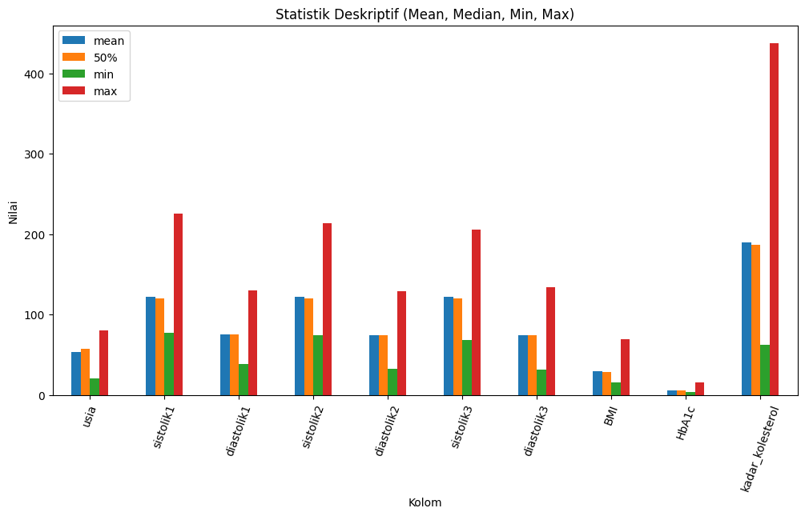
    


## 2. Fitur Numerik


```python
fig, ax = plt.subplots(4, 3, figsize=(14, 10))
ax = ax.flatten()
plt.suptitle("Distribusi Fitur Numerik dengan Histplot", fontsize=14, fontweight='bold')

for col, index in zip(num_cols, range(len(num_cols))):
    sns.histplot(ax=ax[num_cols.index(col)], x=col, data=df, log_scale=False)
    ax[num_cols.index(col)].set_xlabel(f"'{col}'", fontsize=10, fontweight='bold')
    ax[num_cols.index(col)].set_ylabel("jumlah", fontsize=10, fontweight='bold')
    # ax[num_cols.index(col)].set_yticks()

ax[len(num_cols)].set_axis_off()
ax[len(num_cols)+1].set_axis_off()
plt.tight_layout()
plt.show()
```


    
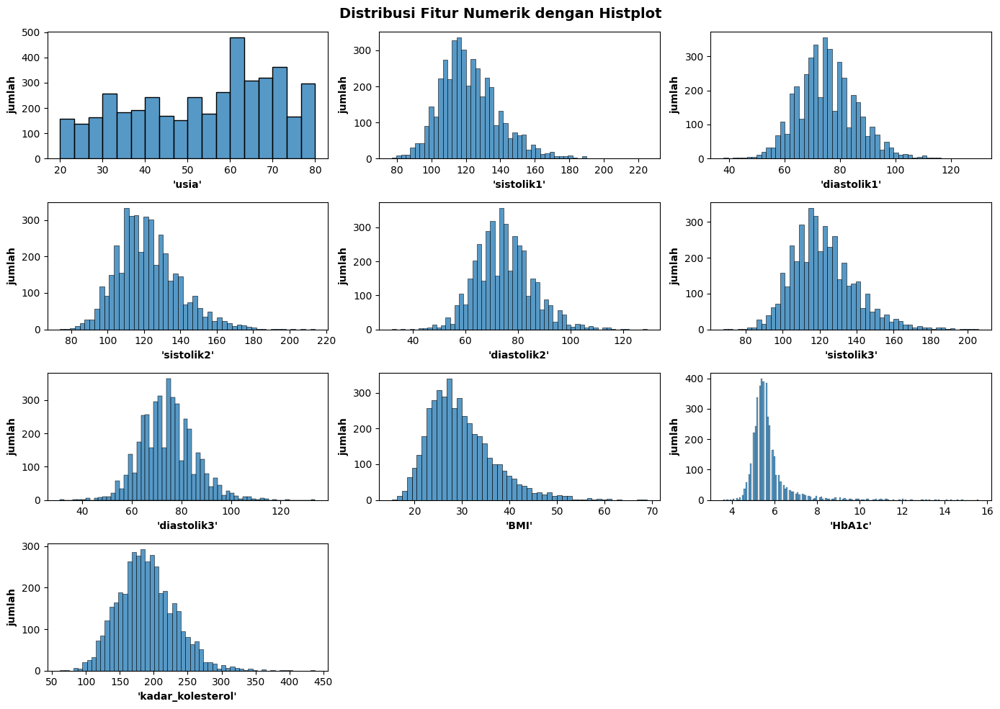
    


```python
fig, ax = plt.subplots(4, 3, figsize=(14, 10))
ax = ax.flatten()
plt.suptitle("Deteksi Outlier pada Fitur Numerik dengan Boxplot", fontsize=14, fontweight='bold')

for col, index in zip(num_cols, range(len(num_cols))):
    sns.boxplot(ax=ax[num_cols.index(col)], x=col, data=df)
    ax[num_cols.index(col)].set_xlabel(f"'{col}'", fontsize=10, fontweight='bold')
    ax[num_cols.index(col)].set_ylabel("jumlah", fontsize=10, fontweight='bold')

ax[len(num_cols)].set_axis_off()
ax[len(num_cols)+1].set_axis_off()
plt.tight_layout()
plt.show()
```


    
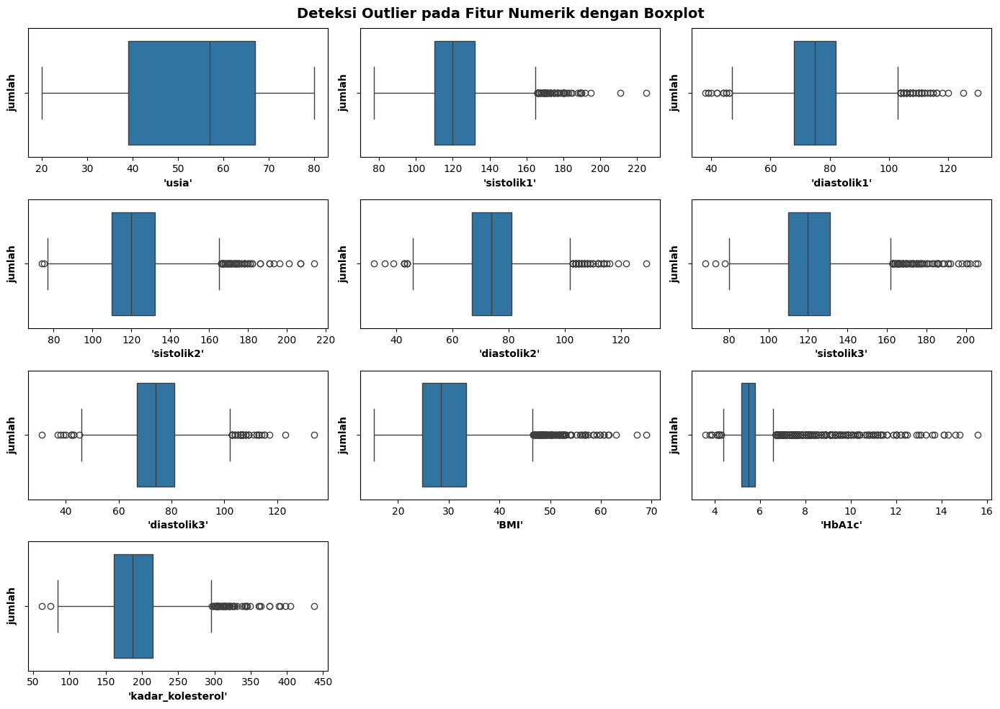
    


## 3. Fitur Katagorikal


```python
fig, ax = plt.subplots(4, 3, figsize=(14, 10))
ax = ax.flatten()
plt.suptitle("Distribusi Fitur Katagori dengan Countplot", fontsize=14, fontweight='bold')

for col, index in zip(cat_cols, range(len(cat_cols))):
    sns.countplot(ax=ax[cat_cols.index(col)], x=col, data=df)
    ax[cat_cols.index(col)].set_ylabel("jumlah", fontsize=10, fontweight='bold')
    ax[cat_cols.index(col)].set_xlabel(f"'{col}'", fontsize=10, fontweight='bold')
    ax[cat_cols.index(col)].bar_label(ax[cat_cols.index(col)].containers[0])
    ax[cat_cols.index(col)].spines['right'].set_visible(False)
    ax[cat_cols.index(col)].spines['top'].set_visible(False)
    ax[cat_cols.index(col)].set_yticklabels([])
# ax[len(num_cols)].set_axis_off()
ax[len(num_cols)+1].set_axis_off()
plt.tight_layout()
plt.show()
```


    
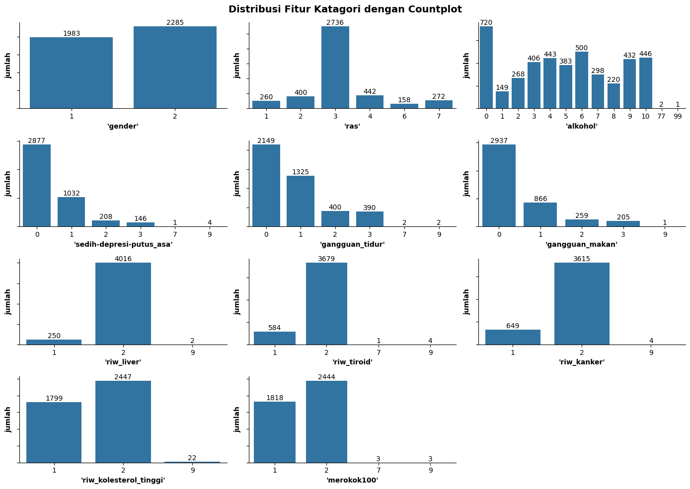
    


## 4. Korelasi Fitur


```python
plt.figure(figsize=(16, 9))
sns.heatmap(df.corr(), annot=True, cmap='Blues')
plt.title('Heatmap Korelasi')
plt.xticks(rotation=90)
plt.show()
```


    
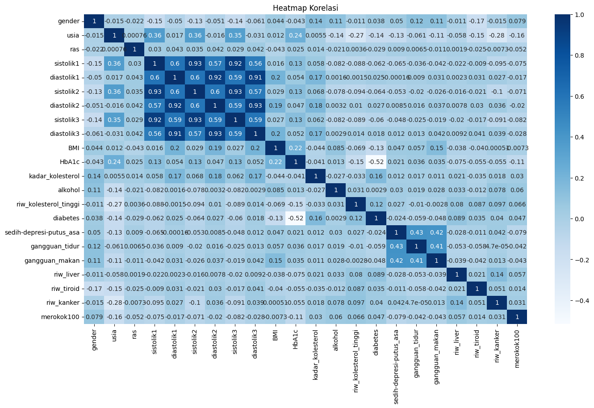
    


## 5. Data Target


```python
fig, ax = plt.subplots(figsize=(12, 8))
plt.suptitle("Distribusi Data Target dengan Countplot", fontsize=14, fontweight='bold')

sns.countplot(data=df, x='diabetes', hue='diabetes', order=df['diabetes'].value_counts().index, legend=False)
ax.set_xlabel("'diabetes'", fontsize=10, fontweight='bold')
ax.set_ylabel("Jumlah", fontsize=10, fontweight='bold')
for i in range(len(df['diabetes'].value_counts())):
    ax.bar_label(ax.containers[i-1])
ax.set_xticks(range(len(df['diabetes'].value_counts())))
plt.show()
```


    
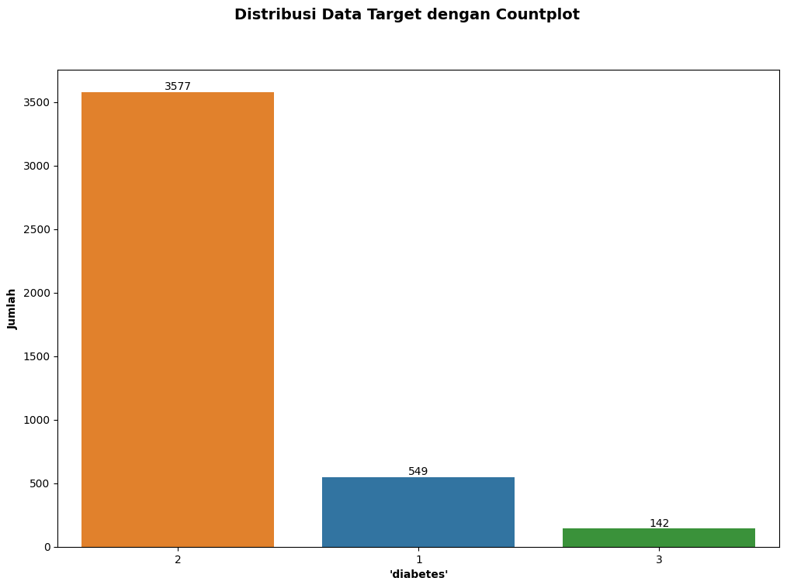
    


# Data Preprocessing

## 1. Drop Respon Tidak Pasti

Drop respon yang tidak pasti
- Kolom `alkohol` yang bernilai 99 artinya responden menjawab tidak tahu, 77 artinya reponden menolak menjawab
- Kolom `sedih/depresi/putus_asa` yang bernilai 7 artinya responden menolak menjawab, 9 artinya responden menjawab tidak tahu
- Kolom `gangguan_tidur` yang bernilai 7 artinya responden menolak menjawab, 9 artinya responden menjawab tidak tahu
- Kolom `gangguan_makan` yang bernilai 7 artinya responden menolak menjawab, 9 artinya responden menjawab tidak tahu
- Kolom `tiroid` yang bernilai 7 artinya responden menolak menjawab, 9 artinya responden menjawab tidak tahu
- Kolom `kanker` yang bernilai 7 artinya responden menolak menjawab, 9 artinya responden menjawab tidak tahu
- Kolom `merokok100` yang bernilai 7 artinya responden menolak menjawab, 9 artinya responden menjawab tidak tahu
- Kolom `akt_fisik` yang bernilai 7777 artinya responden menolak menjawab, 9999 artinya responden menjawab tidak tahu
- Kolom `riw_darah_tinggi` yang bernilai 7 artinya responden menolak menjawab, 9 artinya responden menjawab tidak tahu
- Kolom `riw_kolesterol_tinggi` yang bernilai 7 artinya responden menolak menjawab, 9 artinya responden menjawab tidak tahu
- Kolom `diabetes` yang bernilai 3 artinya responden prediabetes, sedangkan prediksi hanya akan menentukan positif atau negatif saja


```python
print(f"Dimensi dataset sebelum di drop{df.shape}")
```

    Dimensi dataset sebelum di drop(4268, 22)
    


```python
columns_to_filter = {
    # katagori
    'diabetes': [3],
    'alkohol': [99, 77],
    'sedih-depresi-putus_asa': [9, 7],
    'gangguan_tidur': [9, 7],
    'gangguan_makan': [9, 7],
    'riw_liver': [9, 7],
    'riw_tiroid': [9, 7],
    'riw_kanker': [9, 7],
    'riw_kolesterol_tinggi': [9, 7],
    'merokok100': [9, 7]
}
for col, values in columns_to_filter.items():
    if pd.api.types.is_numeric_dtype(df[col]):
        df = df.loc[~df[col].isin(values)].reset_index(drop=True)
    else:
        df = df.loc[~df[col].isin(values)].reset_index(drop=True)
        df[col] = df[col].cat.remove_unused_categories()
```


```python
print(f"Dimensi dataset setelah di drop{df.shape}")
```

    Dimensi dataset setelah di drop(4080, 22)
    


```python
fig, ax = plt.subplots(4, 3, figsize=(14, 10))
ax = ax.flatten()
plt.suptitle("Distribusi Fitur Katagori dengan Countplot", fontsize=14, fontweight='bold')

for col, index in zip(cat_cols, range(len(cat_cols))):
    sns.countplot(ax=ax[cat_cols.index(col)], x=col, data=df)
    ax[cat_cols.index(col)].set_ylabel("jumlah", fontsize=10, fontweight='bold')
    ax[cat_cols.index(col)].set_xlabel(f"'{col}'", fontsize=10, fontweight='bold')
    ax[cat_cols.index(col)].bar_label(ax[cat_cols.index(col)].containers[0])
    ax[cat_cols.index(col)].spines['right'].set_visible(False)
    ax[cat_cols.index(col)].spines['top'].set_visible(False)
    ax[cat_cols.index(col)].set_yticklabels([])
# ax[len(num_cols)].set_axis_off()
ax[len(num_cols)+1].set_axis_off()
plt.tight_layout()
plt.show()
```


    
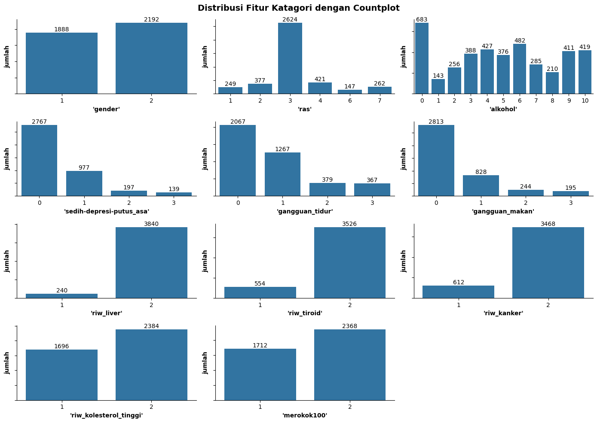
    


## 2. Drop Outlier


```python
fig, ax = plt.subplots(4, 3, figsize=(14, 10))
ax = ax.flatten()
plt.suptitle("Deteksi Outlier pada Fitur Numerik dengan Boxplot", fontsize=14, fontweight='bold')

for col, index in zip(num_cols, range(len(num_cols))):
    sns.boxplot(ax=ax[num_cols.index(col)], x=col, data=df)
    ax[num_cols.index(col)].set_xlabel(f"'{col}'", fontsize=10, fontweight='bold')
    ax[num_cols.index(col)].set_ylabel("jumlah", fontsize=10, fontweight='bold')

ax[len(num_cols)].set_axis_off()
ax[len(num_cols)+1].set_axis_off()
plt.tight_layout()
plt.show()
```


    
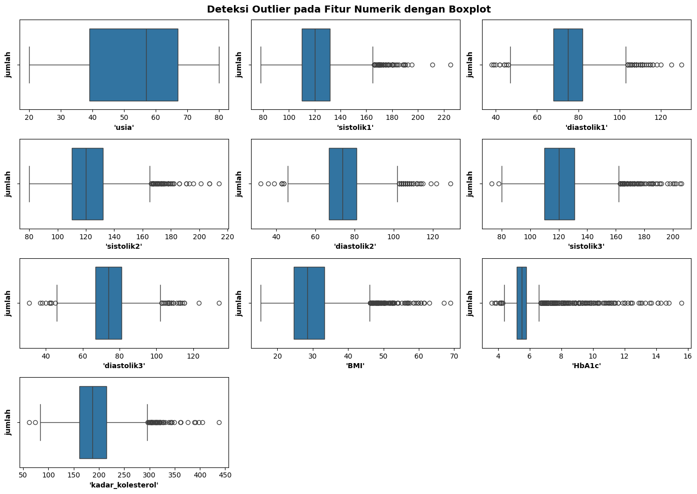
    


## 3. Rekayasa Fitur

### 3.1 Memperbaiki Nilai pada Fitur Usia

- Terdapat kolom unik yaitu kolom `usia` yang memiliki tipe data campuran (numerik untuk umur 0 sampai 79, dan katagori untuk nilai 80 ke atas) sehingga perlu perlakuan khusus dengan mengubah kolom `usia` menjadi katagori.


```python
fig, ax = plt.subplots(figsize=(8, 6))
plt.suptitle("Distribusi Fitur Kelompok Usia dengan Countplot", fontsize=14, fontweight='bold')
sns.histplot(x='usia', data=df)
ax.bar_label(ax.containers[0])
plt.tight_layout()
plt.show()
```


    
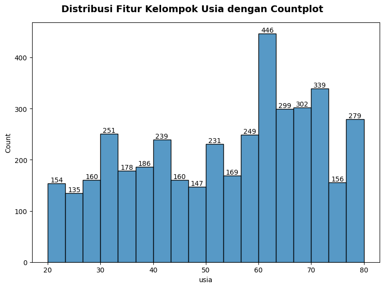
    


```python
df['usia'] = df['usia'].replace(80, 85)
```


```python
fig, ax = plt.subplots(figsize=(10, 8))
plt.suptitle("Distribusi Fitur Usia dengan Histplot", fontsize=14, fontweight='bold')
sns.histplot(x='usia', data=df)
ax.set_xlabel("'Usia'", fontsize=10, fontweight='bold')
ax.set_ylabel("Jumlah", fontsize=12, fontweight='bold')
ax.bar_label(ax.containers[0])
plt.tight_layout()
plt.show()
```


    
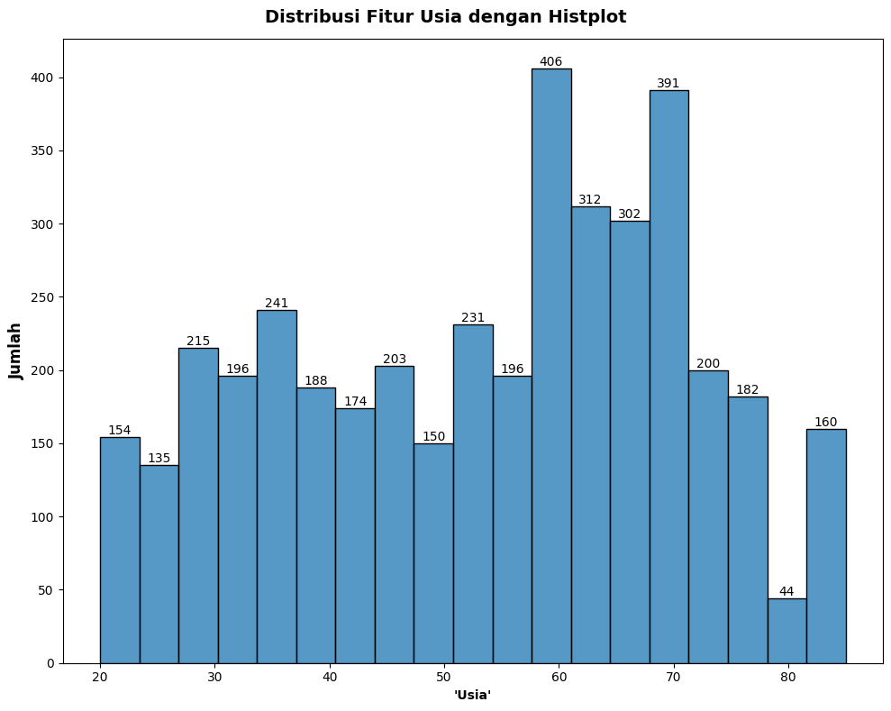
    


### 3.2 Membuat Fitur Tekanan Darah

**Mean Arterial Pressure**</br>
MAP dapat dihitung menggunakan rumus berikut:</br>
Diastolik + 1/3 (Sistolik - Diastolik)


```python
plt.figure(figsize=(20, 8))
# Hitung korelasi
corr = df.corr()
sns.heatmap(corr, annot=True, cmap='coolwarm', fmt=".3f", cbar=True)
plt.title('Heatmap Korelasi (Hanya Nilai > 0)')
plt.xticks(rotation=90)
plt.show()
```


    
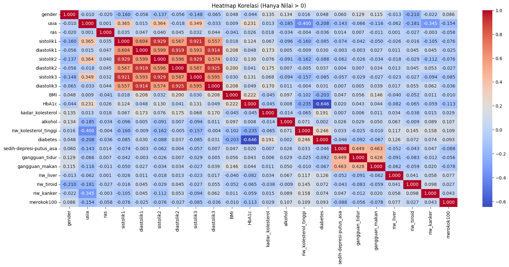
    


```python
rata2_sistolik = (df['sistolik1'] + df['sistolik2'] + df['sistolik3'])/3
rata2_diastolik = (df['diastolik1'] + df['diastolik2'] + df['diastolik3'])/3
df['tekanan_darah'] = rata2_diastolik + (rata2_sistolik - rata2_diastolik)/3
df['tekanan_darah'] = df['tekanan_darah'].round().astype('int64')
```


```python
# drop kolom sistolik dan daistolik
df = df.drop(columns=['sistolik1', 'sistolik2', 'sistolik3', 'diastolik1', 'diastolik2', 'diastolik3'])
```


```python
df.shape
```


    (4080, 17)


```python
fig, ax = plt.subplots(figsize=(10, 8))
plt.suptitle("Distribusi Fitur Tekanan Darah dengan Histplot", fontsize=14, fontweight='bold')
sns.histplot(x='tekanan_darah', data=df)
ax.set_xlabel('Tekanan Darah',fontweight='bold')
ax.set_ylabel("Jumlah", fontsize=12, fontweight='bold')
# ax.bar_label(ax.containers[0])
plt.tight_layout()
# plt.savefig('distribusi tekanan darah.png')
plt.show()
```


    
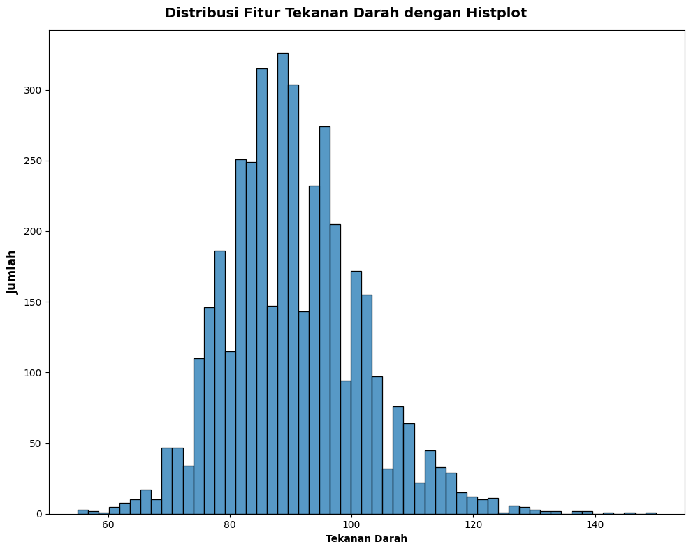
    


### 3.3 Memperbaiki Urutan Katagori Fitur Alkohol


```python
alkohol_mapping = {
    0: 0, 10: 1, 9: 2, 8: 3, 7: 4,
    6: 5, 5: 6, 4: 7, 3: 8, 2: 9, 1: 10,
}
df['alkohol'] = df['alkohol'].map(alkohol_mapping)
```

## 4. Encoding

### 4.1 Biner


```python
bin_cols = ['gender', 'riw_liver', 'riw_tiroid', 'riw_kanker', 'riw_kolesterol_tinggi', 'merokok100', 'diabetes']
for col in bin_cols:
    df[col] = df[col].cat.rename_categories({2:0})
```


```python
fig, ax = plt.subplots(3, 4, figsize=(13, 10))
ax = ax.flatten()
# plt.suptitle("Distribusi Fitur Katagori dengan Countplot", fontsize=14, fontweight='bold')

for col, index in zip(cat_cols, range(len(cat_cols))):
    sns.countplot(ax=ax[cat_cols.index(col)], x=col, data=df, hue='diabetes')
    ax[cat_cols.index(col)].set_ylabel("jumlah", fontsize=10, fontweight='bold')
    ax[cat_cols.index(col)].set_xlabel(f"'{col}'", fontsize=10, fontweight='bold')
    ax[cat_cols.index(col)].bar_label(ax[cat_cols.index(col)].containers[0])
    ax[cat_cols.index(col)].bar_label(ax[cat_cols.index(col)].containers[1])
    ax[cat_cols.index(col)].spines['right'].set_visible(False)
    ax[cat_cols.index(col)].spines['top'].set_visible(False)
    ax[cat_cols.index(col)].set_yticklabels([])
    ax[cat_cols.index(col)].legend_.remove()
# ax[len(num_cols)].set_axis_off()
handles, labels = ax[0].get_legend_handles_labels()
fig.legend(handles, labels, loc="upper right",bbox_to_anchor=(1.25, 0.24), frameon=True, fontsize=16,title="Diabetes",title_fontsize=16)
# plt.tight_layout(rect=[0, 0.03, 1.3, 1])
plt.tight_layout(rect=[0, 0, 1.4, 1])
ax[len(num_cols)+1].set_axis_off()
plt.savefig("distribusi_kategori_HUE_diabetes.png", dpi=400, bbox_inches='tight')
plt.show()
```


    
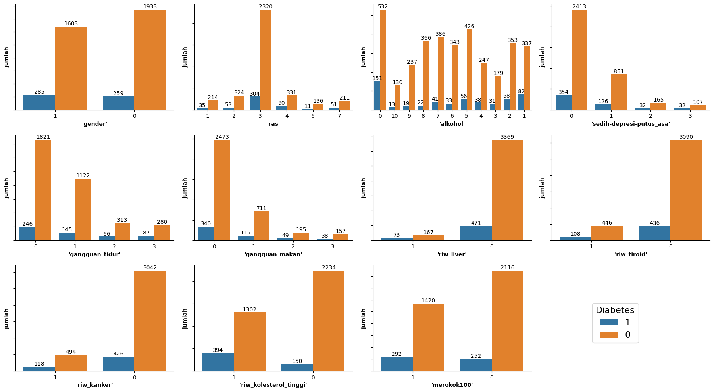
    


---


```python
plt.figure(figsize=(20, 8))
# Hitung korelasi
corr = df.corr()
sns.heatmap(corr, annot=True, cmap='coolwarm', fmt=".3f", cbar=True)
plt.title('Heatmap Korelasi (Hanya Nilai > 0)')
plt.xticks(rotation=90)
plt.show()
```


    
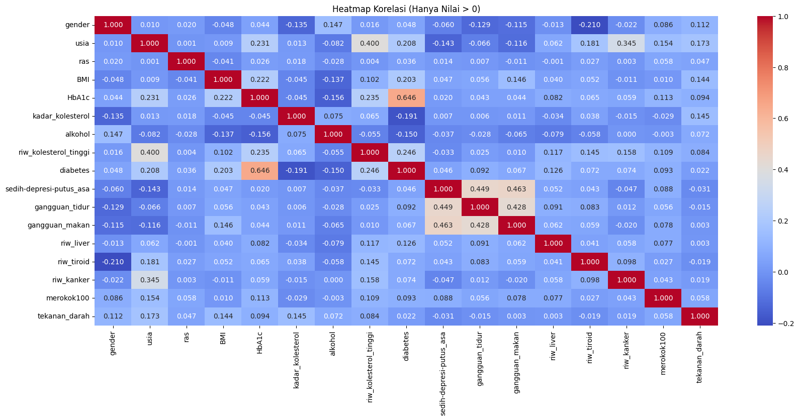
    


### 4.2 Nominal


```python
df = pd.get_dummies(df, columns=['ras'], prefix='ras', drop_first=True)
df[['ras_2', 'ras_3', 'ras_4', 'ras_6', 'ras_7']] = df[['ras_2', 'ras_3', 'ras_4', 'ras_6', 'ras_7']].astype('int64').astype('category')
```


```python
plt.figure(figsize=(20, 8))
sns.heatmap(df.corr(), annot=True, cmap='Blues')
plt.title('Heatmap Korelasi')
plt.xticks(rotation=90)
plt.show()
```


    
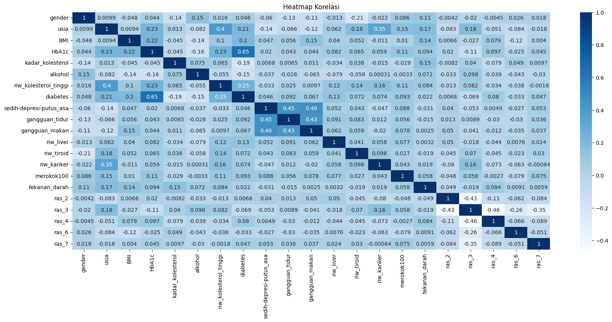
    


```python
df['diabetes'].value_counts()
```


    diabetes
    0    3536
    1     544
    Name: count, dtype: int64


```python
cat_cols
```


    ['gender',
     'ras',
     'alkohol',
     'sedih-depresi-putus_asa',
     'gangguan_tidur',
     'gangguan_makan',
     'riw_liver',
     'riw_tiroid',
     'riw_kanker',
     'riw_kolesterol_tinggi',
     'merokok100']


```python
all_cat_cols = [
'gender',
 'ras_2',
 'ras_3',
 'ras_4',
 'ras_6',
 'ras_7',
 'alkohol',
 'sedih-depresi-putus_asa',
 'gangguan_tidur',
 'gangguan_makan',
 'riw_liver',
 'riw_tiroid',
 'riw_kanker',
 'riw_kolesterol_tinggi',
 'merokok100']
```


```python
df[all_cat_cols].tail()
```


<div>
<style scoped>
    .dataframe tbody tr th:only-of-type {
        vertical-align: middle;
    }

    .dataframe tbody tr th {
        vertical-align: top;
    }

    .dataframe thead th {
        text-align: right;
    }
</style>
<table border="1" class="dataframe">
  <thead>
    <tr style="text-align: right;">
      <th></th>
      <th>gender</th>
      <th>ras_2</th>
      <th>ras_3</th>
      <th>ras_4</th>
      <th>ras_6</th>
      <th>ras_7</th>
      <th>alkohol</th>
      <th>sedih-depresi-putus_asa</th>
      <th>gangguan_tidur</th>
      <th>gangguan_makan</th>
      <th>riw_liver</th>
      <th>riw_tiroid</th>
      <th>riw_kanker</th>
      <th>riw_kolesterol_tinggi</th>
      <th>merokok100</th>
    </tr>
  </thead>
  <tbody>
    <tr>
      <th>4075</th>
      <td>1</td>
      <td>0</td>
      <td>0</td>
      <td>0</td>
      <td>0</td>
      <td>1</td>
      <td>0</td>
      <td>0</td>
      <td>0</td>
      <td>1</td>
      <td>0</td>
      <td>0</td>
      <td>0</td>
      <td>0</td>
      <td>1</td>
    </tr>
    <tr>
      <th>4076</th>
      <td>1</td>
      <td>0</td>
      <td>0</td>
      <td>0</td>
      <td>0</td>
      <td>0</td>
      <td>2</td>
      <td>0</td>
      <td>0</td>
      <td>0</td>
      <td>0</td>
      <td>0</td>
      <td>0</td>
      <td>0</td>
      <td>1</td>
    </tr>
    <tr>
      <th>4077</th>
      <td>0</td>
      <td>0</td>
      <td>0</td>
      <td>0</td>
      <td>0</td>
      <td>0</td>
      <td>5</td>
      <td>0</td>
      <td>1</td>
      <td>0</td>
      <td>0</td>
      <td>0</td>
      <td>0</td>
      <td>0</td>
      <td>1</td>
    </tr>
    <tr>
      <th>4078</th>
      <td>1</td>
      <td>0</td>
      <td>1</td>
      <td>0</td>
      <td>0</td>
      <td>0</td>
      <td>2</td>
      <td>0</td>
      <td>0</td>
      <td>0</td>
      <td>0</td>
      <td>1</td>
      <td>0</td>
      <td>1</td>
      <td>1</td>
    </tr>
    <tr>
      <th>4079</th>
      <td>0</td>
      <td>0</td>
      <td>1</td>
      <td>0</td>
      <td>0</td>
      <td>0</td>
      <td>8</td>
      <td>0</td>
      <td>0</td>
      <td>0</td>
      <td>0</td>
      <td>0</td>
      <td>1</td>
      <td>0</td>
      <td>1</td>
    </tr>
  </tbody>
</table>
</div>


## 5. Splitting


```python
X = df.drop(columns='diabetes', axis=1)
y = df['diabetes']
```


```python
X_train, X_test, y_train, y_test = train_test_split(X, y, test_size=.3, random_state=42, stratify=y)
```


```python
print(f"X_train: {X_train.shape}, X_test: {X_test.shape}, y_train: {y_train.shape}, y_test: {y_test.shape}")
```

    X_train: (2856, 20), X_test: (1224, 20), y_train: (2856,), y_test: (1224,)
    

## 6. Normalization


```python
# Normalization
from sklearn.preprocessing import MinMaxScaler
scaler = MinMaxScaler()
X_train_scaled = scaler.fit_transform(X_train)
X_test_scaled = scaler.transform(X_test)
```


```python
# Mengubah kembali numpy array menjadi dataframe
X_train = pd.DataFrame(X_train_scaled, columns=X_train.columns, index=X_train.index)
X_test = pd.DataFrame(X_test_scaled, columns=X_test.columns, index=X_test.index)
```


```python
X_train.iloc[:20, :8]
```


<div>
<style scoped>
    .dataframe tbody tr th:only-of-type {
        vertical-align: middle;
    }

    .dataframe tbody tr th {
        vertical-align: top;
    }

    .dataframe thead th {
        text-align: right;
    }
</style>
<table border="1" class="dataframe">
  <thead>
    <tr style="text-align: right;">
      <th></th>
      <th>gender</th>
      <th>usia</th>
      <th>BMI</th>
      <th>HbA1c</th>
      <th>kadar_kolesterol</th>
      <th>alkohol</th>
      <th>riw_kolesterol_tinggi</th>
      <th>sedih-depresi-putus_asa</th>
    </tr>
  </thead>
  <tbody>
    <tr>
      <th>149</th>
      <td>1.0</td>
      <td>0.784615</td>
      <td>0.294227</td>
      <td>0.475000</td>
      <td>0.242021</td>
      <td>0.5</td>
      <td>1.0</td>
      <td>0.000000</td>
    </tr>
    <tr>
      <th>2622</th>
      <td>0.0</td>
      <td>0.830769</td>
      <td>0.255121</td>
      <td>0.166667</td>
      <td>0.228723</td>
      <td>0.0</td>
      <td>1.0</td>
      <td>0.000000</td>
    </tr>
    <tr>
      <th>1275</th>
      <td>1.0</td>
      <td>0.569231</td>
      <td>0.249534</td>
      <td>0.283333</td>
      <td>0.263298</td>
      <td>0.6</td>
      <td>1.0</td>
      <td>0.000000</td>
    </tr>
    <tr>
      <th>2778</th>
      <td>1.0</td>
      <td>0.800000</td>
      <td>0.081937</td>
      <td>0.166667</td>
      <td>0.414894</td>
      <td>0.0</td>
      <td>1.0</td>
      <td>0.333333</td>
    </tr>
    <tr>
      <th>2575</th>
      <td>1.0</td>
      <td>0.246154</td>
      <td>0.258845</td>
      <td>0.133333</td>
      <td>0.154255</td>
      <td>0.6</td>
      <td>1.0</td>
      <td>0.000000</td>
    </tr>
    <tr>
      <th>4074</th>
      <td>0.0</td>
      <td>1.000000</td>
      <td>0.333333</td>
      <td>0.141667</td>
      <td>0.454787</td>
      <td>0.0</td>
      <td>0.0</td>
      <td>0.000000</td>
    </tr>
    <tr>
      <th>3920</th>
      <td>1.0</td>
      <td>0.707692</td>
      <td>0.191806</td>
      <td>0.158333</td>
      <td>0.154255</td>
      <td>0.0</td>
      <td>0.0</td>
      <td>0.000000</td>
    </tr>
    <tr>
      <th>471</th>
      <td>0.0</td>
      <td>0.646154</td>
      <td>0.184358</td>
      <td>0.175000</td>
      <td>0.239362</td>
      <td>0.6</td>
      <td>1.0</td>
      <td>0.000000</td>
    </tr>
    <tr>
      <th>1821</th>
      <td>0.0</td>
      <td>0.476923</td>
      <td>0.156425</td>
      <td>0.133333</td>
      <td>0.454787</td>
      <td>0.7</td>
      <td>1.0</td>
      <td>0.333333</td>
    </tr>
    <tr>
      <th>537</th>
      <td>1.0</td>
      <td>0.169231</td>
      <td>0.571695</td>
      <td>0.191667</td>
      <td>0.247340</td>
      <td>0.5</td>
      <td>0.0</td>
      <td>0.000000</td>
    </tr>
    <tr>
      <th>2944</th>
      <td>0.0</td>
      <td>0.784615</td>
      <td>0.206704</td>
      <td>0.208333</td>
      <td>0.236702</td>
      <td>0.1</td>
      <td>1.0</td>
      <td>0.000000</td>
    </tr>
    <tr>
      <th>1554</th>
      <td>0.0</td>
      <td>0.738462</td>
      <td>0.422719</td>
      <td>0.316667</td>
      <td>0.468085</td>
      <td>0.2</td>
      <td>1.0</td>
      <td>0.000000</td>
    </tr>
    <tr>
      <th>988</th>
      <td>0.0</td>
      <td>0.723077</td>
      <td>0.240223</td>
      <td>0.308333</td>
      <td>0.425532</td>
      <td>0.6</td>
      <td>1.0</td>
      <td>0.000000</td>
    </tr>
    <tr>
      <th>704</th>
      <td>0.0</td>
      <td>0.184615</td>
      <td>0.247672</td>
      <td>0.100000</td>
      <td>0.287234</td>
      <td>0.6</td>
      <td>0.0</td>
      <td>0.000000</td>
    </tr>
    <tr>
      <th>2300</th>
      <td>0.0</td>
      <td>1.000000</td>
      <td>0.214153</td>
      <td>0.316667</td>
      <td>0.319149</td>
      <td>0.0</td>
      <td>1.0</td>
      <td>1.000000</td>
    </tr>
    <tr>
      <th>254</th>
      <td>0.0</td>
      <td>0.492308</td>
      <td>0.474860</td>
      <td>0.183333</td>
      <td>0.303191</td>
      <td>0.5</td>
      <td>1.0</td>
      <td>1.000000</td>
    </tr>
    <tr>
      <th>3653</th>
      <td>1.0</td>
      <td>0.600000</td>
      <td>0.240223</td>
      <td>0.166667</td>
      <td>0.375000</td>
      <td>0.0</td>
      <td>1.0</td>
      <td>0.000000</td>
    </tr>
    <tr>
      <th>2224</th>
      <td>1.0</td>
      <td>0.076923</td>
      <td>0.255121</td>
      <td>0.125000</td>
      <td>0.300532</td>
      <td>0.6</td>
      <td>0.0</td>
      <td>0.000000</td>
    </tr>
    <tr>
      <th>1846</th>
      <td>0.0</td>
      <td>0.630769</td>
      <td>0.152700</td>
      <td>0.641667</td>
      <td>0.265957</td>
      <td>0.1</td>
      <td>0.0</td>
      <td>0.000000</td>
    </tr>
    <tr>
      <th>799</th>
      <td>0.0</td>
      <td>0.461538</td>
      <td>0.484171</td>
      <td>0.150000</td>
      <td>0.327128</td>
      <td>0.2</td>
      <td>0.0</td>
      <td>0.000000</td>
    </tr>
  </tbody>
</table>
</div>


```python
X_train.iloc[:20, 8:]
```


<div>
<style scoped>
    .dataframe tbody tr th:only-of-type {
        vertical-align: middle;
    }

    .dataframe tbody tr th {
        vertical-align: top;
    }

    .dataframe thead th {
        text-align: right;
    }
</style>
<table border="1" class="dataframe">
  <thead>
    <tr style="text-align: right;">
      <th></th>
      <th>gangguan_tidur</th>
      <th>gangguan_makan</th>
      <th>riw_liver</th>
      <th>riw_tiroid</th>
      <th>riw_kanker</th>
      <th>merokok100</th>
      <th>tekanan_darah</th>
      <th>ras_2</th>
      <th>ras_3</th>
      <th>ras_4</th>
      <th>ras_6</th>
      <th>ras_7</th>
    </tr>
  </thead>
  <tbody>
    <tr>
      <th>149</th>
      <td>0.666667</td>
      <td>0.000000</td>
      <td>0.0</td>
      <td>0.0</td>
      <td>0.0</td>
      <td>0.0</td>
      <td>0.357895</td>
      <td>0.0</td>
      <td>1.0</td>
      <td>0.0</td>
      <td>0.0</td>
      <td>0.0</td>
    </tr>
    <tr>
      <th>2622</th>
      <td>0.000000</td>
      <td>0.000000</td>
      <td>0.0</td>
      <td>0.0</td>
      <td>0.0</td>
      <td>0.0</td>
      <td>0.421053</td>
      <td>0.0</td>
      <td>1.0</td>
      <td>0.0</td>
      <td>0.0</td>
      <td>0.0</td>
    </tr>
    <tr>
      <th>1275</th>
      <td>0.000000</td>
      <td>0.000000</td>
      <td>0.0</td>
      <td>0.0</td>
      <td>0.0</td>
      <td>0.0</td>
      <td>0.336842</td>
      <td>0.0</td>
      <td>1.0</td>
      <td>0.0</td>
      <td>0.0</td>
      <td>0.0</td>
    </tr>
    <tr>
      <th>2778</th>
      <td>0.000000</td>
      <td>0.000000</td>
      <td>0.0</td>
      <td>0.0</td>
      <td>0.0</td>
      <td>0.0</td>
      <td>0.400000</td>
      <td>0.0</td>
      <td>1.0</td>
      <td>0.0</td>
      <td>0.0</td>
      <td>0.0</td>
    </tr>
    <tr>
      <th>2575</th>
      <td>0.000000</td>
      <td>0.333333</td>
      <td>0.0</td>
      <td>0.0</td>
      <td>0.0</td>
      <td>1.0</td>
      <td>0.421053</td>
      <td>0.0</td>
      <td>1.0</td>
      <td>0.0</td>
      <td>0.0</td>
      <td>0.0</td>
    </tr>
    <tr>
      <th>4074</th>
      <td>0.333333</td>
      <td>0.000000</td>
      <td>0.0</td>
      <td>0.0</td>
      <td>0.0</td>
      <td>0.0</td>
      <td>0.452632</td>
      <td>0.0</td>
      <td>1.0</td>
      <td>0.0</td>
      <td>0.0</td>
      <td>0.0</td>
    </tr>
    <tr>
      <th>3920</th>
      <td>0.000000</td>
      <td>0.000000</td>
      <td>0.0</td>
      <td>0.0</td>
      <td>0.0</td>
      <td>0.0</td>
      <td>0.273684</td>
      <td>0.0</td>
      <td>1.0</td>
      <td>0.0</td>
      <td>0.0</td>
      <td>0.0</td>
    </tr>
    <tr>
      <th>471</th>
      <td>0.000000</td>
      <td>0.000000</td>
      <td>1.0</td>
      <td>0.0</td>
      <td>0.0</td>
      <td>0.0</td>
      <td>0.557895</td>
      <td>1.0</td>
      <td>0.0</td>
      <td>0.0</td>
      <td>0.0</td>
      <td>0.0</td>
    </tr>
    <tr>
      <th>1821</th>
      <td>0.000000</td>
      <td>0.000000</td>
      <td>0.0</td>
      <td>1.0</td>
      <td>0.0</td>
      <td>0.0</td>
      <td>0.526316</td>
      <td>0.0</td>
      <td>1.0</td>
      <td>0.0</td>
      <td>0.0</td>
      <td>0.0</td>
    </tr>
    <tr>
      <th>537</th>
      <td>0.000000</td>
      <td>0.000000</td>
      <td>0.0</td>
      <td>0.0</td>
      <td>0.0</td>
      <td>0.0</td>
      <td>0.410526</td>
      <td>0.0</td>
      <td>0.0</td>
      <td>1.0</td>
      <td>0.0</td>
      <td>0.0</td>
    </tr>
    <tr>
      <th>2944</th>
      <td>0.000000</td>
      <td>0.000000</td>
      <td>0.0</td>
      <td>1.0</td>
      <td>1.0</td>
      <td>1.0</td>
      <td>0.389474</td>
      <td>0.0</td>
      <td>1.0</td>
      <td>0.0</td>
      <td>0.0</td>
      <td>0.0</td>
    </tr>
    <tr>
      <th>1554</th>
      <td>0.000000</td>
      <td>0.000000</td>
      <td>0.0</td>
      <td>1.0</td>
      <td>0.0</td>
      <td>0.0</td>
      <td>0.336842</td>
      <td>0.0</td>
      <td>0.0</td>
      <td>1.0</td>
      <td>0.0</td>
      <td>0.0</td>
    </tr>
    <tr>
      <th>988</th>
      <td>0.333333</td>
      <td>0.333333</td>
      <td>0.0</td>
      <td>1.0</td>
      <td>0.0</td>
      <td>0.0</td>
      <td>0.347368</td>
      <td>0.0</td>
      <td>1.0</td>
      <td>0.0</td>
      <td>0.0</td>
      <td>0.0</td>
    </tr>
    <tr>
      <th>704</th>
      <td>0.333333</td>
      <td>0.666667</td>
      <td>0.0</td>
      <td>0.0</td>
      <td>0.0</td>
      <td>0.0</td>
      <td>0.284211</td>
      <td>1.0</td>
      <td>0.0</td>
      <td>0.0</td>
      <td>0.0</td>
      <td>0.0</td>
    </tr>
    <tr>
      <th>2300</th>
      <td>1.000000</td>
      <td>1.000000</td>
      <td>0.0</td>
      <td>0.0</td>
      <td>0.0</td>
      <td>0.0</td>
      <td>0.547368</td>
      <td>1.0</td>
      <td>0.0</td>
      <td>0.0</td>
      <td>0.0</td>
      <td>0.0</td>
    </tr>
    <tr>
      <th>254</th>
      <td>0.666667</td>
      <td>0.333333</td>
      <td>1.0</td>
      <td>0.0</td>
      <td>0.0</td>
      <td>1.0</td>
      <td>0.515789</td>
      <td>1.0</td>
      <td>0.0</td>
      <td>0.0</td>
      <td>0.0</td>
      <td>0.0</td>
    </tr>
    <tr>
      <th>3653</th>
      <td>0.000000</td>
      <td>0.000000</td>
      <td>0.0</td>
      <td>0.0</td>
      <td>0.0</td>
      <td>1.0</td>
      <td>0.410526</td>
      <td>0.0</td>
      <td>1.0</td>
      <td>0.0</td>
      <td>0.0</td>
      <td>0.0</td>
    </tr>
    <tr>
      <th>2224</th>
      <td>0.000000</td>
      <td>0.000000</td>
      <td>0.0</td>
      <td>0.0</td>
      <td>0.0</td>
      <td>1.0</td>
      <td>0.294737</td>
      <td>1.0</td>
      <td>0.0</td>
      <td>0.0</td>
      <td>0.0</td>
      <td>0.0</td>
    </tr>
    <tr>
      <th>1846</th>
      <td>0.666667</td>
      <td>0.333333</td>
      <td>0.0</td>
      <td>0.0</td>
      <td>0.0</td>
      <td>0.0</td>
      <td>0.389474</td>
      <td>1.0</td>
      <td>0.0</td>
      <td>0.0</td>
      <td>0.0</td>
      <td>0.0</td>
    </tr>
    <tr>
      <th>799</th>
      <td>0.333333</td>
      <td>0.666667</td>
      <td>0.0</td>
      <td>0.0</td>
      <td>0.0</td>
      <td>1.0</td>
      <td>0.442105</td>
      <td>1.0</td>
      <td>0.0</td>
      <td>0.0</td>
      <td>0.0</td>
      <td>0.0</td>
    </tr>
  </tbody>
</table>
</div>


```python
X_train.iloc[:-20, :8]
```


<div>
<style scoped>
    .dataframe tbody tr th:only-of-type {
        vertical-align: middle;
    }

    .dataframe tbody tr th {
        vertical-align: top;
    }

    .dataframe thead th {
        text-align: right;
    }
</style>
<table border="1" class="dataframe">
  <thead>
    <tr style="text-align: right;">
      <th></th>
      <th>gender</th>
      <th>usia</th>
      <th>BMI</th>
      <th>HbA1c</th>
      <th>kadar_kolesterol</th>
      <th>alkohol</th>
      <th>riw_kolesterol_tinggi</th>
      <th>sedih-depresi-putus_asa</th>
    </tr>
  </thead>
  <tbody>
    <tr>
      <th>149</th>
      <td>1.0</td>
      <td>0.784615</td>
      <td>0.294227</td>
      <td>0.475000</td>
      <td>0.242021</td>
      <td>0.5</td>
      <td>1.0</td>
      <td>0.000000</td>
    </tr>
    <tr>
      <th>2622</th>
      <td>0.0</td>
      <td>0.830769</td>
      <td>0.255121</td>
      <td>0.166667</td>
      <td>0.228723</td>
      <td>0.0</td>
      <td>1.0</td>
      <td>0.000000</td>
    </tr>
    <tr>
      <th>1275</th>
      <td>1.0</td>
      <td>0.569231</td>
      <td>0.249534</td>
      <td>0.283333</td>
      <td>0.263298</td>
      <td>0.6</td>
      <td>1.0</td>
      <td>0.000000</td>
    </tr>
    <tr>
      <th>2778</th>
      <td>1.0</td>
      <td>0.800000</td>
      <td>0.081937</td>
      <td>0.166667</td>
      <td>0.414894</td>
      <td>0.0</td>
      <td>1.0</td>
      <td>0.333333</td>
    </tr>
    <tr>
      <th>2575</th>
      <td>1.0</td>
      <td>0.246154</td>
      <td>0.258845</td>
      <td>0.133333</td>
      <td>0.154255</td>
      <td>0.6</td>
      <td>1.0</td>
      <td>0.000000</td>
    </tr>
    <tr>
      <th>...</th>
      <td>...</td>
      <td>...</td>
      <td>...</td>
      <td>...</td>
      <td>...</td>
      <td>...</td>
      <td>...</td>
      <td>...</td>
    </tr>
    <tr>
      <th>1540</th>
      <td>1.0</td>
      <td>0.800000</td>
      <td>0.264432</td>
      <td>0.225000</td>
      <td>0.175532</td>
      <td>0.0</td>
      <td>1.0</td>
      <td>0.000000</td>
    </tr>
    <tr>
      <th>1042</th>
      <td>0.0</td>
      <td>0.446154</td>
      <td>0.251397</td>
      <td>0.158333</td>
      <td>0.385638</td>
      <td>0.7</td>
      <td>1.0</td>
      <td>0.333333</td>
    </tr>
    <tr>
      <th>206</th>
      <td>0.0</td>
      <td>0.661538</td>
      <td>0.189944</td>
      <td>0.166667</td>
      <td>0.388298</td>
      <td>0.6</td>
      <td>0.0</td>
      <td>0.000000</td>
    </tr>
    <tr>
      <th>2219</th>
      <td>1.0</td>
      <td>0.076923</td>
      <td>0.230912</td>
      <td>0.150000</td>
      <td>0.414894</td>
      <td>0.5</td>
      <td>0.0</td>
      <td>0.333333</td>
    </tr>
    <tr>
      <th>1573</th>
      <td>0.0</td>
      <td>0.800000</td>
      <td>0.197393</td>
      <td>0.141667</td>
      <td>0.345745</td>
      <td>0.0</td>
      <td>0.0</td>
      <td>0.000000</td>
    </tr>
  </tbody>
</table>
<p>2836 rows × 8 columns</p>
</div>


## 7. Resampling

Undersampling


```python
fig, ax = plt.subplots(figsize=(8, 8))
# plt.suptitle("Pie Chart", fontsize=14, fontweight='bold')
# sns.set(style="whitegrid")
plt.pie(x=y_train.value_counts(), labels=['Negatif', 'Positif'], autopct='%1.2f%%', textprops={'fontsize': 18, 'color': 'black'} )
# plt.tight_layout()
# plt.savefig('before_resampling.png')
plt.show()
```


    
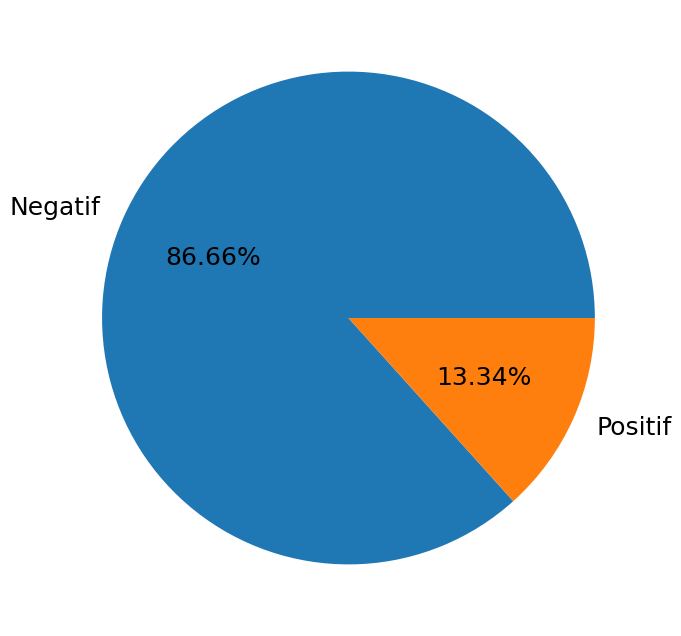
    


```python
from imblearn.combine import SMOTEENN
from collections import Counter

counter = Counter(y_train)
print('Sebelum SMOTE-ENN', counter)

SMOTEENN = SMOTEENN(random_state=42)
X_train, y_train = SMOTEENN.fit_resample(X_train, y_train)

counter = Counter(y_train)
print('Setelah SMOTE-ENN', counter)
```

    Sebelum SMOTE-ENN Counter({0: 2475, 1: 381})
    Setelah SMOTE-ENN Counter({1: 2334, 0: 1783})
    


```python
fig, ax = plt.subplots(figsize=(8, 8))
# plt.suptitle("Pie Chart", fontsize=14, fontweight='bold')
# sns.set(style="whitegrid")
plt.pie(x=y_train.value_counts(), labels=['Negatif', 'Positif'], autopct='%1.2f%%', textprops={'fontsize': 18, 'color': 'black'} )
# plt.tight_layout()
# plt.savefig('after_resampling.png')
plt.show()
```


    
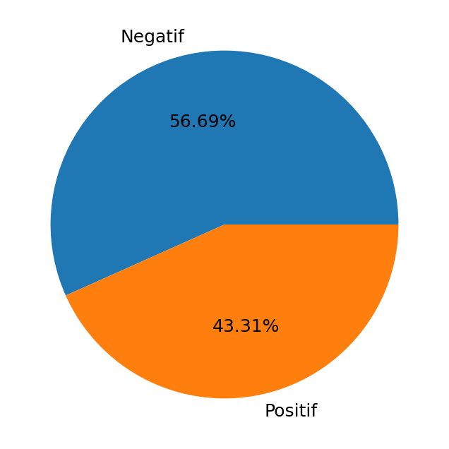
    


```python
class_weight = float(y_train.value_counts()[0]) / y_train.value_counts()[1]
```


```python
class_weight
```


    np.float64(0.7639245929734362)


```python
print(y_train.isnull().sum())
print(y_train.isin([np.inf, -np.inf]).sum())
```

    0
    0
    


```python
X_train.iloc[-20:, :8]
```


<div>
<style scoped>
    .dataframe tbody tr th:only-of-type {
        vertical-align: middle;
    }

    .dataframe tbody tr th {
        vertical-align: top;
    }

    .dataframe thead th {
        text-align: right;
    }
</style>
<table border="1" class="dataframe">
  <thead>
    <tr style="text-align: right;">
      <th></th>
      <th>gender</th>
      <th>usia</th>
      <th>BMI</th>
      <th>HbA1c</th>
      <th>kadar_kolesterol</th>
      <th>alkohol</th>
      <th>riw_kolesterol_tinggi</th>
      <th>sedih-depresi-putus_asa</th>
    </tr>
  </thead>
  <tbody>
    <tr>
      <th>4097</th>
      <td>0.000000</td>
      <td>0.393293</td>
      <td>0.180157</td>
      <td>0.464104</td>
      <td>0.370295</td>
      <td>0.120514</td>
      <td>1.000000</td>
      <td>0.000000</td>
    </tr>
    <tr>
      <th>4098</th>
      <td>1.000000</td>
      <td>0.763189</td>
      <td>0.354494</td>
      <td>0.337788</td>
      <td>0.284758</td>
      <td>0.342908</td>
      <td>1.000000</td>
      <td>0.000000</td>
    </tr>
    <tr>
      <th>4099</th>
      <td>0.000000</td>
      <td>0.276634</td>
      <td>0.353281</td>
      <td>0.329088</td>
      <td>0.252976</td>
      <td>0.249060</td>
      <td>1.000000</td>
      <td>0.000000</td>
    </tr>
    <tr>
      <th>4100</th>
      <td>1.000000</td>
      <td>0.679434</td>
      <td>0.424888</td>
      <td>0.444898</td>
      <td>0.326938</td>
      <td>0.038773</td>
      <td>1.000000</td>
      <td>0.000000</td>
    </tr>
    <tr>
      <th>4101</th>
      <td>1.000000</td>
      <td>0.584435</td>
      <td>0.261628</td>
      <td>0.293922</td>
      <td>0.246025</td>
      <td>0.600000</td>
      <td>1.000000</td>
      <td>0.000000</td>
    </tr>
    <tr>
      <th>4102</th>
      <td>1.000000</td>
      <td>0.679294</td>
      <td>0.401684</td>
      <td>0.447565</td>
      <td>0.269886</td>
      <td>0.135388</td>
      <td>1.000000</td>
      <td>0.000000</td>
    </tr>
    <tr>
      <th>4103</th>
      <td>1.000000</td>
      <td>0.730558</td>
      <td>0.354017</td>
      <td>0.338508</td>
      <td>0.146138</td>
      <td>0.064837</td>
      <td>1.000000</td>
      <td>0.000000</td>
    </tr>
    <tr>
      <th>4104</th>
      <td>0.858764</td>
      <td>0.650674</td>
      <td>0.349513</td>
      <td>0.519399</td>
      <td>0.298580</td>
      <td>0.014124</td>
      <td>1.000000</td>
      <td>0.286255</td>
    </tr>
    <tr>
      <th>4105</th>
      <td>0.000000</td>
      <td>0.622723</td>
      <td>0.247538</td>
      <td>0.193709</td>
      <td>0.212923</td>
      <td>0.275493</td>
      <td>1.000000</td>
      <td>0.249452</td>
    </tr>
    <tr>
      <th>4106</th>
      <td>0.000000</td>
      <td>0.571101</td>
      <td>0.412873</td>
      <td>0.201241</td>
      <td>0.367971</td>
      <td>0.436474</td>
      <td>0.000000</td>
      <td>0.000000</td>
    </tr>
    <tr>
      <th>4107</th>
      <td>1.000000</td>
      <td>0.537650</td>
      <td>0.225447</td>
      <td>0.564639</td>
      <td>0.367135</td>
      <td>0.216836</td>
      <td>1.000000</td>
      <td>0.000000</td>
    </tr>
    <tr>
      <th>4108</th>
      <td>1.000000</td>
      <td>0.598837</td>
      <td>0.212834</td>
      <td>0.268003</td>
      <td>0.210131</td>
      <td>0.016037</td>
      <td>1.000000</td>
      <td>0.893090</td>
    </tr>
    <tr>
      <th>4109</th>
      <td>0.000000</td>
      <td>0.646476</td>
      <td>0.300818</td>
      <td>0.336156</td>
      <td>0.318671</td>
      <td>0.434729</td>
      <td>1.000000</td>
      <td>0.000000</td>
    </tr>
    <tr>
      <th>4110</th>
      <td>1.000000</td>
      <td>0.320753</td>
      <td>0.319402</td>
      <td>0.404322</td>
      <td>0.285175</td>
      <td>0.500000</td>
      <td>0.000000</td>
      <td>0.000000</td>
    </tr>
    <tr>
      <th>4111</th>
      <td>1.000000</td>
      <td>0.802190</td>
      <td>0.270668</td>
      <td>0.282829</td>
      <td>0.358011</td>
      <td>0.969395</td>
      <td>1.000000</td>
      <td>0.000000</td>
    </tr>
    <tr>
      <th>4112</th>
      <td>0.000000</td>
      <td>0.637600</td>
      <td>0.439394</td>
      <td>0.308333</td>
      <td>0.214245</td>
      <td>0.000000</td>
      <td>0.770402</td>
      <td>0.000000</td>
    </tr>
    <tr>
      <th>4113</th>
      <td>1.000000</td>
      <td>0.873306</td>
      <td>0.213598</td>
      <td>0.267646</td>
      <td>0.293650</td>
      <td>0.964735</td>
      <td>1.000000</td>
      <td>0.000000</td>
    </tr>
    <tr>
      <th>4114</th>
      <td>0.000000</td>
      <td>0.487094</td>
      <td>0.174182</td>
      <td>0.446006</td>
      <td>0.287894</td>
      <td>0.933886</td>
      <td>1.000000</td>
      <td>0.721761</td>
    </tr>
    <tr>
      <th>4115</th>
      <td>0.000000</td>
      <td>0.892522</td>
      <td>0.243889</td>
      <td>0.441418</td>
      <td>0.159892</td>
      <td>0.000000</td>
      <td>1.000000</td>
      <td>1.000000</td>
    </tr>
    <tr>
      <th>4116</th>
      <td>0.000000</td>
      <td>0.750478</td>
      <td>0.372205</td>
      <td>0.305727</td>
      <td>0.292888</td>
      <td>0.340630</td>
      <td>0.000000</td>
      <td>0.000000</td>
    </tr>
  </tbody>
</table>
</div>


```python
X_train.iloc[-20:, 8:]
```


<div>
<style scoped>
    .dataframe tbody tr th:only-of-type {
        vertical-align: middle;
    }

    .dataframe tbody tr th {
        vertical-align: top;
    }

    .dataframe thead th {
        text-align: right;
    }
</style>
<table border="1" class="dataframe">
  <thead>
    <tr style="text-align: right;">
      <th></th>
      <th>gangguan_tidur</th>
      <th>gangguan_makan</th>
      <th>riw_liver</th>
      <th>riw_tiroid</th>
      <th>riw_kanker</th>
      <th>merokok100</th>
      <th>tekanan_darah</th>
      <th>ras_2</th>
      <th>ras_3</th>
      <th>ras_4</th>
      <th>ras_6</th>
      <th>ras_7</th>
    </tr>
  </thead>
  <tbody>
    <tr>
      <th>4097</th>
      <td>0.000000</td>
      <td>0.034189</td>
      <td>1.000000</td>
      <td>0.000000</td>
      <td>0.000000</td>
      <td>0.000000</td>
      <td>0.270986</td>
      <td>0.102568</td>
      <td>0.0</td>
      <td>0.0</td>
      <td>0.0</td>
      <td>0.0</td>
    </tr>
    <tr>
      <th>4098</th>
      <td>0.333333</td>
      <td>0.000000</td>
      <td>0.000000</td>
      <td>0.000000</td>
      <td>0.000000</td>
      <td>1.000000</td>
      <td>0.372210</td>
      <td>0.000000</td>
      <td>1.0</td>
      <td>0.0</td>
      <td>0.0</td>
      <td>0.0</td>
    </tr>
    <tr>
      <th>4099</th>
      <td>0.165623</td>
      <td>0.165623</td>
      <td>0.000000</td>
      <td>0.000000</td>
      <td>0.000000</td>
      <td>0.000000</td>
      <td>0.262960</td>
      <td>0.000000</td>
      <td>1.0</td>
      <td>0.0</td>
      <td>0.0</td>
      <td>0.0</td>
    </tr>
    <tr>
      <th>4100</th>
      <td>0.000000</td>
      <td>0.000000</td>
      <td>0.000000</td>
      <td>0.000000</td>
      <td>0.000000</td>
      <td>0.000000</td>
      <td>0.438347</td>
      <td>0.000000</td>
      <td>0.0</td>
      <td>0.0</td>
      <td>0.0</td>
      <td>1.0</td>
    </tr>
    <tr>
      <th>4101</th>
      <td>0.000000</td>
      <td>0.000000</td>
      <td>0.000000</td>
      <td>0.000000</td>
      <td>0.000000</td>
      <td>0.000000</td>
      <td>0.350217</td>
      <td>0.000000</td>
      <td>1.0</td>
      <td>0.0</td>
      <td>0.0</td>
      <td>0.0</td>
    </tr>
    <tr>
      <th>4102</th>
      <td>0.107686</td>
      <td>0.000000</td>
      <td>0.000000</td>
      <td>0.000000</td>
      <td>0.323059</td>
      <td>0.000000</td>
      <td>0.341541</td>
      <td>0.000000</td>
      <td>0.0</td>
      <td>0.0</td>
      <td>0.0</td>
      <td>1.0</td>
    </tr>
    <tr>
      <th>4103</th>
      <td>0.000000</td>
      <td>0.108061</td>
      <td>0.000000</td>
      <td>0.000000</td>
      <td>0.000000</td>
      <td>1.000000</td>
      <td>0.364431</td>
      <td>0.000000</td>
      <td>0.0</td>
      <td>1.0</td>
      <td>0.0</td>
      <td>0.0</td>
    </tr>
    <tr>
      <th>4104</th>
      <td>0.094157</td>
      <td>0.000000</td>
      <td>0.000000</td>
      <td>0.000000</td>
      <td>0.000000</td>
      <td>1.000000</td>
      <td>0.147129</td>
      <td>0.000000</td>
      <td>0.0</td>
      <td>0.0</td>
      <td>0.0</td>
      <td>1.0</td>
    </tr>
    <tr>
      <th>4105</th>
      <td>0.832237</td>
      <td>0.249452</td>
      <td>0.000000</td>
      <td>0.000000</td>
      <td>0.000000</td>
      <td>0.000000</td>
      <td>0.392192</td>
      <td>0.000000</td>
      <td>0.0</td>
      <td>1.0</td>
      <td>0.0</td>
      <td>0.0</td>
    </tr>
    <tr>
      <th>4106</th>
      <td>0.186930</td>
      <td>0.186930</td>
      <td>0.560789</td>
      <td>0.000000</td>
      <td>0.000000</td>
      <td>1.000000</td>
      <td>0.415645</td>
      <td>0.000000</td>
      <td>1.0</td>
      <td>0.0</td>
      <td>0.0</td>
      <td>0.0</td>
    </tr>
    <tr>
      <th>4107</th>
      <td>0.000000</td>
      <td>0.000000</td>
      <td>0.000000</td>
      <td>0.000000</td>
      <td>0.000000</td>
      <td>1.000000</td>
      <td>0.359667</td>
      <td>0.000000</td>
      <td>1.0</td>
      <td>0.0</td>
      <td>0.0</td>
      <td>0.0</td>
    </tr>
    <tr>
      <th>4108</th>
      <td>0.893090</td>
      <td>0.946545</td>
      <td>0.000000</td>
      <td>0.000000</td>
      <td>0.000000</td>
      <td>1.000000</td>
      <td>0.331284</td>
      <td>0.000000</td>
      <td>1.0</td>
      <td>0.0</td>
      <td>0.0</td>
      <td>0.0</td>
    </tr>
    <tr>
      <th>4109</th>
      <td>0.224548</td>
      <td>0.224548</td>
      <td>0.000000</td>
      <td>0.000000</td>
      <td>0.000000</td>
      <td>1.000000</td>
      <td>0.392468</td>
      <td>1.000000</td>
      <td>0.0</td>
      <td>0.0</td>
      <td>0.0</td>
      <td>0.0</td>
    </tr>
    <tr>
      <th>4110</th>
      <td>0.000000</td>
      <td>0.000000</td>
      <td>0.000000</td>
      <td>0.000000</td>
      <td>0.000000</td>
      <td>0.179253</td>
      <td>0.362463</td>
      <td>0.000000</td>
      <td>0.0</td>
      <td>1.0</td>
      <td>0.0</td>
      <td>0.0</td>
    </tr>
    <tr>
      <th>4111</th>
      <td>0.231317</td>
      <td>0.000000</td>
      <td>0.000000</td>
      <td>0.000000</td>
      <td>1.000000</td>
      <td>1.000000</td>
      <td>0.177224</td>
      <td>0.000000</td>
      <td>1.0</td>
      <td>0.0</td>
      <td>0.0</td>
      <td>0.0</td>
    </tr>
    <tr>
      <th>4112</th>
      <td>0.256801</td>
      <td>0.000000</td>
      <td>0.000000</td>
      <td>1.000000</td>
      <td>0.000000</td>
      <td>0.000000</td>
      <td>0.495756</td>
      <td>0.770402</td>
      <td>0.0</td>
      <td>0.0</td>
      <td>0.0</td>
      <td>0.0</td>
    </tr>
    <tr>
      <th>4113</th>
      <td>0.333333</td>
      <td>0.000000</td>
      <td>0.000000</td>
      <td>0.000000</td>
      <td>0.000000</td>
      <td>0.000000</td>
      <td>0.439630</td>
      <td>0.000000</td>
      <td>1.0</td>
      <td>0.0</td>
      <td>0.0</td>
      <td>0.0</td>
    </tr>
    <tr>
      <th>4114</th>
      <td>0.944905</td>
      <td>0.278239</td>
      <td>0.000000</td>
      <td>0.000000</td>
      <td>0.000000</td>
      <td>1.000000</td>
      <td>0.251066</td>
      <td>0.000000</td>
      <td>1.0</td>
      <td>0.0</td>
      <td>0.0</td>
      <td>0.0</td>
    </tr>
    <tr>
      <th>4115</th>
      <td>1.000000</td>
      <td>1.000000</td>
      <td>0.998008</td>
      <td>0.998008</td>
      <td>0.000000</td>
      <td>0.998008</td>
      <td>0.316251</td>
      <td>1.000000</td>
      <td>0.0</td>
      <td>0.0</td>
      <td>0.0</td>
      <td>0.0</td>
    </tr>
    <tr>
      <th>4116</th>
      <td>0.333333</td>
      <td>0.093753</td>
      <td>0.281260</td>
      <td>0.000000</td>
      <td>0.000000</td>
      <td>1.000000</td>
      <td>0.573682</td>
      <td>0.000000</td>
      <td>1.0</td>
      <td>0.0</td>
      <td>0.0</td>
      <td>0.0</td>
    </tr>
  </tbody>
</table>
</div>


# Modeling


```python
from sklearn.metrics import accuracy_score, precision_score, recall_score, f1_score, roc_auc_score, average_precision_score
```

## 1. KNN


```python
model_knn = KNeighborsClassifier()
model_knn.fit(X_train, y_train)
```


<style>#sk-container-id-1 {
  /* Definition of color scheme common for light and dark mode */
  --sklearn-color-text: #000;
  --sklearn-color-text-muted: #666;
  --sklearn-color-line: gray;
  /* Definition of color scheme for unfitted estimators */
  --sklearn-color-unfitted-level-0: #fff5e6;
  --sklearn-color-unfitted-level-1: #f6e4d2;
  --sklearn-color-unfitted-level-2: #ffe0b3;
  --sklearn-color-unfitted-level-3: chocolate;
  /* Definition of color scheme for fitted estimators */
  --sklearn-color-fitted-level-0: #f0f8ff;
  --sklearn-color-fitted-level-1: #d4ebff;
  --sklearn-color-fitted-level-2: #b3dbfd;
  --sklearn-color-fitted-level-3: cornflowerblue;

  /* Specific color for light theme */
  --sklearn-color-text-on-default-background: var(--sg-text-color, var(--theme-code-foreground, var(--jp-content-font-color1, black)));
  --sklearn-color-background: var(--sg-background-color, var(--theme-background, var(--jp-layout-color0, white)));
  --sklearn-color-border-box: var(--sg-text-color, var(--theme-code-foreground, var(--jp-content-font-color1, black)));
  --sklearn-color-icon: #696969;

  @media (prefers-color-scheme: dark) {
    /* Redefinition of color scheme for dark theme */
    --sklearn-color-text-on-default-background: var(--sg-text-color, var(--theme-code-foreground, var(--jp-content-font-color1, white)));
    --sklearn-color-background: var(--sg-background-color, var(--theme-background, var(--jp-layout-color0, #111)));
    --sklearn-color-border-box: var(--sg-text-color, var(--theme-code-foreground, var(--jp-content-font-color1, white)));
    --sklearn-color-icon: #878787;
  }
}

#sk-container-id-1 {
  color: var(--sklearn-color-text);
}

#sk-container-id-1 pre {
  padding: 0;
}

#sk-container-id-1 input.sk-hidden--visually {
  border: 0;
  clip: rect(1px 1px 1px 1px);
  clip: rect(1px, 1px, 1px, 1px);
  height: 1px;
  margin: -1px;
  overflow: hidden;
  padding: 0;
  position: absolute;
  width: 1px;
}

#sk-container-id-1 div.sk-dashed-wrapped {
  border: 1px dashed var(--sklearn-color-line);
  margin: 0 0.4em 0.5em 0.4em;
  box-sizing: border-box;
  padding-bottom: 0.4em;
  background-color: var(--sklearn-color-background);
}

#sk-container-id-1 div.sk-container {
  /* jupyter's `normalize.less` sets `[hidden] { display: none; }`
     but bootstrap.min.css set `[hidden] { display: none !important; }`
     so we also need the `!important` here to be able to override the
     default hidden behavior on the sphinx rendered scikit-learn.org.
     See: https://github.com/scikit-learn/scikit-learn/issues/21755 */
  display: inline-block !important;
  position: relative;
}

#sk-container-id-1 div.sk-text-repr-fallback {
  display: none;
}

div.sk-parallel-item,
div.sk-serial,
div.sk-item {
  /* draw centered vertical line to link estimators */
  background-image: linear-gradient(var(--sklearn-color-text-on-default-background), var(--sklearn-color-text-on-default-background));
  background-size: 2px 100%;
  background-repeat: no-repeat;
  background-position: center center;
}

/* Parallel-specific style estimator block */

#sk-container-id-1 div.sk-parallel-item::after {
  content: "";
  width: 100%;
  border-bottom: 2px solid var(--sklearn-color-text-on-default-background);
  flex-grow: 1;
}

#sk-container-id-1 div.sk-parallel {
  display: flex;
  align-items: stretch;
  justify-content: center;
  background-color: var(--sklearn-color-background);
  position: relative;
}

#sk-container-id-1 div.sk-parallel-item {
  display: flex;
  flex-direction: column;
}

#sk-container-id-1 div.sk-parallel-item:first-child::after {
  align-self: flex-end;
  width: 50%;
}

#sk-container-id-1 div.sk-parallel-item:last-child::after {
  align-self: flex-start;
  width: 50%;
}

#sk-container-id-1 div.sk-parallel-item:only-child::after {
  width: 0;
}

/* Serial-specific style estimator block */

#sk-container-id-1 div.sk-serial {
  display: flex;
  flex-direction: column;
  align-items: center;
  background-color: var(--sklearn-color-background);
  padding-right: 1em;
  padding-left: 1em;
}


/* Toggleable style: style used for estimator/Pipeline/ColumnTransformer box that is
clickable and can be expanded/collapsed.
- Pipeline and ColumnTransformer use this feature and define the default style
- Estimators will overwrite some part of the style using the `sk-estimator` class
*/

/* Pipeline and ColumnTransformer style (default) */

#sk-container-id-1 div.sk-toggleable {
  /* Default theme specific background. It is overwritten whether we have a
  specific estimator or a Pipeline/ColumnTransformer */
  background-color: var(--sklearn-color-background);
}

/* Toggleable label */
#sk-container-id-1 label.sk-toggleable__label {
  cursor: pointer;
  display: flex;
  width: 100%;
  margin-bottom: 0;
  padding: 0.5em;
  box-sizing: border-box;
  text-align: center;
  align-items: start;
  justify-content: space-between;
  gap: 0.5em;
}

#sk-container-id-1 label.sk-toggleable__label .caption {
  font-size: 0.6rem;
  font-weight: lighter;
  color: var(--sklearn-color-text-muted);
}

#sk-container-id-1 label.sk-toggleable__label-arrow:before {
  /* Arrow on the left of the label */
  content: "▸";
  float: left;
  margin-right: 0.25em;
  color: var(--sklearn-color-icon);
}

#sk-container-id-1 label.sk-toggleable__label-arrow:hover:before {
  color: var(--sklearn-color-text);
}

/* Toggleable content - dropdown */

#sk-container-id-1 div.sk-toggleable__content {
  max-height: 0;
  max-width: 0;
  overflow: hidden;
  text-align: left;
  /* unfitted */
  background-color: var(--sklearn-color-unfitted-level-0);
}

#sk-container-id-1 div.sk-toggleable__content.fitted {
  /* fitted */
  background-color: var(--sklearn-color-fitted-level-0);
}

#sk-container-id-1 div.sk-toggleable__content pre {
  margin: 0.2em;
  border-radius: 0.25em;
  color: var(--sklearn-color-text);
  /* unfitted */
  background-color: var(--sklearn-color-unfitted-level-0);
}

#sk-container-id-1 div.sk-toggleable__content.fitted pre {
  /* unfitted */
  background-color: var(--sklearn-color-fitted-level-0);
}

#sk-container-id-1 input.sk-toggleable__control:checked~div.sk-toggleable__content {
  /* Expand drop-down */
  max-height: 200px;
  max-width: 100%;
  overflow: auto;
}

#sk-container-id-1 input.sk-toggleable__control:checked~label.sk-toggleable__label-arrow:before {
  content: "▾";
}

/* Pipeline/ColumnTransformer-specific style */

#sk-container-id-1 div.sk-label input.sk-toggleable__control:checked~label.sk-toggleable__label {
  color: var(--sklearn-color-text);
  background-color: var(--sklearn-color-unfitted-level-2);
}

#sk-container-id-1 div.sk-label.fitted input.sk-toggleable__control:checked~label.sk-toggleable__label {
  background-color: var(--sklearn-color-fitted-level-2);
}

/* Estimator-specific style */

/* Colorize estimator box */
#sk-container-id-1 div.sk-estimator input.sk-toggleable__control:checked~label.sk-toggleable__label {
  /* unfitted */
  background-color: var(--sklearn-color-unfitted-level-2);
}

#sk-container-id-1 div.sk-estimator.fitted input.sk-toggleable__control:checked~label.sk-toggleable__label {
  /* fitted */
  background-color: var(--sklearn-color-fitted-level-2);
}

#sk-container-id-1 div.sk-label label.sk-toggleable__label,
#sk-container-id-1 div.sk-label label {
  /* The background is the default theme color */
  color: var(--sklearn-color-text-on-default-background);
}

/* On hover, darken the color of the background */
#sk-container-id-1 div.sk-label:hover label.sk-toggleable__label {
  color: var(--sklearn-color-text);
  background-color: var(--sklearn-color-unfitted-level-2);
}

/* Label box, darken color on hover, fitted */
#sk-container-id-1 div.sk-label.fitted:hover label.sk-toggleable__label.fitted {
  color: var(--sklearn-color-text);
  background-color: var(--sklearn-color-fitted-level-2);
}

/* Estimator label */

#sk-container-id-1 div.sk-label label {
  font-family: monospace;
  font-weight: bold;
  display: inline-block;
  line-height: 1.2em;
}

#sk-container-id-1 div.sk-label-container {
  text-align: center;
}

/* Estimator-specific */
#sk-container-id-1 div.sk-estimator {
  font-family: monospace;
  border: 1px dotted var(--sklearn-color-border-box);
  border-radius: 0.25em;
  box-sizing: border-box;
  margin-bottom: 0.5em;
  /* unfitted */
  background-color: var(--sklearn-color-unfitted-level-0);
}

#sk-container-id-1 div.sk-estimator.fitted {
  /* fitted */
  background-color: var(--sklearn-color-fitted-level-0);
}

/* on hover */
#sk-container-id-1 div.sk-estimator:hover {
  /* unfitted */
  background-color: var(--sklearn-color-unfitted-level-2);
}

#sk-container-id-1 div.sk-estimator.fitted:hover {
  /* fitted */
  background-color: var(--sklearn-color-fitted-level-2);
}

/* Specification for estimator info (e.g. "i" and "?") */

/* Common style for "i" and "?" */

.sk-estimator-doc-link,
a:link.sk-estimator-doc-link,
a:visited.sk-estimator-doc-link {
  float: right;
  font-size: smaller;
  line-height: 1em;
  font-family: monospace;
  background-color: var(--sklearn-color-background);
  border-radius: 1em;
  height: 1em;
  width: 1em;
  text-decoration: none !important;
  margin-left: 0.5em;
  text-align: center;
  /* unfitted */
  border: var(--sklearn-color-unfitted-level-1) 1pt solid;
  color: var(--sklearn-color-unfitted-level-1);
}

.sk-estimator-doc-link.fitted,
a:link.sk-estimator-doc-link.fitted,
a:visited.sk-estimator-doc-link.fitted {
  /* fitted */
  border: var(--sklearn-color-fitted-level-1) 1pt solid;
  color: var(--sklearn-color-fitted-level-1);
}

/* On hover */
div.sk-estimator:hover .sk-estimator-doc-link:hover,
.sk-estimator-doc-link:hover,
div.sk-label-container:hover .sk-estimator-doc-link:hover,
.sk-estimator-doc-link:hover {
  /* unfitted */
  background-color: var(--sklearn-color-unfitted-level-3);
  color: var(--sklearn-color-background);
  text-decoration: none;
}

div.sk-estimator.fitted:hover .sk-estimator-doc-link.fitted:hover,
.sk-estimator-doc-link.fitted:hover,
div.sk-label-container:hover .sk-estimator-doc-link.fitted:hover,
.sk-estimator-doc-link.fitted:hover {
  /* fitted */
  background-color: var(--sklearn-color-fitted-level-3);
  color: var(--sklearn-color-background);
  text-decoration: none;
}

/* Span, style for the box shown on hovering the info icon */
.sk-estimator-doc-link span {
  display: none;
  z-index: 9999;
  position: relative;
  font-weight: normal;
  right: .2ex;
  padding: .5ex;
  margin: .5ex;
  width: min-content;
  min-width: 20ex;
  max-width: 50ex;
  color: var(--sklearn-color-text);
  box-shadow: 2pt 2pt 4pt #999;
  /* unfitted */
  background: var(--sklearn-color-unfitted-level-0);
  border: .5pt solid var(--sklearn-color-unfitted-level-3);
}

.sk-estimator-doc-link.fitted span {
  /* fitted */
  background: var(--sklearn-color-fitted-level-0);
  border: var(--sklearn-color-fitted-level-3);
}

.sk-estimator-doc-link:hover span {
  display: block;
}

/* "?"-specific style due to the `<a>` HTML tag */

#sk-container-id-1 a.estimator_doc_link {
  float: right;
  font-size: 1rem;
  line-height: 1em;
  font-family: monospace;
  background-color: var(--sklearn-color-background);
  border-radius: 1rem;
  height: 1rem;
  width: 1rem;
  text-decoration: none;
  /* unfitted */
  color: var(--sklearn-color-unfitted-level-1);
  border: var(--sklearn-color-unfitted-level-1) 1pt solid;
}

#sk-container-id-1 a.estimator_doc_link.fitted {
  /* fitted */
  border: var(--sklearn-color-fitted-level-1) 1pt solid;
  color: var(--sklearn-color-fitted-level-1);
}

/* On hover */
#sk-container-id-1 a.estimator_doc_link:hover {
  /* unfitted */
  background-color: var(--sklearn-color-unfitted-level-3);
  color: var(--sklearn-color-background);
  text-decoration: none;
}

#sk-container-id-1 a.estimator_doc_link.fitted:hover {
  /* fitted */
  background-color: var(--sklearn-color-fitted-level-3);
}
</style><div id="sk-container-id-1" class="sk-top-container"><div class="sk-text-repr-fallback"><pre>KNeighborsClassifier()</pre><b>In a Jupyter environment, please rerun this cell to show the HTML representation or trust the notebook. <br />On GitHub, the HTML representation is unable to render, please try loading this page with nbviewer.org.</b></div><div class="sk-container" hidden><div class="sk-item"><div class="sk-estimator fitted sk-toggleable"><input class="sk-toggleable__control sk-hidden--visually" id="sk-estimator-id-1" type="checkbox" checked><label for="sk-estimator-id-1" class="sk-toggleable__label fitted sk-toggleable__label-arrow"><div><div>KNeighborsClassifier</div></div><div><a class="sk-estimator-doc-link fitted" rel="noreferrer" target="_blank" href="https://scikit-learn.org/1.6/modules/generated/sklearn.neighbors.KNeighborsClassifier.html">?<span>Documentation for KNeighborsClassifier</span></a><span class="sk-estimator-doc-link fitted">i<span>Fitted</span></span></div></label><div class="sk-toggleable__content fitted"><pre>KNeighborsClassifier()</pre></div> </div></div></div></div>


```python
model_knn_pred = model_knn.predict(X_test)
```


```python
print("Akurasi KNN: ", accuracy_score(y_test, model_knn_pred))
```

    Akurasi KNN:  0.7034313725490197
    


```python
accuracy_knn = accuracy_score(y_test, model_knn_pred)
precision_knn = precision_score(y_test, model_knn_pred)
recall_knn = recall_score(y_test, model_knn_pred)
f1_knn = f1_score(y_test, model_knn_pred)
roc_auc_knn = roc_auc_score(y_test, model_knn_pred)

print(f"Accuracy: {accuracy_knn:.4f}")
print(f"Recall: {recall_knn:.4f}")
print(f"Precision: {precision_knn:.4f}")
print(f"F1-Score: {f1_knn:.4f}")
```

    Accuracy: 0.7034
    Recall: 0.6748
    Precision: 0.2619
    F1-Score: 0.3774
    


```python
print("Classification Report KNN\n")
print(classification_report(y_test, model_knn_pred))
```

    Classification Report KNN
    
                  precision    recall  f1-score   support
    
               0       0.93      0.71      0.81      1061
               1       0.26      0.67      0.38       163
    
        accuracy                           0.70      1224
       macro avg       0.60      0.69      0.59      1224
    weighted avg       0.84      0.70      0.75      1224
    
    


```python
from sklearn.metrics import confusion_matrix
tn_knn, fp_knn, fn_knn, tp_knn = confusion_matrix(y_test, model_knn_pred).ravel()

# Hitung spesifisitas
specificity_knn = tn_knn / (tn_knn + fp_knn)
sensitiviy_knn = tp_knn / (tp_knn + fn_knn)
```


```python
print(f"True Negative (TN): {tn_knn}")
print(f"False Positive (FP): {fp_knn}")
print(f"Spesifisitas: {specificity_knn:.4f}")
```

    True Negative (TN): 751
    False Positive (FP): 310
    Spesifisitas: 0.7078
    


```python
print(f"True Positive (TN): {tp_knn}")
print(f"False Negative (FP): {fn_knn}")
print(f"Sensitivitas: {sensitiviy_knn:.4f}")
```

    True Positive (TN): 110
    False Negative (FP): 53
    Sensitivitas: 0.6748
    


```python
from sklearn.metrics import roc_auc_score, roc_curve
y_pred_proba_knn = model_knn.predict_proba(X_test)[:, 1]  # Probabilitas kelas positif
roc_auc_knn = roc_auc_score(y_test, y_pred_proba_knn)
pr_auc_knn = average_precision_score(y_test, y_pred_proba_knn)
print(f"ROC-AUC Score: {roc_auc_knn:.4f}")
print(f"PR-AUC Score: {pr_auc_knn:.4f}")
```

    ROC-AUC Score: 0.7284
    PR-AUC Score: 0.2591
    


```python
fpr_knn, tpr_knn, thresholds_knn = roc_curve(y_test, y_pred_proba_knn)

# Visualisasi kurva ROC
plt.figure(figsize=(8, 6))
plt.plot(fpr_knn, tpr_knn, color='blue', lw=2, label=f'ROC Curve (AUC = {roc_auc_knn:.4f})')
plt.plot([0, 1], [0, 1], color='red', lw=2, linestyle='--', label='Random Guess')
plt.xlabel('False Positive Rate (FPR)')
plt.ylabel('True Positive Rate (TPR)')
plt.title('ROC-AUC KNN', fontweight='bold')
plt.legend(loc='lower right')
plt.savefig('ROC-AUC_KNN_tanpa_HYP.png', dpi=400)
plt.show()
```


    
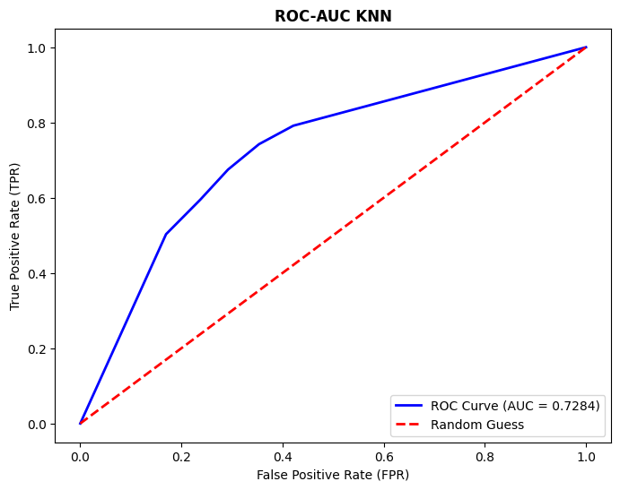
    


## 2. XGBoost


```python
model_xgb = xgb.XGBClassifier(objective='binary:logistic',random_state=42)
model_xgb.fit(X_train, y_train)
```


<style>#sk-container-id-2 {
  /* Definition of color scheme common for light and dark mode */
  --sklearn-color-text: #000;
  --sklearn-color-text-muted: #666;
  --sklearn-color-line: gray;
  /* Definition of color scheme for unfitted estimators */
  --sklearn-color-unfitted-level-0: #fff5e6;
  --sklearn-color-unfitted-level-1: #f6e4d2;
  --sklearn-color-unfitted-level-2: #ffe0b3;
  --sklearn-color-unfitted-level-3: chocolate;
  /* Definition of color scheme for fitted estimators */
  --sklearn-color-fitted-level-0: #f0f8ff;
  --sklearn-color-fitted-level-1: #d4ebff;
  --sklearn-color-fitted-level-2: #b3dbfd;
  --sklearn-color-fitted-level-3: cornflowerblue;

  /* Specific color for light theme */
  --sklearn-color-text-on-default-background: var(--sg-text-color, var(--theme-code-foreground, var(--jp-content-font-color1, black)));
  --sklearn-color-background: var(--sg-background-color, var(--theme-background, var(--jp-layout-color0, white)));
  --sklearn-color-border-box: var(--sg-text-color, var(--theme-code-foreground, var(--jp-content-font-color1, black)));
  --sklearn-color-icon: #696969;

  @media (prefers-color-scheme: dark) {
    /* Redefinition of color scheme for dark theme */
    --sklearn-color-text-on-default-background: var(--sg-text-color, var(--theme-code-foreground, var(--jp-content-font-color1, white)));
    --sklearn-color-background: var(--sg-background-color, var(--theme-background, var(--jp-layout-color0, #111)));
    --sklearn-color-border-box: var(--sg-text-color, var(--theme-code-foreground, var(--jp-content-font-color1, white)));
    --sklearn-color-icon: #878787;
  }
}

#sk-container-id-2 {
  color: var(--sklearn-color-text);
}

#sk-container-id-2 pre {
  padding: 0;
}

#sk-container-id-2 input.sk-hidden--visually {
  border: 0;
  clip: rect(1px 1px 1px 1px);
  clip: rect(1px, 1px, 1px, 1px);
  height: 1px;
  margin: -1px;
  overflow: hidden;
  padding: 0;
  position: absolute;
  width: 1px;
}

#sk-container-id-2 div.sk-dashed-wrapped {
  border: 1px dashed var(--sklearn-color-line);
  margin: 0 0.4em 0.5em 0.4em;
  box-sizing: border-box;
  padding-bottom: 0.4em;
  background-color: var(--sklearn-color-background);
}

#sk-container-id-2 div.sk-container {
  /* jupyter's `normalize.less` sets `[hidden] { display: none; }`
     but bootstrap.min.css set `[hidden] { display: none !important; }`
     so we also need the `!important` here to be able to override the
     default hidden behavior on the sphinx rendered scikit-learn.org.
     See: https://github.com/scikit-learn/scikit-learn/issues/21755 */
  display: inline-block !important;
  position: relative;
}

#sk-container-id-2 div.sk-text-repr-fallback {
  display: none;
}

div.sk-parallel-item,
div.sk-serial,
div.sk-item {
  /* draw centered vertical line to link estimators */
  background-image: linear-gradient(var(--sklearn-color-text-on-default-background), var(--sklearn-color-text-on-default-background));
  background-size: 2px 100%;
  background-repeat: no-repeat;
  background-position: center center;
}

/* Parallel-specific style estimator block */

#sk-container-id-2 div.sk-parallel-item::after {
  content: "";
  width: 100%;
  border-bottom: 2px solid var(--sklearn-color-text-on-default-background);
  flex-grow: 1;
}

#sk-container-id-2 div.sk-parallel {
  display: flex;
  align-items: stretch;
  justify-content: center;
  background-color: var(--sklearn-color-background);
  position: relative;
}

#sk-container-id-2 div.sk-parallel-item {
  display: flex;
  flex-direction: column;
}

#sk-container-id-2 div.sk-parallel-item:first-child::after {
  align-self: flex-end;
  width: 50%;
}

#sk-container-id-2 div.sk-parallel-item:last-child::after {
  align-self: flex-start;
  width: 50%;
}

#sk-container-id-2 div.sk-parallel-item:only-child::after {
  width: 0;
}

/* Serial-specific style estimator block */

#sk-container-id-2 div.sk-serial {
  display: flex;
  flex-direction: column;
  align-items: center;
  background-color: var(--sklearn-color-background);
  padding-right: 1em;
  padding-left: 1em;
}


/* Toggleable style: style used for estimator/Pipeline/ColumnTransformer box that is
clickable and can be expanded/collapsed.
- Pipeline and ColumnTransformer use this feature and define the default style
- Estimators will overwrite some part of the style using the `sk-estimator` class
*/

/* Pipeline and ColumnTransformer style (default) */

#sk-container-id-2 div.sk-toggleable {
  /* Default theme specific background. It is overwritten whether we have a
  specific estimator or a Pipeline/ColumnTransformer */
  background-color: var(--sklearn-color-background);
}

/* Toggleable label */
#sk-container-id-2 label.sk-toggleable__label {
  cursor: pointer;
  display: flex;
  width: 100%;
  margin-bottom: 0;
  padding: 0.5em;
  box-sizing: border-box;
  text-align: center;
  align-items: start;
  justify-content: space-between;
  gap: 0.5em;
}

#sk-container-id-2 label.sk-toggleable__label .caption {
  font-size: 0.6rem;
  font-weight: lighter;
  color: var(--sklearn-color-text-muted);
}

#sk-container-id-2 label.sk-toggleable__label-arrow:before {
  /* Arrow on the left of the label */
  content: "▸";
  float: left;
  margin-right: 0.25em;
  color: var(--sklearn-color-icon);
}

#sk-container-id-2 label.sk-toggleable__label-arrow:hover:before {
  color: var(--sklearn-color-text);
}

/* Toggleable content - dropdown */

#sk-container-id-2 div.sk-toggleable__content {
  max-height: 0;
  max-width: 0;
  overflow: hidden;
  text-align: left;
  /* unfitted */
  background-color: var(--sklearn-color-unfitted-level-0);
}

#sk-container-id-2 div.sk-toggleable__content.fitted {
  /* fitted */
  background-color: var(--sklearn-color-fitted-level-0);
}

#sk-container-id-2 div.sk-toggleable__content pre {
  margin: 0.2em;
  border-radius: 0.25em;
  color: var(--sklearn-color-text);
  /* unfitted */
  background-color: var(--sklearn-color-unfitted-level-0);
}

#sk-container-id-2 div.sk-toggleable__content.fitted pre {
  /* unfitted */
  background-color: var(--sklearn-color-fitted-level-0);
}

#sk-container-id-2 input.sk-toggleable__control:checked~div.sk-toggleable__content {
  /* Expand drop-down */
  max-height: 200px;
  max-width: 100%;
  overflow: auto;
}

#sk-container-id-2 input.sk-toggleable__control:checked~label.sk-toggleable__label-arrow:before {
  content: "▾";
}

/* Pipeline/ColumnTransformer-specific style */

#sk-container-id-2 div.sk-label input.sk-toggleable__control:checked~label.sk-toggleable__label {
  color: var(--sklearn-color-text);
  background-color: var(--sklearn-color-unfitted-level-2);
}

#sk-container-id-2 div.sk-label.fitted input.sk-toggleable__control:checked~label.sk-toggleable__label {
  background-color: var(--sklearn-color-fitted-level-2);
}

/* Estimator-specific style */

/* Colorize estimator box */
#sk-container-id-2 div.sk-estimator input.sk-toggleable__control:checked~label.sk-toggleable__label {
  /* unfitted */
  background-color: var(--sklearn-color-unfitted-level-2);
}

#sk-container-id-2 div.sk-estimator.fitted input.sk-toggleable__control:checked~label.sk-toggleable__label {
  /* fitted */
  background-color: var(--sklearn-color-fitted-level-2);
}

#sk-container-id-2 div.sk-label label.sk-toggleable__label,
#sk-container-id-2 div.sk-label label {
  /* The background is the default theme color */
  color: var(--sklearn-color-text-on-default-background);
}

/* On hover, darken the color of the background */
#sk-container-id-2 div.sk-label:hover label.sk-toggleable__label {
  color: var(--sklearn-color-text);
  background-color: var(--sklearn-color-unfitted-level-2);
}

/* Label box, darken color on hover, fitted */
#sk-container-id-2 div.sk-label.fitted:hover label.sk-toggleable__label.fitted {
  color: var(--sklearn-color-text);
  background-color: var(--sklearn-color-fitted-level-2);
}

/* Estimator label */

#sk-container-id-2 div.sk-label label {
  font-family: monospace;
  font-weight: bold;
  display: inline-block;
  line-height: 1.2em;
}

#sk-container-id-2 div.sk-label-container {
  text-align: center;
}

/* Estimator-specific */
#sk-container-id-2 div.sk-estimator {
  font-family: monospace;
  border: 1px dotted var(--sklearn-color-border-box);
  border-radius: 0.25em;
  box-sizing: border-box;
  margin-bottom: 0.5em;
  /* unfitted */
  background-color: var(--sklearn-color-unfitted-level-0);
}

#sk-container-id-2 div.sk-estimator.fitted {
  /* fitted */
  background-color: var(--sklearn-color-fitted-level-0);
}

/* on hover */
#sk-container-id-2 div.sk-estimator:hover {
  /* unfitted */
  background-color: var(--sklearn-color-unfitted-level-2);
}

#sk-container-id-2 div.sk-estimator.fitted:hover {
  /* fitted */
  background-color: var(--sklearn-color-fitted-level-2);
}

/* Specification for estimator info (e.g. "i" and "?") */

/* Common style for "i" and "?" */

.sk-estimator-doc-link,
a:link.sk-estimator-doc-link,
a:visited.sk-estimator-doc-link {
  float: right;
  font-size: smaller;
  line-height: 1em;
  font-family: monospace;
  background-color: var(--sklearn-color-background);
  border-radius: 1em;
  height: 1em;
  width: 1em;
  text-decoration: none !important;
  margin-left: 0.5em;
  text-align: center;
  /* unfitted */
  border: var(--sklearn-color-unfitted-level-1) 1pt solid;
  color: var(--sklearn-color-unfitted-level-1);
}

.sk-estimator-doc-link.fitted,
a:link.sk-estimator-doc-link.fitted,
a:visited.sk-estimator-doc-link.fitted {
  /* fitted */
  border: var(--sklearn-color-fitted-level-1) 1pt solid;
  color: var(--sklearn-color-fitted-level-1);
}

/* On hover */
div.sk-estimator:hover .sk-estimator-doc-link:hover,
.sk-estimator-doc-link:hover,
div.sk-label-container:hover .sk-estimator-doc-link:hover,
.sk-estimator-doc-link:hover {
  /* unfitted */
  background-color: var(--sklearn-color-unfitted-level-3);
  color: var(--sklearn-color-background);
  text-decoration: none;
}

div.sk-estimator.fitted:hover .sk-estimator-doc-link.fitted:hover,
.sk-estimator-doc-link.fitted:hover,
div.sk-label-container:hover .sk-estimator-doc-link.fitted:hover,
.sk-estimator-doc-link.fitted:hover {
  /* fitted */
  background-color: var(--sklearn-color-fitted-level-3);
  color: var(--sklearn-color-background);
  text-decoration: none;
}

/* Span, style for the box shown on hovering the info icon */
.sk-estimator-doc-link span {
  display: none;
  z-index: 9999;
  position: relative;
  font-weight: normal;
  right: .2ex;
  padding: .5ex;
  margin: .5ex;
  width: min-content;
  min-width: 20ex;
  max-width: 50ex;
  color: var(--sklearn-color-text);
  box-shadow: 2pt 2pt 4pt #999;
  /* unfitted */
  background: var(--sklearn-color-unfitted-level-0);
  border: .5pt solid var(--sklearn-color-unfitted-level-3);
}

.sk-estimator-doc-link.fitted span {
  /* fitted */
  background: var(--sklearn-color-fitted-level-0);
  border: var(--sklearn-color-fitted-level-3);
}

.sk-estimator-doc-link:hover span {
  display: block;
}

/* "?"-specific style due to the `<a>` HTML tag */

#sk-container-id-2 a.estimator_doc_link {
  float: right;
  font-size: 1rem;
  line-height: 1em;
  font-family: monospace;
  background-color: var(--sklearn-color-background);
  border-radius: 1rem;
  height: 1rem;
  width: 1rem;
  text-decoration: none;
  /* unfitted */
  color: var(--sklearn-color-unfitted-level-1);
  border: var(--sklearn-color-unfitted-level-1) 1pt solid;
}

#sk-container-id-2 a.estimator_doc_link.fitted {
  /* fitted */
  border: var(--sklearn-color-fitted-level-1) 1pt solid;
  color: var(--sklearn-color-fitted-level-1);
}

/* On hover */
#sk-container-id-2 a.estimator_doc_link:hover {
  /* unfitted */
  background-color: var(--sklearn-color-unfitted-level-3);
  color: var(--sklearn-color-background);
  text-decoration: none;
}

#sk-container-id-2 a.estimator_doc_link.fitted:hover {
  /* fitted */
  background-color: var(--sklearn-color-fitted-level-3);
}
</style><div id="sk-container-id-2" class="sk-top-container"><div class="sk-text-repr-fallback"><pre>XGBClassifier(base_score=None, booster=None, callbacks=None,
              colsample_bylevel=None, colsample_bynode=None,
              colsample_bytree=None, device=None, early_stopping_rounds=None,
              enable_categorical=False, eval_metric=None, feature_types=None,
              feature_weights=None, gamma=None, grow_policy=None,
              importance_type=None, interaction_constraints=None,
              learning_rate=None, max_bin=None, max_cat_threshold=None,
              max_cat_to_onehot=None, max_delta_step=None, max_depth=None,
              max_leaves=None, min_child_weight=None, missing=nan,
              monotone_constraints=None, multi_strategy=None, n_estimators=None,
              n_jobs=None, num_parallel_tree=None, ...)</pre><b>In a Jupyter environment, please rerun this cell to show the HTML representation or trust the notebook. <br />On GitHub, the HTML representation is unable to render, please try loading this page with nbviewer.org.</b></div><div class="sk-container" hidden><div class="sk-item"><div class="sk-estimator fitted sk-toggleable"><input class="sk-toggleable__control sk-hidden--visually" id="sk-estimator-id-2" type="checkbox" checked><label for="sk-estimator-id-2" class="sk-toggleable__label fitted sk-toggleable__label-arrow"><div><div>XGBClassifier</div></div><div><a class="sk-estimator-doc-link fitted" rel="noreferrer" target="_blank" href="https://xgboost.readthedocs.io/en/release_3.0.0/python/python_api.html#xgboost.XGBClassifier">?<span>Documentation for XGBClassifier</span></a><span class="sk-estimator-doc-link fitted">i<span>Fitted</span></span></div></label><div class="sk-toggleable__content fitted"><pre>XGBClassifier(base_score=None, booster=None, callbacks=None,
              colsample_bylevel=None, colsample_bynode=None,
              colsample_bytree=None, device=None, early_stopping_rounds=None,
              enable_categorical=False, eval_metric=None, feature_types=None,
              feature_weights=None, gamma=None, grow_policy=None,
              importance_type=None, interaction_constraints=None,
              learning_rate=None, max_bin=None, max_cat_threshold=None,
              max_cat_to_onehot=None, max_delta_step=None, max_depth=None,
              max_leaves=None, min_child_weight=None, missing=nan,
              monotone_constraints=None, multi_strategy=None, n_estimators=None,
              n_jobs=None, num_parallel_tree=None, ...)</pre></div> </div></div></div></div>


```python
model_xgb_pred = model_xgb.predict(X_test)
```


```python
print("Akurasi XGB: ", accuracy_score(y_test, model_xgb_pred))
```

    Akurasi XGB:  0.934640522875817
    


```python
accuracy_xgb = accuracy_score(y_test, model_xgb_pred)
precision_xgb = precision_score(y_test, model_xgb_pred)
recall_xgb = recall_score(y_test, model_xgb_pred)
f1_xgb = f1_score(y_test, model_xgb_pred)
roc_auc_xgb = roc_auc_score(y_test, model_xgb_pred)

print(f"Accuracy: {accuracy_xgb:.4f}")
print(f"Recall: {recall_xgb:.4f}")
print(f"Precision: {precision_xgb:.4f}")
print(f"F1-Score: {f1_xgb:.4f}")
```

    Accuracy: 0.9346
    Recall: 0.8528
    Precision: 0.7128
    F1-Score: 0.7765
    


```python
print("Classification Report XGBoost\n")
print(classification_report(y_test, model_xgb_pred))
```

    Classification Report XGBoost
    
                  precision    recall  f1-score   support
    
               0       0.98      0.95      0.96      1061
               1       0.71      0.85      0.78       163
    
        accuracy                           0.93      1224
       macro avg       0.84      0.90      0.87      1224
    weighted avg       0.94      0.93      0.94      1224
    
    


```python
from sklearn.metrics import confusion_matrix
tn_xgb, fp_xgb, fn_xgb, tp_xgb = confusion_matrix(y_test, model_xgb_pred).ravel()

# Hitung spesifisitas
specificity_xgb = tn_xgb / (tn_xgb + fp_xgb)
sensitiviy_xgb = tp_xgb / (tp_xgb + fn_xgb)
```


```python
print(f"True Negative (TN): {tn_xgb}")
print(f"False Positive (FP): {fp_xgb}")
print(f"Spesifisitas: {specificity_xgb:.4f}")
```

    True Negative (TN): 1005
    False Positive (FP): 56
    Spesifisitas: 0.9472
    


```python
print(f"True Positive (TN): {tp_xgb}")
print(f"False Negative (FP): {fn_xgb}")
print(f"Sensitivitas: {sensitiviy_xgb:.4f}")
```

    True Positive (TN): 139
    False Negative (FP): 24
    Sensitivitas: 0.8528
    


```python
from sklearn.metrics import roc_auc_score, roc_curve
y_pred_proba_xgb = model_xgb.predict_proba(X_test)[:, 1]  # Probabilitas kelas positif
roc_auc_xgb = roc_auc_score(y_test, y_pred_proba_xgb)
pr_auc_xgb = average_precision_score(y_test, y_pred_proba_xgb)
print(f"ROC-AUC Score: {roc_auc_xgb:.4f}")
print(f"PR-AUC Score: {pr_auc_xgb:.4f}")
```

    ROC-AUC Score: 0.9564
    PR-AUC Score: 0.8703
    


```python
fpr_xgb, tpr_xgb, thresholds_xgb = roc_curve(y_test, y_pred_proba_xgb)

# Visualisasi kurva ROC
plt.figure(figsize=(8, 6))
plt.plot(fpr_xgb, tpr_xgb, color='blue', lw=2, label=f'ROC Curve (AUC = {roc_auc_xgb:.4f})')
plt.plot([0, 1], [0, 1], color='red', lw=2, linestyle='--', label='Random Guess')
plt.xlabel('False Positive Rate (FPR)')
plt.ylabel('True Positive Rate (TPR)')
plt.title('ROC-AUC XGBoost', fontweight='bold')
plt.legend(loc='lower right')
plt.savefig('ROC-AUC_XGBoost_tanpa_HYP.png', dpi=400)
plt.show()
```


    
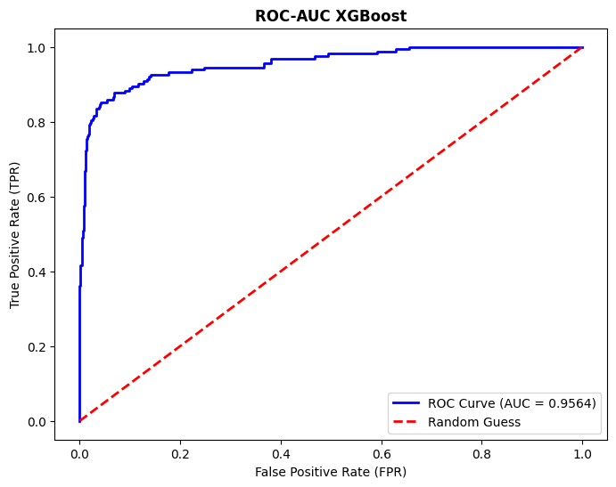
    


## 3. SVM


```python
from sklearn.svm import SVC
model_svm = SVC(probability=True, random_state=42)
model_svm.fit(X_train, y_train)
```


<style>#sk-container-id-3 {
  /* Definition of color scheme common for light and dark mode */
  --sklearn-color-text: #000;
  --sklearn-color-text-muted: #666;
  --sklearn-color-line: gray;
  /* Definition of color scheme for unfitted estimators */
  --sklearn-color-unfitted-level-0: #fff5e6;
  --sklearn-color-unfitted-level-1: #f6e4d2;
  --sklearn-color-unfitted-level-2: #ffe0b3;
  --sklearn-color-unfitted-level-3: chocolate;
  /* Definition of color scheme for fitted estimators */
  --sklearn-color-fitted-level-0: #f0f8ff;
  --sklearn-color-fitted-level-1: #d4ebff;
  --sklearn-color-fitted-level-2: #b3dbfd;
  --sklearn-color-fitted-level-3: cornflowerblue;

  /* Specific color for light theme */
  --sklearn-color-text-on-default-background: var(--sg-text-color, var(--theme-code-foreground, var(--jp-content-font-color1, black)));
  --sklearn-color-background: var(--sg-background-color, var(--theme-background, var(--jp-layout-color0, white)));
  --sklearn-color-border-box: var(--sg-text-color, var(--theme-code-foreground, var(--jp-content-font-color1, black)));
  --sklearn-color-icon: #696969;

  @media (prefers-color-scheme: dark) {
    /* Redefinition of color scheme for dark theme */
    --sklearn-color-text-on-default-background: var(--sg-text-color, var(--theme-code-foreground, var(--jp-content-font-color1, white)));
    --sklearn-color-background: var(--sg-background-color, var(--theme-background, var(--jp-layout-color0, #111)));
    --sklearn-color-border-box: var(--sg-text-color, var(--theme-code-foreground, var(--jp-content-font-color1, white)));
    --sklearn-color-icon: #878787;
  }
}

#sk-container-id-3 {
  color: var(--sklearn-color-text);
}

#sk-container-id-3 pre {
  padding: 0;
}

#sk-container-id-3 input.sk-hidden--visually {
  border: 0;
  clip: rect(1px 1px 1px 1px);
  clip: rect(1px, 1px, 1px, 1px);
  height: 1px;
  margin: -1px;
  overflow: hidden;
  padding: 0;
  position: absolute;
  width: 1px;
}

#sk-container-id-3 div.sk-dashed-wrapped {
  border: 1px dashed var(--sklearn-color-line);
  margin: 0 0.4em 0.5em 0.4em;
  box-sizing: border-box;
  padding-bottom: 0.4em;
  background-color: var(--sklearn-color-background);
}

#sk-container-id-3 div.sk-container {
  /* jupyter's `normalize.less` sets `[hidden] { display: none; }`
     but bootstrap.min.css set `[hidden] { display: none !important; }`
     so we also need the `!important` here to be able to override the
     default hidden behavior on the sphinx rendered scikit-learn.org.
     See: https://github.com/scikit-learn/scikit-learn/issues/21755 */
  display: inline-block !important;
  position: relative;
}

#sk-container-id-3 div.sk-text-repr-fallback {
  display: none;
}

div.sk-parallel-item,
div.sk-serial,
div.sk-item {
  /* draw centered vertical line to link estimators */
  background-image: linear-gradient(var(--sklearn-color-text-on-default-background), var(--sklearn-color-text-on-default-background));
  background-size: 2px 100%;
  background-repeat: no-repeat;
  background-position: center center;
}

/* Parallel-specific style estimator block */

#sk-container-id-3 div.sk-parallel-item::after {
  content: "";
  width: 100%;
  border-bottom: 2px solid var(--sklearn-color-text-on-default-background);
  flex-grow: 1;
}

#sk-container-id-3 div.sk-parallel {
  display: flex;
  align-items: stretch;
  justify-content: center;
  background-color: var(--sklearn-color-background);
  position: relative;
}

#sk-container-id-3 div.sk-parallel-item {
  display: flex;
  flex-direction: column;
}

#sk-container-id-3 div.sk-parallel-item:first-child::after {
  align-self: flex-end;
  width: 50%;
}

#sk-container-id-3 div.sk-parallel-item:last-child::after {
  align-self: flex-start;
  width: 50%;
}

#sk-container-id-3 div.sk-parallel-item:only-child::after {
  width: 0;
}

/* Serial-specific style estimator block */

#sk-container-id-3 div.sk-serial {
  display: flex;
  flex-direction: column;
  align-items: center;
  background-color: var(--sklearn-color-background);
  padding-right: 1em;
  padding-left: 1em;
}


/* Toggleable style: style used for estimator/Pipeline/ColumnTransformer box that is
clickable and can be expanded/collapsed.
- Pipeline and ColumnTransformer use this feature and define the default style
- Estimators will overwrite some part of the style using the `sk-estimator` class
*/

/* Pipeline and ColumnTransformer style (default) */

#sk-container-id-3 div.sk-toggleable {
  /* Default theme specific background. It is overwritten whether we have a
  specific estimator or a Pipeline/ColumnTransformer */
  background-color: var(--sklearn-color-background);
}

/* Toggleable label */
#sk-container-id-3 label.sk-toggleable__label {
  cursor: pointer;
  display: flex;
  width: 100%;
  margin-bottom: 0;
  padding: 0.5em;
  box-sizing: border-box;
  text-align: center;
  align-items: start;
  justify-content: space-between;
  gap: 0.5em;
}

#sk-container-id-3 label.sk-toggleable__label .caption {
  font-size: 0.6rem;
  font-weight: lighter;
  color: var(--sklearn-color-text-muted);
}

#sk-container-id-3 label.sk-toggleable__label-arrow:before {
  /* Arrow on the left of the label */
  content: "▸";
  float: left;
  margin-right: 0.25em;
  color: var(--sklearn-color-icon);
}

#sk-container-id-3 label.sk-toggleable__label-arrow:hover:before {
  color: var(--sklearn-color-text);
}

/* Toggleable content - dropdown */

#sk-container-id-3 div.sk-toggleable__content {
  max-height: 0;
  max-width: 0;
  overflow: hidden;
  text-align: left;
  /* unfitted */
  background-color: var(--sklearn-color-unfitted-level-0);
}

#sk-container-id-3 div.sk-toggleable__content.fitted {
  /* fitted */
  background-color: var(--sklearn-color-fitted-level-0);
}

#sk-container-id-3 div.sk-toggleable__content pre {
  margin: 0.2em;
  border-radius: 0.25em;
  color: var(--sklearn-color-text);
  /* unfitted */
  background-color: var(--sklearn-color-unfitted-level-0);
}

#sk-container-id-3 div.sk-toggleable__content.fitted pre {
  /* unfitted */
  background-color: var(--sklearn-color-fitted-level-0);
}

#sk-container-id-3 input.sk-toggleable__control:checked~div.sk-toggleable__content {
  /* Expand drop-down */
  max-height: 200px;
  max-width: 100%;
  overflow: auto;
}

#sk-container-id-3 input.sk-toggleable__control:checked~label.sk-toggleable__label-arrow:before {
  content: "▾";
}

/* Pipeline/ColumnTransformer-specific style */

#sk-container-id-3 div.sk-label input.sk-toggleable__control:checked~label.sk-toggleable__label {
  color: var(--sklearn-color-text);
  background-color: var(--sklearn-color-unfitted-level-2);
}

#sk-container-id-3 div.sk-label.fitted input.sk-toggleable__control:checked~label.sk-toggleable__label {
  background-color: var(--sklearn-color-fitted-level-2);
}

/* Estimator-specific style */

/* Colorize estimator box */
#sk-container-id-3 div.sk-estimator input.sk-toggleable__control:checked~label.sk-toggleable__label {
  /* unfitted */
  background-color: var(--sklearn-color-unfitted-level-2);
}

#sk-container-id-3 div.sk-estimator.fitted input.sk-toggleable__control:checked~label.sk-toggleable__label {
  /* fitted */
  background-color: var(--sklearn-color-fitted-level-2);
}

#sk-container-id-3 div.sk-label label.sk-toggleable__label,
#sk-container-id-3 div.sk-label label {
  /* The background is the default theme color */
  color: var(--sklearn-color-text-on-default-background);
}

/* On hover, darken the color of the background */
#sk-container-id-3 div.sk-label:hover label.sk-toggleable__label {
  color: var(--sklearn-color-text);
  background-color: var(--sklearn-color-unfitted-level-2);
}

/* Label box, darken color on hover, fitted */
#sk-container-id-3 div.sk-label.fitted:hover label.sk-toggleable__label.fitted {
  color: var(--sklearn-color-text);
  background-color: var(--sklearn-color-fitted-level-2);
}

/* Estimator label */

#sk-container-id-3 div.sk-label label {
  font-family: monospace;
  font-weight: bold;
  display: inline-block;
  line-height: 1.2em;
}

#sk-container-id-3 div.sk-label-container {
  text-align: center;
}

/* Estimator-specific */
#sk-container-id-3 div.sk-estimator {
  font-family: monospace;
  border: 1px dotted var(--sklearn-color-border-box);
  border-radius: 0.25em;
  box-sizing: border-box;
  margin-bottom: 0.5em;
  /* unfitted */
  background-color: var(--sklearn-color-unfitted-level-0);
}

#sk-container-id-3 div.sk-estimator.fitted {
  /* fitted */
  background-color: var(--sklearn-color-fitted-level-0);
}

/* on hover */
#sk-container-id-3 div.sk-estimator:hover {
  /* unfitted */
  background-color: var(--sklearn-color-unfitted-level-2);
}

#sk-container-id-3 div.sk-estimator.fitted:hover {
  /* fitted */
  background-color: var(--sklearn-color-fitted-level-2);
}

/* Specification for estimator info (e.g. "i" and "?") */

/* Common style for "i" and "?" */

.sk-estimator-doc-link,
a:link.sk-estimator-doc-link,
a:visited.sk-estimator-doc-link {
  float: right;
  font-size: smaller;
  line-height: 1em;
  font-family: monospace;
  background-color: var(--sklearn-color-background);
  border-radius: 1em;
  height: 1em;
  width: 1em;
  text-decoration: none !important;
  margin-left: 0.5em;
  text-align: center;
  /* unfitted */
  border: var(--sklearn-color-unfitted-level-1) 1pt solid;
  color: var(--sklearn-color-unfitted-level-1);
}

.sk-estimator-doc-link.fitted,
a:link.sk-estimator-doc-link.fitted,
a:visited.sk-estimator-doc-link.fitted {
  /* fitted */
  border: var(--sklearn-color-fitted-level-1) 1pt solid;
  color: var(--sklearn-color-fitted-level-1);
}

/* On hover */
div.sk-estimator:hover .sk-estimator-doc-link:hover,
.sk-estimator-doc-link:hover,
div.sk-label-container:hover .sk-estimator-doc-link:hover,
.sk-estimator-doc-link:hover {
  /* unfitted */
  background-color: var(--sklearn-color-unfitted-level-3);
  color: var(--sklearn-color-background);
  text-decoration: none;
}

div.sk-estimator.fitted:hover .sk-estimator-doc-link.fitted:hover,
.sk-estimator-doc-link.fitted:hover,
div.sk-label-container:hover .sk-estimator-doc-link.fitted:hover,
.sk-estimator-doc-link.fitted:hover {
  /* fitted */
  background-color: var(--sklearn-color-fitted-level-3);
  color: var(--sklearn-color-background);
  text-decoration: none;
}

/* Span, style for the box shown on hovering the info icon */
.sk-estimator-doc-link span {
  display: none;
  z-index: 9999;
  position: relative;
  font-weight: normal;
  right: .2ex;
  padding: .5ex;
  margin: .5ex;
  width: min-content;
  min-width: 20ex;
  max-width: 50ex;
  color: var(--sklearn-color-text);
  box-shadow: 2pt 2pt 4pt #999;
  /* unfitted */
  background: var(--sklearn-color-unfitted-level-0);
  border: .5pt solid var(--sklearn-color-unfitted-level-3);
}

.sk-estimator-doc-link.fitted span {
  /* fitted */
  background: var(--sklearn-color-fitted-level-0);
  border: var(--sklearn-color-fitted-level-3);
}

.sk-estimator-doc-link:hover span {
  display: block;
}

/* "?"-specific style due to the `<a>` HTML tag */

#sk-container-id-3 a.estimator_doc_link {
  float: right;
  font-size: 1rem;
  line-height: 1em;
  font-family: monospace;
  background-color: var(--sklearn-color-background);
  border-radius: 1rem;
  height: 1rem;
  width: 1rem;
  text-decoration: none;
  /* unfitted */
  color: var(--sklearn-color-unfitted-level-1);
  border: var(--sklearn-color-unfitted-level-1) 1pt solid;
}

#sk-container-id-3 a.estimator_doc_link.fitted {
  /* fitted */
  border: var(--sklearn-color-fitted-level-1) 1pt solid;
  color: var(--sklearn-color-fitted-level-1);
}

/* On hover */
#sk-container-id-3 a.estimator_doc_link:hover {
  /* unfitted */
  background-color: var(--sklearn-color-unfitted-level-3);
  color: var(--sklearn-color-background);
  text-decoration: none;
}

#sk-container-id-3 a.estimator_doc_link.fitted:hover {
  /* fitted */
  background-color: var(--sklearn-color-fitted-level-3);
}
</style><div id="sk-container-id-3" class="sk-top-container"><div class="sk-text-repr-fallback"><pre>SVC(probability=True, random_state=42)</pre><b>In a Jupyter environment, please rerun this cell to show the HTML representation or trust the notebook. <br />On GitHub, the HTML representation is unable to render, please try loading this page with nbviewer.org.</b></div><div class="sk-container" hidden><div class="sk-item"><div class="sk-estimator fitted sk-toggleable"><input class="sk-toggleable__control sk-hidden--visually" id="sk-estimator-id-3" type="checkbox" checked><label for="sk-estimator-id-3" class="sk-toggleable__label fitted sk-toggleable__label-arrow"><div><div>SVC</div></div><div><a class="sk-estimator-doc-link fitted" rel="noreferrer" target="_blank" href="https://scikit-learn.org/1.6/modules/generated/sklearn.svm.SVC.html">?<span>Documentation for SVC</span></a><span class="sk-estimator-doc-link fitted">i<span>Fitted</span></span></div></label><div class="sk-toggleable__content fitted"><pre>SVC(probability=True, random_state=42)</pre></div> </div></div></div></div>


```python
model_svm_pred = model_svm.predict(X_test)
```


```python
print("Akurasi SVM: ", accuracy_score(y_test, model_svm_pred))
```

    Akurasi SVM:  0.8178104575163399
    


```python
accuracy_svm = accuracy_score(y_test, model_svm_pred)
precision_svm = precision_score(y_test, model_svm_pred)
recall_svm = recall_score(y_test, model_svm_pred)
f1_svm = f1_score(y_test, model_svm_pred)
roc_auc_svm = roc_auc_score(y_test, model_svm_pred)

print(f"Accuracy: {accuracy_svm:.4f}")
print(f"Recall: {recall_svm:.4f}")
print(f"Precision: {precision_svm:.4f}")
print(f"F1-Score: {f1_svm:.4f}")
```

    Accuracy: 0.8178
    Recall: 0.8344
    Precision: 0.4096
    F1-Score: 0.5495
    


```python
print("Akurasi SVM: ", accuracy_score(y_test, model_svm_pred))
```

    Akurasi SVM:  0.8178104575163399
    


```python
print("Classification Report SVM\n")
print(classification_report(y_test, model_svm_pred))
```

    Classification Report SVM
    
                  precision    recall  f1-score   support
    
               0       0.97      0.82      0.89      1061
               1       0.41      0.83      0.55       163
    
        accuracy                           0.82      1224
       macro avg       0.69      0.82      0.72      1224
    weighted avg       0.90      0.82      0.84      1224
    
    


```python
from sklearn.metrics import confusion_matrix
tn_svm, fp_svm, fn_svm, tp_svm = confusion_matrix(y_test, model_svm_pred).ravel()

# Hitung spesifisitas
specificity_svm = tn_svm / (tn_svm + fp_svm)
sensitiviy_svm = tp_svm / (tp_svm + fn_svm)
```


```python
print(f"True Negative (TN): {tn_svm}")
print(f"False Positive (FP): {fp_svm}")
print(f"Spesifisitas: {specificity_svm:.4f}")
```

    True Negative (TN): 865
    False Positive (FP): 196
    Spesifisitas: 0.8153
    


```python
print(f"True Positive (TN): {tp_svm}")
print(f"False Negative (FP): {fn_svm}")
print(f"Sensitivitas: {sensitiviy_svm:.4f}")
```

    True Positive (TN): 136
    False Negative (FP): 27
    Sensitivitas: 0.8344
    


```python
from sklearn.metrics import roc_auc_score, roc_curve
y_pred_proba_svm = model_svm.predict_proba(X_test)[:, 1]  # Probabilitas kelas positif
roc_auc_svm = roc_auc_score(y_test, y_pred_proba_svm)
pr_auc_svm = average_precision_score(y_test, y_pred_proba_svm)
print(f"ROC-AUC Score: {roc_auc_svm:.4f}")
print(f"PR-AUC Score: {pr_auc_svm:.4f}")
```

    ROC-AUC Score: 0.9110
    PR-AUC Score: 0.7134
    


```python
fpr_svm, tpr_svm, thresholds_svm = roc_curve(y_test, y_pred_proba_svm)

# Visualisasi kurva ROC
plt.figure(figsize=(8, 6))
plt.plot(fpr_svm, tpr_svm, color='blue', lw=2, label=f'ROC Curve (AUC = {roc_auc_svm:.4f})')
plt.plot([0, 1], [0, 1], color='red', lw=2, linestyle='--', label='Random Guess')
plt.xlabel('False Positive Rate (FPR)')
plt.ylabel('True Positive Rate (TPR)')
plt.title('ROC-AUC SVM', fontweight='bold')
plt.legend(loc='lower right')
plt.savefig('ROC-AUC_SVM_tanpa_HYP.png', dpi=400)
plt.show()
```


    
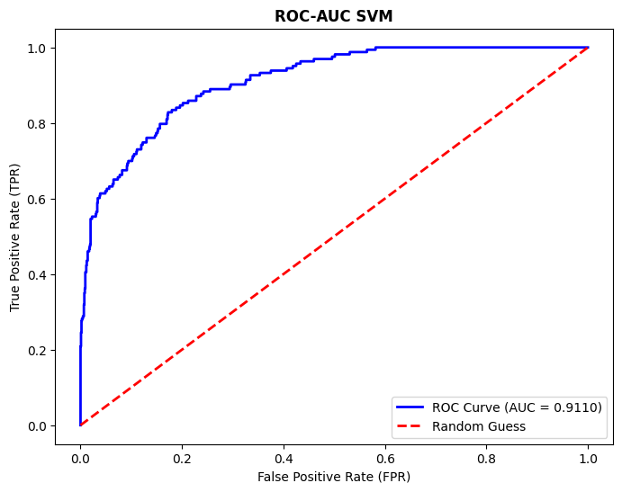
    


## 4. Random Forest


```python
from sklearn.ensemble import RandomForestClassifier
```


```python
model_rf = RandomForestClassifier(random_state=42)
model_rf.fit(X_train, y_train)
```


<style>#sk-container-id-4 {
  /* Definition of color scheme common for light and dark mode */
  --sklearn-color-text: #000;
  --sklearn-color-text-muted: #666;
  --sklearn-color-line: gray;
  /* Definition of color scheme for unfitted estimators */
  --sklearn-color-unfitted-level-0: #fff5e6;
  --sklearn-color-unfitted-level-1: #f6e4d2;
  --sklearn-color-unfitted-level-2: #ffe0b3;
  --sklearn-color-unfitted-level-3: chocolate;
  /* Definition of color scheme for fitted estimators */
  --sklearn-color-fitted-level-0: #f0f8ff;
  --sklearn-color-fitted-level-1: #d4ebff;
  --sklearn-color-fitted-level-2: #b3dbfd;
  --sklearn-color-fitted-level-3: cornflowerblue;

  /* Specific color for light theme */
  --sklearn-color-text-on-default-background: var(--sg-text-color, var(--theme-code-foreground, var(--jp-content-font-color1, black)));
  --sklearn-color-background: var(--sg-background-color, var(--theme-background, var(--jp-layout-color0, white)));
  --sklearn-color-border-box: var(--sg-text-color, var(--theme-code-foreground, var(--jp-content-font-color1, black)));
  --sklearn-color-icon: #696969;

  @media (prefers-color-scheme: dark) {
    /* Redefinition of color scheme for dark theme */
    --sklearn-color-text-on-default-background: var(--sg-text-color, var(--theme-code-foreground, var(--jp-content-font-color1, white)));
    --sklearn-color-background: var(--sg-background-color, var(--theme-background, var(--jp-layout-color0, #111)));
    --sklearn-color-border-box: var(--sg-text-color, var(--theme-code-foreground, var(--jp-content-font-color1, white)));
    --sklearn-color-icon: #878787;
  }
}

#sk-container-id-4 {
  color: var(--sklearn-color-text);
}

#sk-container-id-4 pre {
  padding: 0;
}

#sk-container-id-4 input.sk-hidden--visually {
  border: 0;
  clip: rect(1px 1px 1px 1px);
  clip: rect(1px, 1px, 1px, 1px);
  height: 1px;
  margin: -1px;
  overflow: hidden;
  padding: 0;
  position: absolute;
  width: 1px;
}

#sk-container-id-4 div.sk-dashed-wrapped {
  border: 1px dashed var(--sklearn-color-line);
  margin: 0 0.4em 0.5em 0.4em;
  box-sizing: border-box;
  padding-bottom: 0.4em;
  background-color: var(--sklearn-color-background);
}

#sk-container-id-4 div.sk-container {
  /* jupyter's `normalize.less` sets `[hidden] { display: none; }`
     but bootstrap.min.css set `[hidden] { display: none !important; }`
     so we also need the `!important` here to be able to override the
     default hidden behavior on the sphinx rendered scikit-learn.org.
     See: https://github.com/scikit-learn/scikit-learn/issues/21755 */
  display: inline-block !important;
  position: relative;
}

#sk-container-id-4 div.sk-text-repr-fallback {
  display: none;
}

div.sk-parallel-item,
div.sk-serial,
div.sk-item {
  /* draw centered vertical line to link estimators */
  background-image: linear-gradient(var(--sklearn-color-text-on-default-background), var(--sklearn-color-text-on-default-background));
  background-size: 2px 100%;
  background-repeat: no-repeat;
  background-position: center center;
}

/* Parallel-specific style estimator block */

#sk-container-id-4 div.sk-parallel-item::after {
  content: "";
  width: 100%;
  border-bottom: 2px solid var(--sklearn-color-text-on-default-background);
  flex-grow: 1;
}

#sk-container-id-4 div.sk-parallel {
  display: flex;
  align-items: stretch;
  justify-content: center;
  background-color: var(--sklearn-color-background);
  position: relative;
}

#sk-container-id-4 div.sk-parallel-item {
  display: flex;
  flex-direction: column;
}

#sk-container-id-4 div.sk-parallel-item:first-child::after {
  align-self: flex-end;
  width: 50%;
}

#sk-container-id-4 div.sk-parallel-item:last-child::after {
  align-self: flex-start;
  width: 50%;
}

#sk-container-id-4 div.sk-parallel-item:only-child::after {
  width: 0;
}

/* Serial-specific style estimator block */

#sk-container-id-4 div.sk-serial {
  display: flex;
  flex-direction: column;
  align-items: center;
  background-color: var(--sklearn-color-background);
  padding-right: 1em;
  padding-left: 1em;
}


/* Toggleable style: style used for estimator/Pipeline/ColumnTransformer box that is
clickable and can be expanded/collapsed.
- Pipeline and ColumnTransformer use this feature and define the default style
- Estimators will overwrite some part of the style using the `sk-estimator` class
*/

/* Pipeline and ColumnTransformer style (default) */

#sk-container-id-4 div.sk-toggleable {
  /* Default theme specific background. It is overwritten whether we have a
  specific estimator or a Pipeline/ColumnTransformer */
  background-color: var(--sklearn-color-background);
}

/* Toggleable label */
#sk-container-id-4 label.sk-toggleable__label {
  cursor: pointer;
  display: flex;
  width: 100%;
  margin-bottom: 0;
  padding: 0.5em;
  box-sizing: border-box;
  text-align: center;
  align-items: start;
  justify-content: space-between;
  gap: 0.5em;
}

#sk-container-id-4 label.sk-toggleable__label .caption {
  font-size: 0.6rem;
  font-weight: lighter;
  color: var(--sklearn-color-text-muted);
}

#sk-container-id-4 label.sk-toggleable__label-arrow:before {
  /* Arrow on the left of the label */
  content: "▸";
  float: left;
  margin-right: 0.25em;
  color: var(--sklearn-color-icon);
}

#sk-container-id-4 label.sk-toggleable__label-arrow:hover:before {
  color: var(--sklearn-color-text);
}

/* Toggleable content - dropdown */

#sk-container-id-4 div.sk-toggleable__content {
  max-height: 0;
  max-width: 0;
  overflow: hidden;
  text-align: left;
  /* unfitted */
  background-color: var(--sklearn-color-unfitted-level-0);
}

#sk-container-id-4 div.sk-toggleable__content.fitted {
  /* fitted */
  background-color: var(--sklearn-color-fitted-level-0);
}

#sk-container-id-4 div.sk-toggleable__content pre {
  margin: 0.2em;
  border-radius: 0.25em;
  color: var(--sklearn-color-text);
  /* unfitted */
  background-color: var(--sklearn-color-unfitted-level-0);
}

#sk-container-id-4 div.sk-toggleable__content.fitted pre {
  /* unfitted */
  background-color: var(--sklearn-color-fitted-level-0);
}

#sk-container-id-4 input.sk-toggleable__control:checked~div.sk-toggleable__content {
  /* Expand drop-down */
  max-height: 200px;
  max-width: 100%;
  overflow: auto;
}

#sk-container-id-4 input.sk-toggleable__control:checked~label.sk-toggleable__label-arrow:before {
  content: "▾";
}

/* Pipeline/ColumnTransformer-specific style */

#sk-container-id-4 div.sk-label input.sk-toggleable__control:checked~label.sk-toggleable__label {
  color: var(--sklearn-color-text);
  background-color: var(--sklearn-color-unfitted-level-2);
}

#sk-container-id-4 div.sk-label.fitted input.sk-toggleable__control:checked~label.sk-toggleable__label {
  background-color: var(--sklearn-color-fitted-level-2);
}

/* Estimator-specific style */

/* Colorize estimator box */
#sk-container-id-4 div.sk-estimator input.sk-toggleable__control:checked~label.sk-toggleable__label {
  /* unfitted */
  background-color: var(--sklearn-color-unfitted-level-2);
}

#sk-container-id-4 div.sk-estimator.fitted input.sk-toggleable__control:checked~label.sk-toggleable__label {
  /* fitted */
  background-color: var(--sklearn-color-fitted-level-2);
}

#sk-container-id-4 div.sk-label label.sk-toggleable__label,
#sk-container-id-4 div.sk-label label {
  /* The background is the default theme color */
  color: var(--sklearn-color-text-on-default-background);
}

/* On hover, darken the color of the background */
#sk-container-id-4 div.sk-label:hover label.sk-toggleable__label {
  color: var(--sklearn-color-text);
  background-color: var(--sklearn-color-unfitted-level-2);
}

/* Label box, darken color on hover, fitted */
#sk-container-id-4 div.sk-label.fitted:hover label.sk-toggleable__label.fitted {
  color: var(--sklearn-color-text);
  background-color: var(--sklearn-color-fitted-level-2);
}

/* Estimator label */

#sk-container-id-4 div.sk-label label {
  font-family: monospace;
  font-weight: bold;
  display: inline-block;
  line-height: 1.2em;
}

#sk-container-id-4 div.sk-label-container {
  text-align: center;
}

/* Estimator-specific */
#sk-container-id-4 div.sk-estimator {
  font-family: monospace;
  border: 1px dotted var(--sklearn-color-border-box);
  border-radius: 0.25em;
  box-sizing: border-box;
  margin-bottom: 0.5em;
  /* unfitted */
  background-color: var(--sklearn-color-unfitted-level-0);
}

#sk-container-id-4 div.sk-estimator.fitted {
  /* fitted */
  background-color: var(--sklearn-color-fitted-level-0);
}

/* on hover */
#sk-container-id-4 div.sk-estimator:hover {
  /* unfitted */
  background-color: var(--sklearn-color-unfitted-level-2);
}

#sk-container-id-4 div.sk-estimator.fitted:hover {
  /* fitted */
  background-color: var(--sklearn-color-fitted-level-2);
}

/* Specification for estimator info (e.g. "i" and "?") */

/* Common style for "i" and "?" */

.sk-estimator-doc-link,
a:link.sk-estimator-doc-link,
a:visited.sk-estimator-doc-link {
  float: right;
  font-size: smaller;
  line-height: 1em;
  font-family: monospace;
  background-color: var(--sklearn-color-background);
  border-radius: 1em;
  height: 1em;
  width: 1em;
  text-decoration: none !important;
  margin-left: 0.5em;
  text-align: center;
  /* unfitted */
  border: var(--sklearn-color-unfitted-level-1) 1pt solid;
  color: var(--sklearn-color-unfitted-level-1);
}

.sk-estimator-doc-link.fitted,
a:link.sk-estimator-doc-link.fitted,
a:visited.sk-estimator-doc-link.fitted {
  /* fitted */
  border: var(--sklearn-color-fitted-level-1) 1pt solid;
  color: var(--sklearn-color-fitted-level-1);
}

/* On hover */
div.sk-estimator:hover .sk-estimator-doc-link:hover,
.sk-estimator-doc-link:hover,
div.sk-label-container:hover .sk-estimator-doc-link:hover,
.sk-estimator-doc-link:hover {
  /* unfitted */
  background-color: var(--sklearn-color-unfitted-level-3);
  color: var(--sklearn-color-background);
  text-decoration: none;
}

div.sk-estimator.fitted:hover .sk-estimator-doc-link.fitted:hover,
.sk-estimator-doc-link.fitted:hover,
div.sk-label-container:hover .sk-estimator-doc-link.fitted:hover,
.sk-estimator-doc-link.fitted:hover {
  /* fitted */
  background-color: var(--sklearn-color-fitted-level-3);
  color: var(--sklearn-color-background);
  text-decoration: none;
}

/* Span, style for the box shown on hovering the info icon */
.sk-estimator-doc-link span {
  display: none;
  z-index: 9999;
  position: relative;
  font-weight: normal;
  right: .2ex;
  padding: .5ex;
  margin: .5ex;
  width: min-content;
  min-width: 20ex;
  max-width: 50ex;
  color: var(--sklearn-color-text);
  box-shadow: 2pt 2pt 4pt #999;
  /* unfitted */
  background: var(--sklearn-color-unfitted-level-0);
  border: .5pt solid var(--sklearn-color-unfitted-level-3);
}

.sk-estimator-doc-link.fitted span {
  /* fitted */
  background: var(--sklearn-color-fitted-level-0);
  border: var(--sklearn-color-fitted-level-3);
}

.sk-estimator-doc-link:hover span {
  display: block;
}

/* "?"-specific style due to the `<a>` HTML tag */

#sk-container-id-4 a.estimator_doc_link {
  float: right;
  font-size: 1rem;
  line-height: 1em;
  font-family: monospace;
  background-color: var(--sklearn-color-background);
  border-radius: 1rem;
  height: 1rem;
  width: 1rem;
  text-decoration: none;
  /* unfitted */
  color: var(--sklearn-color-unfitted-level-1);
  border: var(--sklearn-color-unfitted-level-1) 1pt solid;
}

#sk-container-id-4 a.estimator_doc_link.fitted {
  /* fitted */
  border: var(--sklearn-color-fitted-level-1) 1pt solid;
  color: var(--sklearn-color-fitted-level-1);
}

/* On hover */
#sk-container-id-4 a.estimator_doc_link:hover {
  /* unfitted */
  background-color: var(--sklearn-color-unfitted-level-3);
  color: var(--sklearn-color-background);
  text-decoration: none;
}

#sk-container-id-4 a.estimator_doc_link.fitted:hover {
  /* fitted */
  background-color: var(--sklearn-color-fitted-level-3);
}
</style><div id="sk-container-id-4" class="sk-top-container"><div class="sk-text-repr-fallback"><pre>RandomForestClassifier(random_state=42)</pre><b>In a Jupyter environment, please rerun this cell to show the HTML representation or trust the notebook. <br />On GitHub, the HTML representation is unable to render, please try loading this page with nbviewer.org.</b></div><div class="sk-container" hidden><div class="sk-item"><div class="sk-estimator fitted sk-toggleable"><input class="sk-toggleable__control sk-hidden--visually" id="sk-estimator-id-4" type="checkbox" checked><label for="sk-estimator-id-4" class="sk-toggleable__label fitted sk-toggleable__label-arrow"><div><div>RandomForestClassifier</div></div><div><a class="sk-estimator-doc-link fitted" rel="noreferrer" target="_blank" href="https://scikit-learn.org/1.6/modules/generated/sklearn.ensemble.RandomForestClassifier.html">?<span>Documentation for RandomForestClassifier</span></a><span class="sk-estimator-doc-link fitted">i<span>Fitted</span></span></div></label><div class="sk-toggleable__content fitted"><pre>RandomForestClassifier(random_state=42)</pre></div> </div></div></div></div>


```python
model_rf_pred = model_rf.predict(X_test)
```


```python
print("Akurasi RF: ", accuracy_score(y_test, model_rf_pred))
```

    Akurasi RF:  0.928921568627451
    


```python
accuracy_rf = accuracy_score(y_test, model_rf_pred)
precision_rf = precision_score(y_test, model_rf_pred)
recall_rf = recall_score(y_test, model_rf_pred)
f1_rf = f1_score(y_test, model_rf_pred)
roc_auc_rf = roc_auc_score(y_test, model_rf_pred)

print(f"Accuracy: {accuracy_rf:.4f}")
print(f"Recall: {recall_rf:.4f}")
print(f"Precision: {precision_rf:.4f}")
print(f"F1-Score: {f1_rf:.4f}")
```

    Accuracy: 0.9289
    Recall: 0.8712
    Precision: 0.6827
    F1-Score: 0.7655
    


```python
print("Classification Report RF\n")
print(classification_report(y_test, model_rf_pred))
```

    Classification Report RF
    
                  precision    recall  f1-score   support
    
               0       0.98      0.94      0.96      1061
               1       0.68      0.87      0.77       163
    
        accuracy                           0.93      1224
       macro avg       0.83      0.90      0.86      1224
    weighted avg       0.94      0.93      0.93      1224
    
    


```python
from sklearn.metrics import confusion_matrix
tn_rf, fp_rf, fn_rf, tp_rf = confusion_matrix(y_test, model_rf_pred).ravel()

# Hitung spesifisitas
specificity_rf = tn_rf / (tn_rf + fp_rf)
sensitiviy_rf = tp_rf / (tp_rf + fn_rf)
```


```python
print(f"True Negative (TN): {tn_rf}")
print(f"False Positive (FP): {fp_rf}")
print(f"Spesifisitas: {specificity_rf:.4f}")
```

    True Negative (TN): 995
    False Positive (FP): 66
    Spesifisitas: 0.9378
    


```python
print(f"True Positive (TN): {tp_rf}")
print(f"False Negative (FP): {fn_rf}")
print(f"Sensitivitas: {sensitiviy_rf:.4f}")
```

    True Positive (TN): 142
    False Negative (FP): 21
    Sensitivitas: 0.8712
    


```python
from sklearn.metrics import roc_auc_score, roc_curve
y_pred_proba_rf = model_rf.predict_proba(X_test)[:, 1]  # Probabilitas kelas positif
roc_auc_rf = roc_auc_score(y_test, y_pred_proba_rf)
print(f"ROC-AUC Score: {roc_auc_rf:4f}")
```

    ROC-AUC Score: 0.960311
    


```python
from sklearn.metrics import roc_auc_score, roc_curve
y_pred_proba_rf = model_rf.predict_proba(X_test)[:, 1]  # Probabilitas kelas positif
roc_auc_rf = roc_auc_score(y_test, y_pred_proba_rf)
pr_auc_rf = average_precision_score(y_test, y_pred_proba_rf)
print(f"ROC-AUC Score: {roc_auc_rf:.4f}")
print(f"PR-AUC Score: {pr_auc_rf:.4f}")
```

    ROC-AUC Score: 0.9603
    PR-AUC Score: 0.8521
    


```python
fpr_rf, tpr_rf, thresholds_rf = roc_curve(y_test, y_pred_proba_rf)

# Visualisasi kurva ROC
plt.figure(figsize=(8, 6))
plt.plot(fpr_rf, tpr_rf, color='blue', lw=2, label=f'ROC Curve (AUC = {roc_auc_rf:.4f})')
plt.plot([0, 1], [0, 1], color='red', lw=2, linestyle='--', label='Random Guess')
plt.xlabel('False Positive Rate (FPR)')
plt.ylabel('True Positive Rate (TPR)')
plt.title('ROC-AUC Random Forest', fontweight='bold')
plt.legend(loc='lower right')
plt.savefig('ROC-AUC_RF_tanpa_HYP.png', dpi=400)
plt.show()
```


    
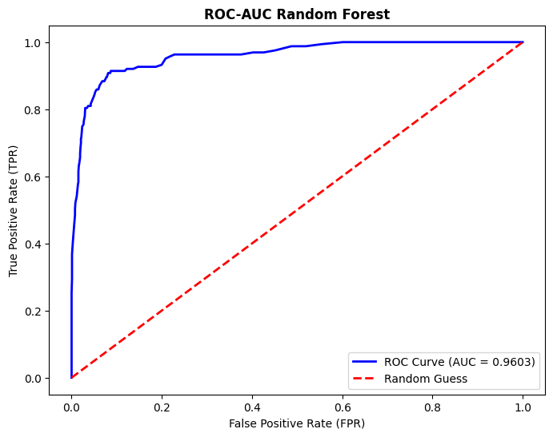
    


### ROC-AUC

### Confusion Matrix


```python
# from sklearn.metrics import confusion_matrix
# models = {
#     'KNN': model_knn_pred,
#     'XGBoost': model_xgb_pred,
#     'SVM': model_svm_pred,
#     'Random Forest': model_rf_pred
# }
# # Membuat grid subplot 2x2 untuk menampung 4 confusion matrix
# fig, axes = plt.subplots(2, 2, figsize=(12, 10))
# # Meratakan array axes agar mudah di-loop
# axes = axes.flatten()
# # Loop melalui setiap model untuk membuat dan memvisualisasikan confusion matrix
# for i, (model_name, y_pred) in enumerate(models.items()):
#     # Hitung confusion matrix
#     cm = confusion_matrix(y_test, y_pred)
#     # Buat heatmap menggunakan Seaborn
#     sns.heatmap(cm, ax=axes[i], annot=True, fmt='d', cmap='Blues',
#                 xticklabels=['Negatif', 'Positif'],
#                 yticklabels=['Negatif', 'Positif'],
#                 annot_kws={"size": 14}) # Ukuran font untuk angka di dalam sel
#     # Atur judul dan label untuk setiap subplot
#     axes[i].set_title(f'{model_name}', fontsize=15, pad=10)
#     axes[i].set_xlabel('Predicted Label', fontsize=12)
#     axes[i].set_ylabel('True Label', fontsize=12)
# # Menyesuaikan layout agar tidak ada tumpang tindih dan menampilkan plot
# plt.tight_layout(pad=3.0)
# plt.show()
# # Anda dapat menyimpan gambar ini dengan menambahkan baris berikut sebelum plt.show()
# fig.savefig('confusion_matrix_tanpa_HYP.png', dpi=400)
```

## 5. Hyperparameter


```python
from sklearn.model_selection import StratifiedKFold
# Inisialisasi StratifiedKFold untuk cross-validation
stratified_cv = StratifiedKFold(n_splits=10, shuffle=True, random_state=42)
from sklearn.model_selection import RandomizedSearchCV
```

### 5.1 KNN


```python
hyp_knn_params = {
    'n_neighbors': [n for n in range(3, 20, 2)],
    'weights': ['uniform', 'distance'],
    'metric': ['euclidean', 'manhattan', 'minkowski'],
    'p': [1, 2]  # untuk 'minkowski'
}
```


```python
hyp_knn = KNeighborsClassifier()
clf_knn = GridSearchCV(
    estimator=hyp_knn,
    param_grid=hyp_knn_params,
    scoring='f1_weighted',
    cv=stratified_cv,
    verbose=1,
    n_jobs=-2
)
```


```python
clf_knn.fit(X_train, y_train)
```

    Fitting 10 folds for each of 108 candidates, totalling 1080 fits
    


<style>#sk-container-id-5 {
  /* Definition of color scheme common for light and dark mode */
  --sklearn-color-text: #000;
  --sklearn-color-text-muted: #666;
  --sklearn-color-line: gray;
  /* Definition of color scheme for unfitted estimators */
  --sklearn-color-unfitted-level-0: #fff5e6;
  --sklearn-color-unfitted-level-1: #f6e4d2;
  --sklearn-color-unfitted-level-2: #ffe0b3;
  --sklearn-color-unfitted-level-3: chocolate;
  /* Definition of color scheme for fitted estimators */
  --sklearn-color-fitted-level-0: #f0f8ff;
  --sklearn-color-fitted-level-1: #d4ebff;
  --sklearn-color-fitted-level-2: #b3dbfd;
  --sklearn-color-fitted-level-3: cornflowerblue;

  /* Specific color for light theme */
  --sklearn-color-text-on-default-background: var(--sg-text-color, var(--theme-code-foreground, var(--jp-content-font-color1, black)));
  --sklearn-color-background: var(--sg-background-color, var(--theme-background, var(--jp-layout-color0, white)));
  --sklearn-color-border-box: var(--sg-text-color, var(--theme-code-foreground, var(--jp-content-font-color1, black)));
  --sklearn-color-icon: #696969;

  @media (prefers-color-scheme: dark) {
    /* Redefinition of color scheme for dark theme */
    --sklearn-color-text-on-default-background: var(--sg-text-color, var(--theme-code-foreground, var(--jp-content-font-color1, white)));
    --sklearn-color-background: var(--sg-background-color, var(--theme-background, var(--jp-layout-color0, #111)));
    --sklearn-color-border-box: var(--sg-text-color, var(--theme-code-foreground, var(--jp-content-font-color1, white)));
    --sklearn-color-icon: #878787;
  }
}

#sk-container-id-5 {
  color: var(--sklearn-color-text);
}

#sk-container-id-5 pre {
  padding: 0;
}

#sk-container-id-5 input.sk-hidden--visually {
  border: 0;
  clip: rect(1px 1px 1px 1px);
  clip: rect(1px, 1px, 1px, 1px);
  height: 1px;
  margin: -1px;
  overflow: hidden;
  padding: 0;
  position: absolute;
  width: 1px;
}

#sk-container-id-5 div.sk-dashed-wrapped {
  border: 1px dashed var(--sklearn-color-line);
  margin: 0 0.4em 0.5em 0.4em;
  box-sizing: border-box;
  padding-bottom: 0.4em;
  background-color: var(--sklearn-color-background);
}

#sk-container-id-5 div.sk-container {
  /* jupyter's `normalize.less` sets `[hidden] { display: none; }`
     but bootstrap.min.css set `[hidden] { display: none !important; }`
     so we also need the `!important` here to be able to override the
     default hidden behavior on the sphinx rendered scikit-learn.org.
     See: https://github.com/scikit-learn/scikit-learn/issues/21755 */
  display: inline-block !important;
  position: relative;
}

#sk-container-id-5 div.sk-text-repr-fallback {
  display: none;
}

div.sk-parallel-item,
div.sk-serial,
div.sk-item {
  /* draw centered vertical line to link estimators */
  background-image: linear-gradient(var(--sklearn-color-text-on-default-background), var(--sklearn-color-text-on-default-background));
  background-size: 2px 100%;
  background-repeat: no-repeat;
  background-position: center center;
}

/* Parallel-specific style estimator block */

#sk-container-id-5 div.sk-parallel-item::after {
  content: "";
  width: 100%;
  border-bottom: 2px solid var(--sklearn-color-text-on-default-background);
  flex-grow: 1;
}

#sk-container-id-5 div.sk-parallel {
  display: flex;
  align-items: stretch;
  justify-content: center;
  background-color: var(--sklearn-color-background);
  position: relative;
}

#sk-container-id-5 div.sk-parallel-item {
  display: flex;
  flex-direction: column;
}

#sk-container-id-5 div.sk-parallel-item:first-child::after {
  align-self: flex-end;
  width: 50%;
}

#sk-container-id-5 div.sk-parallel-item:last-child::after {
  align-self: flex-start;
  width: 50%;
}

#sk-container-id-5 div.sk-parallel-item:only-child::after {
  width: 0;
}

/* Serial-specific style estimator block */

#sk-container-id-5 div.sk-serial {
  display: flex;
  flex-direction: column;
  align-items: center;
  background-color: var(--sklearn-color-background);
  padding-right: 1em;
  padding-left: 1em;
}


/* Toggleable style: style used for estimator/Pipeline/ColumnTransformer box that is
clickable and can be expanded/collapsed.
- Pipeline and ColumnTransformer use this feature and define the default style
- Estimators will overwrite some part of the style using the `sk-estimator` class
*/

/* Pipeline and ColumnTransformer style (default) */

#sk-container-id-5 div.sk-toggleable {
  /* Default theme specific background. It is overwritten whether we have a
  specific estimator or a Pipeline/ColumnTransformer */
  background-color: var(--sklearn-color-background);
}

/* Toggleable label */
#sk-container-id-5 label.sk-toggleable__label {
  cursor: pointer;
  display: flex;
  width: 100%;
  margin-bottom: 0;
  padding: 0.5em;
  box-sizing: border-box;
  text-align: center;
  align-items: start;
  justify-content: space-between;
  gap: 0.5em;
}

#sk-container-id-5 label.sk-toggleable__label .caption {
  font-size: 0.6rem;
  font-weight: lighter;
  color: var(--sklearn-color-text-muted);
}

#sk-container-id-5 label.sk-toggleable__label-arrow:before {
  /* Arrow on the left of the label */
  content: "▸";
  float: left;
  margin-right: 0.25em;
  color: var(--sklearn-color-icon);
}

#sk-container-id-5 label.sk-toggleable__label-arrow:hover:before {
  color: var(--sklearn-color-text);
}

/* Toggleable content - dropdown */

#sk-container-id-5 div.sk-toggleable__content {
  max-height: 0;
  max-width: 0;
  overflow: hidden;
  text-align: left;
  /* unfitted */
  background-color: var(--sklearn-color-unfitted-level-0);
}

#sk-container-id-5 div.sk-toggleable__content.fitted {
  /* fitted */
  background-color: var(--sklearn-color-fitted-level-0);
}

#sk-container-id-5 div.sk-toggleable__content pre {
  margin: 0.2em;
  border-radius: 0.25em;
  color: var(--sklearn-color-text);
  /* unfitted */
  background-color: var(--sklearn-color-unfitted-level-0);
}

#sk-container-id-5 div.sk-toggleable__content.fitted pre {
  /* unfitted */
  background-color: var(--sklearn-color-fitted-level-0);
}

#sk-container-id-5 input.sk-toggleable__control:checked~div.sk-toggleable__content {
  /* Expand drop-down */
  max-height: 200px;
  max-width: 100%;
  overflow: auto;
}

#sk-container-id-5 input.sk-toggleable__control:checked~label.sk-toggleable__label-arrow:before {
  content: "▾";
}

/* Pipeline/ColumnTransformer-specific style */

#sk-container-id-5 div.sk-label input.sk-toggleable__control:checked~label.sk-toggleable__label {
  color: var(--sklearn-color-text);
  background-color: var(--sklearn-color-unfitted-level-2);
}

#sk-container-id-5 div.sk-label.fitted input.sk-toggleable__control:checked~label.sk-toggleable__label {
  background-color: var(--sklearn-color-fitted-level-2);
}

/* Estimator-specific style */

/* Colorize estimator box */
#sk-container-id-5 div.sk-estimator input.sk-toggleable__control:checked~label.sk-toggleable__label {
  /* unfitted */
  background-color: var(--sklearn-color-unfitted-level-2);
}

#sk-container-id-5 div.sk-estimator.fitted input.sk-toggleable__control:checked~label.sk-toggleable__label {
  /* fitted */
  background-color: var(--sklearn-color-fitted-level-2);
}

#sk-container-id-5 div.sk-label label.sk-toggleable__label,
#sk-container-id-5 div.sk-label label {
  /* The background is the default theme color */
  color: var(--sklearn-color-text-on-default-background);
}

/* On hover, darken the color of the background */
#sk-container-id-5 div.sk-label:hover label.sk-toggleable__label {
  color: var(--sklearn-color-text);
  background-color: var(--sklearn-color-unfitted-level-2);
}

/* Label box, darken color on hover, fitted */
#sk-container-id-5 div.sk-label.fitted:hover label.sk-toggleable__label.fitted {
  color: var(--sklearn-color-text);
  background-color: var(--sklearn-color-fitted-level-2);
}

/* Estimator label */

#sk-container-id-5 div.sk-label label {
  font-family: monospace;
  font-weight: bold;
  display: inline-block;
  line-height: 1.2em;
}

#sk-container-id-5 div.sk-label-container {
  text-align: center;
}

/* Estimator-specific */
#sk-container-id-5 div.sk-estimator {
  font-family: monospace;
  border: 1px dotted var(--sklearn-color-border-box);
  border-radius: 0.25em;
  box-sizing: border-box;
  margin-bottom: 0.5em;
  /* unfitted */
  background-color: var(--sklearn-color-unfitted-level-0);
}

#sk-container-id-5 div.sk-estimator.fitted {
  /* fitted */
  background-color: var(--sklearn-color-fitted-level-0);
}

/* on hover */
#sk-container-id-5 div.sk-estimator:hover {
  /* unfitted */
  background-color: var(--sklearn-color-unfitted-level-2);
}

#sk-container-id-5 div.sk-estimator.fitted:hover {
  /* fitted */
  background-color: var(--sklearn-color-fitted-level-2);
}

/* Specification for estimator info (e.g. "i" and "?") */

/* Common style for "i" and "?" */

.sk-estimator-doc-link,
a:link.sk-estimator-doc-link,
a:visited.sk-estimator-doc-link {
  float: right;
  font-size: smaller;
  line-height: 1em;
  font-family: monospace;
  background-color: var(--sklearn-color-background);
  border-radius: 1em;
  height: 1em;
  width: 1em;
  text-decoration: none !important;
  margin-left: 0.5em;
  text-align: center;
  /* unfitted */
  border: var(--sklearn-color-unfitted-level-1) 1pt solid;
  color: var(--sklearn-color-unfitted-level-1);
}

.sk-estimator-doc-link.fitted,
a:link.sk-estimator-doc-link.fitted,
a:visited.sk-estimator-doc-link.fitted {
  /* fitted */
  border: var(--sklearn-color-fitted-level-1) 1pt solid;
  color: var(--sklearn-color-fitted-level-1);
}

/* On hover */
div.sk-estimator:hover .sk-estimator-doc-link:hover,
.sk-estimator-doc-link:hover,
div.sk-label-container:hover .sk-estimator-doc-link:hover,
.sk-estimator-doc-link:hover {
  /* unfitted */
  background-color: var(--sklearn-color-unfitted-level-3);
  color: var(--sklearn-color-background);
  text-decoration: none;
}

div.sk-estimator.fitted:hover .sk-estimator-doc-link.fitted:hover,
.sk-estimator-doc-link.fitted:hover,
div.sk-label-container:hover .sk-estimator-doc-link.fitted:hover,
.sk-estimator-doc-link.fitted:hover {
  /* fitted */
  background-color: var(--sklearn-color-fitted-level-3);
  color: var(--sklearn-color-background);
  text-decoration: none;
}

/* Span, style for the box shown on hovering the info icon */
.sk-estimator-doc-link span {
  display: none;
  z-index: 9999;
  position: relative;
  font-weight: normal;
  right: .2ex;
  padding: .5ex;
  margin: .5ex;
  width: min-content;
  min-width: 20ex;
  max-width: 50ex;
  color: var(--sklearn-color-text);
  box-shadow: 2pt 2pt 4pt #999;
  /* unfitted */
  background: var(--sklearn-color-unfitted-level-0);
  border: .5pt solid var(--sklearn-color-unfitted-level-3);
}

.sk-estimator-doc-link.fitted span {
  /* fitted */
  background: var(--sklearn-color-fitted-level-0);
  border: var(--sklearn-color-fitted-level-3);
}

.sk-estimator-doc-link:hover span {
  display: block;
}

/* "?"-specific style due to the `<a>` HTML tag */

#sk-container-id-5 a.estimator_doc_link {
  float: right;
  font-size: 1rem;
  line-height: 1em;
  font-family: monospace;
  background-color: var(--sklearn-color-background);
  border-radius: 1rem;
  height: 1rem;
  width: 1rem;
  text-decoration: none;
  /* unfitted */
  color: var(--sklearn-color-unfitted-level-1);
  border: var(--sklearn-color-unfitted-level-1) 1pt solid;
}

#sk-container-id-5 a.estimator_doc_link.fitted {
  /* fitted */
  border: var(--sklearn-color-fitted-level-1) 1pt solid;
  color: var(--sklearn-color-fitted-level-1);
}

/* On hover */
#sk-container-id-5 a.estimator_doc_link:hover {
  /* unfitted */
  background-color: var(--sklearn-color-unfitted-level-3);
  color: var(--sklearn-color-background);
  text-decoration: none;
}

#sk-container-id-5 a.estimator_doc_link.fitted:hover {
  /* fitted */
  background-color: var(--sklearn-color-fitted-level-3);
}
</style><div id="sk-container-id-5" class="sk-top-container"><div class="sk-text-repr-fallback"><pre>GridSearchCV(cv=StratifiedKFold(n_splits=10, random_state=42, shuffle=True),
             estimator=KNeighborsClassifier(), n_jobs=-2,
             param_grid={&#x27;metric&#x27;: [&#x27;euclidean&#x27;, &#x27;manhattan&#x27;, &#x27;minkowski&#x27;],
                         &#x27;n_neighbors&#x27;: [3, 5, 7, 9, 11, 13, 15, 17, 19],
                         &#x27;p&#x27;: [1, 2], &#x27;weights&#x27;: [&#x27;uniform&#x27;, &#x27;distance&#x27;]},
             scoring=&#x27;f1_weighted&#x27;, verbose=1)</pre><b>In a Jupyter environment, please rerun this cell to show the HTML representation or trust the notebook. <br />On GitHub, the HTML representation is unable to render, please try loading this page with nbviewer.org.</b></div><div class="sk-container" hidden><div class="sk-item sk-dashed-wrapped"><div class="sk-label-container"><div class="sk-label fitted sk-toggleable"><input class="sk-toggleable__control sk-hidden--visually" id="sk-estimator-id-5" type="checkbox" ><label for="sk-estimator-id-5" class="sk-toggleable__label fitted sk-toggleable__label-arrow"><div><div>GridSearchCV</div></div><div><a class="sk-estimator-doc-link fitted" rel="noreferrer" target="_blank" href="https://scikit-learn.org/1.6/modules/generated/sklearn.model_selection.GridSearchCV.html">?<span>Documentation for GridSearchCV</span></a><span class="sk-estimator-doc-link fitted">i<span>Fitted</span></span></div></label><div class="sk-toggleable__content fitted"><pre>GridSearchCV(cv=StratifiedKFold(n_splits=10, random_state=42, shuffle=True),
             estimator=KNeighborsClassifier(), n_jobs=-2,
             param_grid={&#x27;metric&#x27;: [&#x27;euclidean&#x27;, &#x27;manhattan&#x27;, &#x27;minkowski&#x27;],
                         &#x27;n_neighbors&#x27;: [3, 5, 7, 9, 11, 13, 15, 17, 19],
                         &#x27;p&#x27;: [1, 2], &#x27;weights&#x27;: [&#x27;uniform&#x27;, &#x27;distance&#x27;]},
             scoring=&#x27;f1_weighted&#x27;, verbose=1)</pre></div> </div></div><div class="sk-parallel"><div class="sk-parallel-item"><div class="sk-item"><div class="sk-label-container"><div class="sk-label fitted sk-toggleable"><input class="sk-toggleable__control sk-hidden--visually" id="sk-estimator-id-6" type="checkbox" ><label for="sk-estimator-id-6" class="sk-toggleable__label fitted sk-toggleable__label-arrow"><div><div>best_estimator_: KNeighborsClassifier</div></div></label><div class="sk-toggleable__content fitted"><pre>KNeighborsClassifier(metric=&#x27;manhattan&#x27;, n_neighbors=3, p=1, weights=&#x27;distance&#x27;)</pre></div> </div></div><div class="sk-serial"><div class="sk-item"><div class="sk-estimator fitted sk-toggleable"><input class="sk-toggleable__control sk-hidden--visually" id="sk-estimator-id-7" type="checkbox" ><label for="sk-estimator-id-7" class="sk-toggleable__label fitted sk-toggleable__label-arrow"><div><div>KNeighborsClassifier</div></div><div><a class="sk-estimator-doc-link fitted" rel="noreferrer" target="_blank" href="https://scikit-learn.org/1.6/modules/generated/sklearn.neighbors.KNeighborsClassifier.html">?<span>Documentation for KNeighborsClassifier</span></a></div></label><div class="sk-toggleable__content fitted"><pre>KNeighborsClassifier(metric=&#x27;manhattan&#x27;, n_neighbors=3, p=1, weights=&#x27;distance&#x27;)</pre></div> </div></div></div></div></div></div></div></div></div>


```python
best_comb_knn = clf_knn.best_params_
best_comb_knn
```


    {'metric': 'manhattan', 'n_neighbors': 3, 'p': 1, 'weights': 'distance'}


```python
clf_knn_pred = clf_knn.predict(X_test)
print("Akurasi HYPER KNN: ", accuracy_score(y_test, clf_knn_pred))
```

    Akurasi HYPER KNN:  0.7589869281045751
    


```python
accuracy_clf_knn = accuracy_score(y_test, clf_knn_pred)
precision_clf_knn = precision_score(y_test, clf_knn_pred)
recall_clf_knn = recall_score(y_test, clf_knn_pred)
f1_clf_knn = f1_score(y_test, clf_knn_pred)
roc_auc_clf_knn = roc_auc_score(y_test, clf_knn_pred)

print(f"Accuracy: {accuracy_clf_knn:.4f}")
print(f"Recall: {recall_clf_knn:.4f}")
print(f"Precision: {precision_clf_knn:.4f}")
print(f"F1-Score: {f1_clf_knn:.4f}")
```

    Accuracy: 0.7590
    Recall: 0.6380
    Precision: 0.3059
    F1-Score: 0.4135
    


```python
clf_knn_pred = clf_knn.predict(X_test)
print("Akurasi HYPER KNN: ", accuracy_score(y_test, clf_knn_pred))
```

    Akurasi HYPER KNN:  0.7589869281045751
    


```python
print(classification_report(y_test, clf_knn_pred))
```

                  precision    recall  f1-score   support
    
               0       0.93      0.78      0.85      1061
               1       0.31      0.64      0.41       163
    
        accuracy                           0.76      1224
       macro avg       0.62      0.71      0.63      1224
    weighted avg       0.85      0.76      0.79      1224
    
    


```python
from sklearn.metrics import roc_auc_score, roc_curve
y_pred_proba_clf_knn = clf_knn.predict_proba(X_test)[:, 1]  # Probabilitas kelas positif
roc_auc_clf_knn = roc_auc_score(y_test, y_pred_proba_clf_knn)
pr_auc_clf_knn = average_precision_score(y_test, y_pred_proba_clf_knn)
print(f"ROC-AUC Score: {roc_auc_clf_knn:.4f}")
print(f"PR-AUC Score: {pr_auc_clf_knn:.4f}")
```

    ROC-AUC Score: 0.7299
    PR-AUC Score: 0.2753
    


```python
from sklearn.metrics import confusion_matrix
tn_clf_knn, fp_clf_knn, fn_clf_knn, tp_clf_knn = confusion_matrix(y_test, clf_knn_pred).ravel()

# Hitung spesifisitas
specificity_clf_knn = tn_clf_knn / (tn_clf_knn + fp_clf_knn)
sensitiviy_clf_knn = tp_clf_knn / (tp_clf_knn + fn_clf_knn)
```


```python
print(f"True Negative (TN): {tn_clf_knn}")
print(f"False Positive (FP): {fp_clf_knn}")
print(f"Spesifisitas: {specificity_clf_knn:.4f}")
```

    True Negative (TN): 825
    False Positive (FP): 236
    Spesifisitas: 0.7776
    


```python
print(f"True Positive (TN): {tp_clf_knn}")
print(f"False Negative (FP): {fn_clf_knn}")
print(f"Sensitivitas: {sensitiviy_clf_knn:.4f}")
```

    True Positive (TN): 104
    False Negative (FP): 59
    Sensitivitas: 0.6380
    


```python
fpr_clf_knn, tpr_clf_knn, thresholds_knn = roc_curve(y_test, y_pred_proba_clf_knn)

# Visualisasi kurva ROC
plt.figure(figsize=(8, 6))
plt.plot(fpr_clf_knn, tpr_clf_knn, color='blue', lw=2, label=f'ROC Curve (AUC = {roc_auc_clf_knn:.4f})')
plt.plot([0, 1], [0, 1], color='red', lw=2, linestyle='--', label='Random Guess')
plt.xlabel('False Positive Rate (FPR)')
plt.ylabel('True Positive Rate (TPR)')
plt.title('ROC-AUC KNN', fontweight='bold')
plt.legend(loc='lower right')
plt.savefig('ROC-AUC_KNN_dengan_HYP.png', dpi=400)
plt.show()
```


    
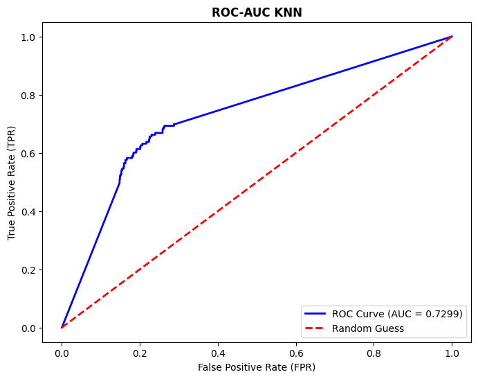
    


```python
from sklearn.inspection import permutation_importance
result_knn = permutation_importance(clf_knn, X_test, y_test, n_repeats=10, random_state=42)
importance_knn = result_knn.importances_mean
#visualisasi
import matplotlib.pyplot as plt
plt.barh(X_train.columns, importance_knn)
plt.xlabel("Feature Importance")
plt.ylabel("Features")
plt.show()
```


    
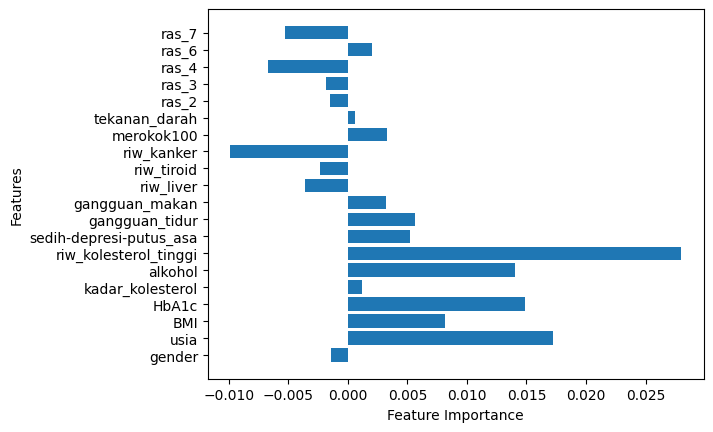
    


### 5.2 XGBoost


```python
# hyp_xgb_params = {
#     'n_estimators': [100, 200, 300, 400],
#     'learning_rate': [0.01, 0.05, 0.1],
#     'max_depth': [3, 5, 7],
#     'min_child_weight': [1, 3, 5],
#     'gamma': [0, 0.1, 0.2],
#     'subsample': [0.7, 0.8, 0.9],
#     'colsample_bytree': [0.7, 0.8, 0.9]
# }
```


```python
hyp_xgb_params = {
    'n_estimators': [400, 500],
    'learning_rate': [.2, .1, .05],
    'max_depth': [7, 8, 9],
    'min_child_weight': [1, 3, 5],
    'gamma': [0, 0.1, 0.2],
    'subsample': [0.7, 0.8],
    'colsample_bytree': [0.7, 0.8]
}
```


```python
# hyp_xgb_params = {
#     'n_estimators': [700, 800],
#     'learning_rate': [.2, .1, .05],
#     'max_depth': [None, 9, 10],
#     'min_child_weight': [1, 3, 5],
#     'gamma': [0.1, 0.2],
#     'subsample': [0.8, 0.9],
#     'colsample_bytree': [0.8, 0.9]
# }
```


```python
hyp_xgb = xgb.XGBClassifier(objective='binary:logistic', 
                            random_state=42)
clf_xgb = GridSearchCV(
    estimator=hyp_xgb,
    param_grid=hyp_xgb_params,
    scoring='f1_weighted',
    cv=stratified_cv,
    verbose=1,
    n_jobs=-2
)
```


```python
clf_xgb.fit(X_train, y_train)
```

    Fitting 10 folds for each of 648 candidates, totalling 6480 fits
    


<style>#sk-container-id-6 {
  /* Definition of color scheme common for light and dark mode */
  --sklearn-color-text: #000;
  --sklearn-color-text-muted: #666;
  --sklearn-color-line: gray;
  /* Definition of color scheme for unfitted estimators */
  --sklearn-color-unfitted-level-0: #fff5e6;
  --sklearn-color-unfitted-level-1: #f6e4d2;
  --sklearn-color-unfitted-level-2: #ffe0b3;
  --sklearn-color-unfitted-level-3: chocolate;
  /* Definition of color scheme for fitted estimators */
  --sklearn-color-fitted-level-0: #f0f8ff;
  --sklearn-color-fitted-level-1: #d4ebff;
  --sklearn-color-fitted-level-2: #b3dbfd;
  --sklearn-color-fitted-level-3: cornflowerblue;

  /* Specific color for light theme */
  --sklearn-color-text-on-default-background: var(--sg-text-color, var(--theme-code-foreground, var(--jp-content-font-color1, black)));
  --sklearn-color-background: var(--sg-background-color, var(--theme-background, var(--jp-layout-color0, white)));
  --sklearn-color-border-box: var(--sg-text-color, var(--theme-code-foreground, var(--jp-content-font-color1, black)));
  --sklearn-color-icon: #696969;

  @media (prefers-color-scheme: dark) {
    /* Redefinition of color scheme for dark theme */
    --sklearn-color-text-on-default-background: var(--sg-text-color, var(--theme-code-foreground, var(--jp-content-font-color1, white)));
    --sklearn-color-background: var(--sg-background-color, var(--theme-background, var(--jp-layout-color0, #111)));
    --sklearn-color-border-box: var(--sg-text-color, var(--theme-code-foreground, var(--jp-content-font-color1, white)));
    --sklearn-color-icon: #878787;
  }
}

#sk-container-id-6 {
  color: var(--sklearn-color-text);
}

#sk-container-id-6 pre {
  padding: 0;
}

#sk-container-id-6 input.sk-hidden--visually {
  border: 0;
  clip: rect(1px 1px 1px 1px);
  clip: rect(1px, 1px, 1px, 1px);
  height: 1px;
  margin: -1px;
  overflow: hidden;
  padding: 0;
  position: absolute;
  width: 1px;
}

#sk-container-id-6 div.sk-dashed-wrapped {
  border: 1px dashed var(--sklearn-color-line);
  margin: 0 0.4em 0.5em 0.4em;
  box-sizing: border-box;
  padding-bottom: 0.4em;
  background-color: var(--sklearn-color-background);
}

#sk-container-id-6 div.sk-container {
  /* jupyter's `normalize.less` sets `[hidden] { display: none; }`
     but bootstrap.min.css set `[hidden] { display: none !important; }`
     so we also need the `!important` here to be able to override the
     default hidden behavior on the sphinx rendered scikit-learn.org.
     See: https://github.com/scikit-learn/scikit-learn/issues/21755 */
  display: inline-block !important;
  position: relative;
}

#sk-container-id-6 div.sk-text-repr-fallback {
  display: none;
}

div.sk-parallel-item,
div.sk-serial,
div.sk-item {
  /* draw centered vertical line to link estimators */
  background-image: linear-gradient(var(--sklearn-color-text-on-default-background), var(--sklearn-color-text-on-default-background));
  background-size: 2px 100%;
  background-repeat: no-repeat;
  background-position: center center;
}

/* Parallel-specific style estimator block */

#sk-container-id-6 div.sk-parallel-item::after {
  content: "";
  width: 100%;
  border-bottom: 2px solid var(--sklearn-color-text-on-default-background);
  flex-grow: 1;
}

#sk-container-id-6 div.sk-parallel {
  display: flex;
  align-items: stretch;
  justify-content: center;
  background-color: var(--sklearn-color-background);
  position: relative;
}

#sk-container-id-6 div.sk-parallel-item {
  display: flex;
  flex-direction: column;
}

#sk-container-id-6 div.sk-parallel-item:first-child::after {
  align-self: flex-end;
  width: 50%;
}

#sk-container-id-6 div.sk-parallel-item:last-child::after {
  align-self: flex-start;
  width: 50%;
}

#sk-container-id-6 div.sk-parallel-item:only-child::after {
  width: 0;
}

/* Serial-specific style estimator block */

#sk-container-id-6 div.sk-serial {
  display: flex;
  flex-direction: column;
  align-items: center;
  background-color: var(--sklearn-color-background);
  padding-right: 1em;
  padding-left: 1em;
}


/* Toggleable style: style used for estimator/Pipeline/ColumnTransformer box that is
clickable and can be expanded/collapsed.
- Pipeline and ColumnTransformer use this feature and define the default style
- Estimators will overwrite some part of the style using the `sk-estimator` class
*/

/* Pipeline and ColumnTransformer style (default) */

#sk-container-id-6 div.sk-toggleable {
  /* Default theme specific background. It is overwritten whether we have a
  specific estimator or a Pipeline/ColumnTransformer */
  background-color: var(--sklearn-color-background);
}

/* Toggleable label */
#sk-container-id-6 label.sk-toggleable__label {
  cursor: pointer;
  display: flex;
  width: 100%;
  margin-bottom: 0;
  padding: 0.5em;
  box-sizing: border-box;
  text-align: center;
  align-items: start;
  justify-content: space-between;
  gap: 0.5em;
}

#sk-container-id-6 label.sk-toggleable__label .caption {
  font-size: 0.6rem;
  font-weight: lighter;
  color: var(--sklearn-color-text-muted);
}

#sk-container-id-6 label.sk-toggleable__label-arrow:before {
  /* Arrow on the left of the label */
  content: "▸";
  float: left;
  margin-right: 0.25em;
  color: var(--sklearn-color-icon);
}

#sk-container-id-6 label.sk-toggleable__label-arrow:hover:before {
  color: var(--sklearn-color-text);
}

/* Toggleable content - dropdown */

#sk-container-id-6 div.sk-toggleable__content {
  max-height: 0;
  max-width: 0;
  overflow: hidden;
  text-align: left;
  /* unfitted */
  background-color: var(--sklearn-color-unfitted-level-0);
}

#sk-container-id-6 div.sk-toggleable__content.fitted {
  /* fitted */
  background-color: var(--sklearn-color-fitted-level-0);
}

#sk-container-id-6 div.sk-toggleable__content pre {
  margin: 0.2em;
  border-radius: 0.25em;
  color: var(--sklearn-color-text);
  /* unfitted */
  background-color: var(--sklearn-color-unfitted-level-0);
}

#sk-container-id-6 div.sk-toggleable__content.fitted pre {
  /* unfitted */
  background-color: var(--sklearn-color-fitted-level-0);
}

#sk-container-id-6 input.sk-toggleable__control:checked~div.sk-toggleable__content {
  /* Expand drop-down */
  max-height: 200px;
  max-width: 100%;
  overflow: auto;
}

#sk-container-id-6 input.sk-toggleable__control:checked~label.sk-toggleable__label-arrow:before {
  content: "▾";
}

/* Pipeline/ColumnTransformer-specific style */

#sk-container-id-6 div.sk-label input.sk-toggleable__control:checked~label.sk-toggleable__label {
  color: var(--sklearn-color-text);
  background-color: var(--sklearn-color-unfitted-level-2);
}

#sk-container-id-6 div.sk-label.fitted input.sk-toggleable__control:checked~label.sk-toggleable__label {
  background-color: var(--sklearn-color-fitted-level-2);
}

/* Estimator-specific style */

/* Colorize estimator box */
#sk-container-id-6 div.sk-estimator input.sk-toggleable__control:checked~label.sk-toggleable__label {
  /* unfitted */
  background-color: var(--sklearn-color-unfitted-level-2);
}

#sk-container-id-6 div.sk-estimator.fitted input.sk-toggleable__control:checked~label.sk-toggleable__label {
  /* fitted */
  background-color: var(--sklearn-color-fitted-level-2);
}

#sk-container-id-6 div.sk-label label.sk-toggleable__label,
#sk-container-id-6 div.sk-label label {
  /* The background is the default theme color */
  color: var(--sklearn-color-text-on-default-background);
}

/* On hover, darken the color of the background */
#sk-container-id-6 div.sk-label:hover label.sk-toggleable__label {
  color: var(--sklearn-color-text);
  background-color: var(--sklearn-color-unfitted-level-2);
}

/* Label box, darken color on hover, fitted */
#sk-container-id-6 div.sk-label.fitted:hover label.sk-toggleable__label.fitted {
  color: var(--sklearn-color-text);
  background-color: var(--sklearn-color-fitted-level-2);
}

/* Estimator label */

#sk-container-id-6 div.sk-label label {
  font-family: monospace;
  font-weight: bold;
  display: inline-block;
  line-height: 1.2em;
}

#sk-container-id-6 div.sk-label-container {
  text-align: center;
}

/* Estimator-specific */
#sk-container-id-6 div.sk-estimator {
  font-family: monospace;
  border: 1px dotted var(--sklearn-color-border-box);
  border-radius: 0.25em;
  box-sizing: border-box;
  margin-bottom: 0.5em;
  /* unfitted */
  background-color: var(--sklearn-color-unfitted-level-0);
}

#sk-container-id-6 div.sk-estimator.fitted {
  /* fitted */
  background-color: var(--sklearn-color-fitted-level-0);
}

/* on hover */
#sk-container-id-6 div.sk-estimator:hover {
  /* unfitted */
  background-color: var(--sklearn-color-unfitted-level-2);
}

#sk-container-id-6 div.sk-estimator.fitted:hover {
  /* fitted */
  background-color: var(--sklearn-color-fitted-level-2);
}

/* Specification for estimator info (e.g. "i" and "?") */

/* Common style for "i" and "?" */

.sk-estimator-doc-link,
a:link.sk-estimator-doc-link,
a:visited.sk-estimator-doc-link {
  float: right;
  font-size: smaller;
  line-height: 1em;
  font-family: monospace;
  background-color: var(--sklearn-color-background);
  border-radius: 1em;
  height: 1em;
  width: 1em;
  text-decoration: none !important;
  margin-left: 0.5em;
  text-align: center;
  /* unfitted */
  border: var(--sklearn-color-unfitted-level-1) 1pt solid;
  color: var(--sklearn-color-unfitted-level-1);
}

.sk-estimator-doc-link.fitted,
a:link.sk-estimator-doc-link.fitted,
a:visited.sk-estimator-doc-link.fitted {
  /* fitted */
  border: var(--sklearn-color-fitted-level-1) 1pt solid;
  color: var(--sklearn-color-fitted-level-1);
}

/* On hover */
div.sk-estimator:hover .sk-estimator-doc-link:hover,
.sk-estimator-doc-link:hover,
div.sk-label-container:hover .sk-estimator-doc-link:hover,
.sk-estimator-doc-link:hover {
  /* unfitted */
  background-color: var(--sklearn-color-unfitted-level-3);
  color: var(--sklearn-color-background);
  text-decoration: none;
}

div.sk-estimator.fitted:hover .sk-estimator-doc-link.fitted:hover,
.sk-estimator-doc-link.fitted:hover,
div.sk-label-container:hover .sk-estimator-doc-link.fitted:hover,
.sk-estimator-doc-link.fitted:hover {
  /* fitted */
  background-color: var(--sklearn-color-fitted-level-3);
  color: var(--sklearn-color-background);
  text-decoration: none;
}

/* Span, style for the box shown on hovering the info icon */
.sk-estimator-doc-link span {
  display: none;
  z-index: 9999;
  position: relative;
  font-weight: normal;
  right: .2ex;
  padding: .5ex;
  margin: .5ex;
  width: min-content;
  min-width: 20ex;
  max-width: 50ex;
  color: var(--sklearn-color-text);
  box-shadow: 2pt 2pt 4pt #999;
  /* unfitted */
  background: var(--sklearn-color-unfitted-level-0);
  border: .5pt solid var(--sklearn-color-unfitted-level-3);
}

.sk-estimator-doc-link.fitted span {
  /* fitted */
  background: var(--sklearn-color-fitted-level-0);
  border: var(--sklearn-color-fitted-level-3);
}

.sk-estimator-doc-link:hover span {
  display: block;
}

/* "?"-specific style due to the `<a>` HTML tag */

#sk-container-id-6 a.estimator_doc_link {
  float: right;
  font-size: 1rem;
  line-height: 1em;
  font-family: monospace;
  background-color: var(--sklearn-color-background);
  border-radius: 1rem;
  height: 1rem;
  width: 1rem;
  text-decoration: none;
  /* unfitted */
  color: var(--sklearn-color-unfitted-level-1);
  border: var(--sklearn-color-unfitted-level-1) 1pt solid;
}

#sk-container-id-6 a.estimator_doc_link.fitted {
  /* fitted */
  border: var(--sklearn-color-fitted-level-1) 1pt solid;
  color: var(--sklearn-color-fitted-level-1);
}

/* On hover */
#sk-container-id-6 a.estimator_doc_link:hover {
  /* unfitted */
  background-color: var(--sklearn-color-unfitted-level-3);
  color: var(--sklearn-color-background);
  text-decoration: none;
}

#sk-container-id-6 a.estimator_doc_link.fitted:hover {
  /* fitted */
  background-color: var(--sklearn-color-fitted-level-3);
}
</style><div id="sk-container-id-6" class="sk-top-container"><div class="sk-text-repr-fallback"><pre>GridSearchCV(cv=StratifiedKFold(n_splits=10, random_state=42, shuffle=True),
             estimator=XGBClassifier(base_score=None, booster=None,
                                     callbacks=None, colsample_bylevel=None,
                                     colsample_bynode=None,
                                     colsample_bytree=None, device=None,
                                     early_stopping_rounds=None,
                                     enable_categorical=False, eval_metric=None,
                                     feature_types=None, feature_weights=None,
                                     gamma=None, grow_poli...
                                     max_leaves=None, min_child_weight=None,
                                     missing=nan, monotone_constraints=None,
                                     multi_strategy=None, n_estimators=None,
                                     n_jobs=None, num_parallel_tree=None, ...),
             n_jobs=-2,
             param_grid={&#x27;colsample_bytree&#x27;: [0.7, 0.8], &#x27;gamma&#x27;: [0, 0.1, 0.2],
                         &#x27;learning_rate&#x27;: [0.2, 0.1, 0.05],
                         &#x27;max_depth&#x27;: [7, 8, 9], &#x27;min_child_weight&#x27;: [1, 3, 5],
                         &#x27;n_estimators&#x27;: [400, 500], &#x27;subsample&#x27;: [0.7, 0.8]},
             scoring=&#x27;f1_weighted&#x27;, verbose=1)</pre><b>In a Jupyter environment, please rerun this cell to show the HTML representation or trust the notebook. <br />On GitHub, the HTML representation is unable to render, please try loading this page with nbviewer.org.</b></div><div class="sk-container" hidden><div class="sk-item sk-dashed-wrapped"><div class="sk-label-container"><div class="sk-label fitted sk-toggleable"><input class="sk-toggleable__control sk-hidden--visually" id="sk-estimator-id-8" type="checkbox" ><label for="sk-estimator-id-8" class="sk-toggleable__label fitted sk-toggleable__label-arrow"><div><div>GridSearchCV</div></div><div><a class="sk-estimator-doc-link fitted" rel="noreferrer" target="_blank" href="https://scikit-learn.org/1.6/modules/generated/sklearn.model_selection.GridSearchCV.html">?<span>Documentation for GridSearchCV</span></a><span class="sk-estimator-doc-link fitted">i<span>Fitted</span></span></div></label><div class="sk-toggleable__content fitted"><pre>GridSearchCV(cv=StratifiedKFold(n_splits=10, random_state=42, shuffle=True),
             estimator=XGBClassifier(base_score=None, booster=None,
                                     callbacks=None, colsample_bylevel=None,
                                     colsample_bynode=None,
                                     colsample_bytree=None, device=None,
                                     early_stopping_rounds=None,
                                     enable_categorical=False, eval_metric=None,
                                     feature_types=None, feature_weights=None,
                                     gamma=None, grow_poli...
                                     max_leaves=None, min_child_weight=None,
                                     missing=nan, monotone_constraints=None,
                                     multi_strategy=None, n_estimators=None,
                                     n_jobs=None, num_parallel_tree=None, ...),
             n_jobs=-2,
             param_grid={&#x27;colsample_bytree&#x27;: [0.7, 0.8], &#x27;gamma&#x27;: [0, 0.1, 0.2],
                         &#x27;learning_rate&#x27;: [0.2, 0.1, 0.05],
                         &#x27;max_depth&#x27;: [7, 8, 9], &#x27;min_child_weight&#x27;: [1, 3, 5],
                         &#x27;n_estimators&#x27;: [400, 500], &#x27;subsample&#x27;: [0.7, 0.8]},
             scoring=&#x27;f1_weighted&#x27;, verbose=1)</pre></div> </div></div><div class="sk-parallel"><div class="sk-parallel-item"><div class="sk-item"><div class="sk-label-container"><div class="sk-label fitted sk-toggleable"><input class="sk-toggleable__control sk-hidden--visually" id="sk-estimator-id-9" type="checkbox" ><label for="sk-estimator-id-9" class="sk-toggleable__label fitted sk-toggleable__label-arrow"><div><div>best_estimator_: XGBClassifier</div></div></label><div class="sk-toggleable__content fitted"><pre>XGBClassifier(base_score=None, booster=None, callbacks=None,
              colsample_bylevel=None, colsample_bynode=None,
              colsample_bytree=0.7, device=None, early_stopping_rounds=None,
              enable_categorical=False, eval_metric=None, feature_types=None,
              feature_weights=None, gamma=0, grow_policy=None,
              importance_type=None, interaction_constraints=None,
              learning_rate=0.1, max_bin=None, max_cat_threshold=None,
              max_cat_to_onehot=None, max_delta_step=None, max_depth=7,
              max_leaves=None, min_child_weight=1, missing=nan,
              monotone_constraints=None, multi_strategy=None, n_estimators=500,
              n_jobs=None, num_parallel_tree=None, ...)</pre></div> </div></div><div class="sk-serial"><div class="sk-item"><div class="sk-estimator fitted sk-toggleable"><input class="sk-toggleable__control sk-hidden--visually" id="sk-estimator-id-10" type="checkbox" ><label for="sk-estimator-id-10" class="sk-toggleable__label fitted sk-toggleable__label-arrow"><div><div>XGBClassifier</div></div><div><a class="sk-estimator-doc-link fitted" rel="noreferrer" target="_blank" href="https://xgboost.readthedocs.io/en/release_3.0.0/python/python_api.html#xgboost.XGBClassifier">?<span>Documentation for XGBClassifier</span></a></div></label><div class="sk-toggleable__content fitted"><pre>XGBClassifier(base_score=None, booster=None, callbacks=None,
              colsample_bylevel=None, colsample_bynode=None,
              colsample_bytree=0.7, device=None, early_stopping_rounds=None,
              enable_categorical=False, eval_metric=None, feature_types=None,
              feature_weights=None, gamma=0, grow_policy=None,
              importance_type=None, interaction_constraints=None,
              learning_rate=0.1, max_bin=None, max_cat_threshold=None,
              max_cat_to_onehot=None, max_delta_step=None, max_depth=7,
              max_leaves=None, min_child_weight=1, missing=nan,
              monotone_constraints=None, multi_strategy=None, n_estimators=500,
              n_jobs=None, num_parallel_tree=None, ...)</pre></div> </div></div></div></div></div></div></div></div></div>


```python
clf_xgb.best_params_
```


    {'colsample_bytree': 0.7,
     'gamma': 0,
     'learning_rate': 0.1,
     'max_depth': 7,
     'min_child_weight': 1,
     'n_estimators': 500,
     'subsample': 0.8}


```python
clf_xgb_pred = clf_xgb.predict(X_test)
print("Akurasi HYPER XGB: ", accuracy_score(y_test, clf_xgb_pred))
```

    Akurasi HYPER XGB:  0.9370915032679739
    


```python
accuracy_clf_xgb = accuracy_score(y_test, clf_xgb_pred)
precision_clf_xgb = precision_score(y_test, clf_xgb_pred)
recall_clf_xgb = recall_score(y_test, clf_xgb_pred)
f1_clf_xgb = f1_score(y_test, clf_xgb_pred)
roc_auc_clf_xgb = roc_auc_score(y_test, clf_xgb_pred)

print(f"Accuracy: {accuracy_clf_xgb:.4f}")
print(f"Recall: {recall_clf_xgb:.4f}")
print(f"Precision: {precision_clf_xgb:.4f}")
print(f"F1-Score: {f1_clf_xgb:.4f}")
```

    Accuracy: 0.9371
    Recall: 0.8650
    Precision: 0.7194
    F1-Score: 0.7855
    


```python
print(classification_report(y_test, clf_xgb_pred))
```

                  precision    recall  f1-score   support
    
               0       0.98      0.95      0.96      1061
               1       0.72      0.87      0.79       163
    
        accuracy                           0.94      1224
       macro avg       0.85      0.91      0.87      1224
    weighted avg       0.94      0.94      0.94      1224
    
    


```python
clf_xgb.best_score_
```


    np.float64(0.976918777444366)


```python
from sklearn.metrics import roc_auc_score, roc_curve
y_pred_proba_clf_xgb = clf_xgb.predict_proba(X_test)[:, 1]  # Probabilitas kelas positif
roc_auc_clf_xgb = roc_auc_score(y_test, y_pred_proba_clf_xgb)
pr_auc_clf_xgb = average_precision_score(y_test, y_pred_proba_clf_xgb)
print(f"ROC-AUC Score: {roc_auc_clf_xgb:.4f}")
print(f"PR-AUC Score: {pr_auc_clf_xgb:.4f}")
```

    ROC-AUC Score: 0.9560
    PR-AUC Score: 0.8563
    


```python
from sklearn.metrics import confusion_matrix
tn_clf_xgb, fp_clf_xgb, fn_clf_xgb, tp_clf_xgb = confusion_matrix(y_test, clf_xgb_pred).ravel()

# Hitung spesifisitas
specificity_clf_xgb = tn_clf_xgb / (tn_clf_xgb + fp_clf_xgb)
sensitiviy_clf_xgb = tp_clf_xgb / (tp_clf_xgb + fn_clf_xgb)
```


```python
print(f"True Negative (TN): {tn_clf_xgb}")
print(f"False Positive (FP): {fp_clf_xgb}")
print(f"Spesifisitas: {specificity_clf_xgb:.4f}")
```

    True Negative (TN): 1006
    False Positive (FP): 55
    Spesifisitas: 0.9482
    


```python
print(f"True Positive (TN): {tp_clf_xgb}")
print(f"False Negative (FP): {fn_clf_xgb}")
print(f"Sensitivitas: {sensitiviy_clf_xgb:.4f}")
```

    True Positive (TN): 141
    False Negative (FP): 22
    Sensitivitas: 0.8650
    


```python
fpr_clf_xgb, tpr_clf_xgb, thresholds_xgb = roc_curve(y_test, y_pred_proba_clf_xgb)

# Visualisasi kurva ROC
plt.figure(figsize=(8, 6))
plt.plot(fpr_clf_xgb, tpr_clf_xgb, color='blue', lw=2, label=f'ROC Curve (AUC = {roc_auc_clf_xgb:.4f})')
plt.plot([0, 1], [0, 1], color='red', lw=2, linestyle='--', label='Random Guess')
plt.xlabel('False Positive Rate (FPR)')
plt.ylabel('True Positive Rate (TPR)')
plt.title('ROC-AUC XGBoost', fontweight='bold')
plt.legend(loc='lower right')
plt.savefig('ROC-AUC_XGBoost_dengan_HYP.png', dpi=400)
plt.show()
```


    
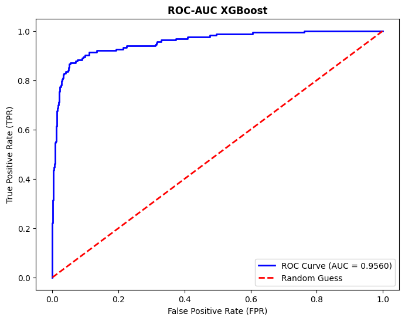
    


```python
from sklearn.inspection import permutation_importance
result_xgb = permutation_importance(clf_xgb, X_test, y_test, n_repeats=10, random_state=42)
importance_xgb = result_xgb.importances_mean

sorted_idx_xgb = importance_xgb.argsort()[::1]
#visualisasi
import matplotlib.pyplot as plt
plt.barh(X_train.columns[sorted_idx_xgb], importance_xgb[sorted_idx_xgb])
plt.xlabel("Feature Importance")
plt.ylabel("Features")
plt.show()
```


    
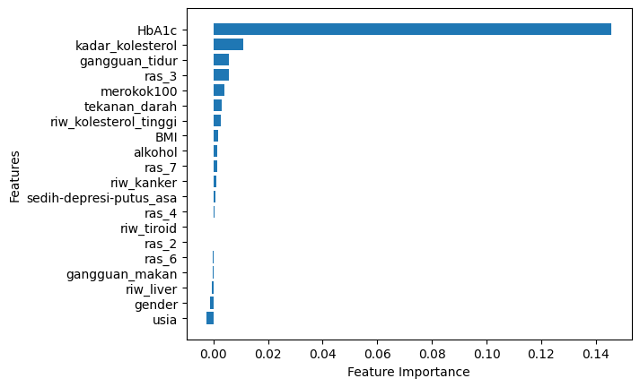
    


### 5.3 SVM


```python
hyp_svm_params = [
    # Linear kernel: hanya C
    {
        'kernel': ['linear'],
        'C': [0.01, 0.1, 1]
    },
    # RBF kernel: C dan gamma
    {
        'kernel': ['rbf'],
        'C': [0.01, 0.1, 1],
        'gamma': ['scale', 0.01, 0.1]
    },
    # Polynomial kernel: C, gamma, dan coef0
    {
        'kernel': ['poly'],
        'C': [0.01, 0.1, 1],
        'gamma': ['scale', 0.01, 0.1],
        'coef0': [float(c) for c in np.arange(0, 1, 0.1)],
        'degree': [2, 3]
    }
]


# hyp_svm_params = [svm_linear_params, svm_rbf_params, svm_poly_params]
```


```python
hyp_svm = SVC(probability=True, random_state=42)
clf_svm = GridSearchCV(
    estimator=hyp_svm,
    param_grid=hyp_svm_params,
    scoring='f1_weighted',
    cv=stratified_cv,
    verbose=1,
    n_jobs=-2
)
```


```python
clf_svm.fit(X_train, y_train)
```

    Fitting 10 folds for each of 192 candidates, totalling 1920 fits
    


<style>#sk-container-id-7 {
  /* Definition of color scheme common for light and dark mode */
  --sklearn-color-text: #000;
  --sklearn-color-text-muted: #666;
  --sklearn-color-line: gray;
  /* Definition of color scheme for unfitted estimators */
  --sklearn-color-unfitted-level-0: #fff5e6;
  --sklearn-color-unfitted-level-1: #f6e4d2;
  --sklearn-color-unfitted-level-2: #ffe0b3;
  --sklearn-color-unfitted-level-3: chocolate;
  /* Definition of color scheme for fitted estimators */
  --sklearn-color-fitted-level-0: #f0f8ff;
  --sklearn-color-fitted-level-1: #d4ebff;
  --sklearn-color-fitted-level-2: #b3dbfd;
  --sklearn-color-fitted-level-3: cornflowerblue;

  /* Specific color for light theme */
  --sklearn-color-text-on-default-background: var(--sg-text-color, var(--theme-code-foreground, var(--jp-content-font-color1, black)));
  --sklearn-color-background: var(--sg-background-color, var(--theme-background, var(--jp-layout-color0, white)));
  --sklearn-color-border-box: var(--sg-text-color, var(--theme-code-foreground, var(--jp-content-font-color1, black)));
  --sklearn-color-icon: #696969;

  @media (prefers-color-scheme: dark) {
    /* Redefinition of color scheme for dark theme */
    --sklearn-color-text-on-default-background: var(--sg-text-color, var(--theme-code-foreground, var(--jp-content-font-color1, white)));
    --sklearn-color-background: var(--sg-background-color, var(--theme-background, var(--jp-layout-color0, #111)));
    --sklearn-color-border-box: var(--sg-text-color, var(--theme-code-foreground, var(--jp-content-font-color1, white)));
    --sklearn-color-icon: #878787;
  }
}

#sk-container-id-7 {
  color: var(--sklearn-color-text);
}

#sk-container-id-7 pre {
  padding: 0;
}

#sk-container-id-7 input.sk-hidden--visually {
  border: 0;
  clip: rect(1px 1px 1px 1px);
  clip: rect(1px, 1px, 1px, 1px);
  height: 1px;
  margin: -1px;
  overflow: hidden;
  padding: 0;
  position: absolute;
  width: 1px;
}

#sk-container-id-7 div.sk-dashed-wrapped {
  border: 1px dashed var(--sklearn-color-line);
  margin: 0 0.4em 0.5em 0.4em;
  box-sizing: border-box;
  padding-bottom: 0.4em;
  background-color: var(--sklearn-color-background);
}

#sk-container-id-7 div.sk-container {
  /* jupyter's `normalize.less` sets `[hidden] { display: none; }`
     but bootstrap.min.css set `[hidden] { display: none !important; }`
     so we also need the `!important` here to be able to override the
     default hidden behavior on the sphinx rendered scikit-learn.org.
     See: https://github.com/scikit-learn/scikit-learn/issues/21755 */
  display: inline-block !important;
  position: relative;
}

#sk-container-id-7 div.sk-text-repr-fallback {
  display: none;
}

div.sk-parallel-item,
div.sk-serial,
div.sk-item {
  /* draw centered vertical line to link estimators */
  background-image: linear-gradient(var(--sklearn-color-text-on-default-background), var(--sklearn-color-text-on-default-background));
  background-size: 2px 100%;
  background-repeat: no-repeat;
  background-position: center center;
}

/* Parallel-specific style estimator block */

#sk-container-id-7 div.sk-parallel-item::after {
  content: "";
  width: 100%;
  border-bottom: 2px solid var(--sklearn-color-text-on-default-background);
  flex-grow: 1;
}

#sk-container-id-7 div.sk-parallel {
  display: flex;
  align-items: stretch;
  justify-content: center;
  background-color: var(--sklearn-color-background);
  position: relative;
}

#sk-container-id-7 div.sk-parallel-item {
  display: flex;
  flex-direction: column;
}

#sk-container-id-7 div.sk-parallel-item:first-child::after {
  align-self: flex-end;
  width: 50%;
}

#sk-container-id-7 div.sk-parallel-item:last-child::after {
  align-self: flex-start;
  width: 50%;
}

#sk-container-id-7 div.sk-parallel-item:only-child::after {
  width: 0;
}

/* Serial-specific style estimator block */

#sk-container-id-7 div.sk-serial {
  display: flex;
  flex-direction: column;
  align-items: center;
  background-color: var(--sklearn-color-background);
  padding-right: 1em;
  padding-left: 1em;
}


/* Toggleable style: style used for estimator/Pipeline/ColumnTransformer box that is
clickable and can be expanded/collapsed.
- Pipeline and ColumnTransformer use this feature and define the default style
- Estimators will overwrite some part of the style using the `sk-estimator` class
*/

/* Pipeline and ColumnTransformer style (default) */

#sk-container-id-7 div.sk-toggleable {
  /* Default theme specific background. It is overwritten whether we have a
  specific estimator or a Pipeline/ColumnTransformer */
  background-color: var(--sklearn-color-background);
}

/* Toggleable label */
#sk-container-id-7 label.sk-toggleable__label {
  cursor: pointer;
  display: flex;
  width: 100%;
  margin-bottom: 0;
  padding: 0.5em;
  box-sizing: border-box;
  text-align: center;
  align-items: start;
  justify-content: space-between;
  gap: 0.5em;
}

#sk-container-id-7 label.sk-toggleable__label .caption {
  font-size: 0.6rem;
  font-weight: lighter;
  color: var(--sklearn-color-text-muted);
}

#sk-container-id-7 label.sk-toggleable__label-arrow:before {
  /* Arrow on the left of the label */
  content: "▸";
  float: left;
  margin-right: 0.25em;
  color: var(--sklearn-color-icon);
}

#sk-container-id-7 label.sk-toggleable__label-arrow:hover:before {
  color: var(--sklearn-color-text);
}

/* Toggleable content - dropdown */

#sk-container-id-7 div.sk-toggleable__content {
  max-height: 0;
  max-width: 0;
  overflow: hidden;
  text-align: left;
  /* unfitted */
  background-color: var(--sklearn-color-unfitted-level-0);
}

#sk-container-id-7 div.sk-toggleable__content.fitted {
  /* fitted */
  background-color: var(--sklearn-color-fitted-level-0);
}

#sk-container-id-7 div.sk-toggleable__content pre {
  margin: 0.2em;
  border-radius: 0.25em;
  color: var(--sklearn-color-text);
  /* unfitted */
  background-color: var(--sklearn-color-unfitted-level-0);
}

#sk-container-id-7 div.sk-toggleable__content.fitted pre {
  /* unfitted */
  background-color: var(--sklearn-color-fitted-level-0);
}

#sk-container-id-7 input.sk-toggleable__control:checked~div.sk-toggleable__content {
  /* Expand drop-down */
  max-height: 200px;
  max-width: 100%;
  overflow: auto;
}

#sk-container-id-7 input.sk-toggleable__control:checked~label.sk-toggleable__label-arrow:before {
  content: "▾";
}

/* Pipeline/ColumnTransformer-specific style */

#sk-container-id-7 div.sk-label input.sk-toggleable__control:checked~label.sk-toggleable__label {
  color: var(--sklearn-color-text);
  background-color: var(--sklearn-color-unfitted-level-2);
}

#sk-container-id-7 div.sk-label.fitted input.sk-toggleable__control:checked~label.sk-toggleable__label {
  background-color: var(--sklearn-color-fitted-level-2);
}

/* Estimator-specific style */

/* Colorize estimator box */
#sk-container-id-7 div.sk-estimator input.sk-toggleable__control:checked~label.sk-toggleable__label {
  /* unfitted */
  background-color: var(--sklearn-color-unfitted-level-2);
}

#sk-container-id-7 div.sk-estimator.fitted input.sk-toggleable__control:checked~label.sk-toggleable__label {
  /* fitted */
  background-color: var(--sklearn-color-fitted-level-2);
}

#sk-container-id-7 div.sk-label label.sk-toggleable__label,
#sk-container-id-7 div.sk-label label {
  /* The background is the default theme color */
  color: var(--sklearn-color-text-on-default-background);
}

/* On hover, darken the color of the background */
#sk-container-id-7 div.sk-label:hover label.sk-toggleable__label {
  color: var(--sklearn-color-text);
  background-color: var(--sklearn-color-unfitted-level-2);
}

/* Label box, darken color on hover, fitted */
#sk-container-id-7 div.sk-label.fitted:hover label.sk-toggleable__label.fitted {
  color: var(--sklearn-color-text);
  background-color: var(--sklearn-color-fitted-level-2);
}

/* Estimator label */

#sk-container-id-7 div.sk-label label {
  font-family: monospace;
  font-weight: bold;
  display: inline-block;
  line-height: 1.2em;
}

#sk-container-id-7 div.sk-label-container {
  text-align: center;
}

/* Estimator-specific */
#sk-container-id-7 div.sk-estimator {
  font-family: monospace;
  border: 1px dotted var(--sklearn-color-border-box);
  border-radius: 0.25em;
  box-sizing: border-box;
  margin-bottom: 0.5em;
  /* unfitted */
  background-color: var(--sklearn-color-unfitted-level-0);
}

#sk-container-id-7 div.sk-estimator.fitted {
  /* fitted */
  background-color: var(--sklearn-color-fitted-level-0);
}

/* on hover */
#sk-container-id-7 div.sk-estimator:hover {
  /* unfitted */
  background-color: var(--sklearn-color-unfitted-level-2);
}

#sk-container-id-7 div.sk-estimator.fitted:hover {
  /* fitted */
  background-color: var(--sklearn-color-fitted-level-2);
}

/* Specification for estimator info (e.g. "i" and "?") */

/* Common style for "i" and "?" */

.sk-estimator-doc-link,
a:link.sk-estimator-doc-link,
a:visited.sk-estimator-doc-link {
  float: right;
  font-size: smaller;
  line-height: 1em;
  font-family: monospace;
  background-color: var(--sklearn-color-background);
  border-radius: 1em;
  height: 1em;
  width: 1em;
  text-decoration: none !important;
  margin-left: 0.5em;
  text-align: center;
  /* unfitted */
  border: var(--sklearn-color-unfitted-level-1) 1pt solid;
  color: var(--sklearn-color-unfitted-level-1);
}

.sk-estimator-doc-link.fitted,
a:link.sk-estimator-doc-link.fitted,
a:visited.sk-estimator-doc-link.fitted {
  /* fitted */
  border: var(--sklearn-color-fitted-level-1) 1pt solid;
  color: var(--sklearn-color-fitted-level-1);
}

/* On hover */
div.sk-estimator:hover .sk-estimator-doc-link:hover,
.sk-estimator-doc-link:hover,
div.sk-label-container:hover .sk-estimator-doc-link:hover,
.sk-estimator-doc-link:hover {
  /* unfitted */
  background-color: var(--sklearn-color-unfitted-level-3);
  color: var(--sklearn-color-background);
  text-decoration: none;
}

div.sk-estimator.fitted:hover .sk-estimator-doc-link.fitted:hover,
.sk-estimator-doc-link.fitted:hover,
div.sk-label-container:hover .sk-estimator-doc-link.fitted:hover,
.sk-estimator-doc-link.fitted:hover {
  /* fitted */
  background-color: var(--sklearn-color-fitted-level-3);
  color: var(--sklearn-color-background);
  text-decoration: none;
}

/* Span, style for the box shown on hovering the info icon */
.sk-estimator-doc-link span {
  display: none;
  z-index: 9999;
  position: relative;
  font-weight: normal;
  right: .2ex;
  padding: .5ex;
  margin: .5ex;
  width: min-content;
  min-width: 20ex;
  max-width: 50ex;
  color: var(--sklearn-color-text);
  box-shadow: 2pt 2pt 4pt #999;
  /* unfitted */
  background: var(--sklearn-color-unfitted-level-0);
  border: .5pt solid var(--sklearn-color-unfitted-level-3);
}

.sk-estimator-doc-link.fitted span {
  /* fitted */
  background: var(--sklearn-color-fitted-level-0);
  border: var(--sklearn-color-fitted-level-3);
}

.sk-estimator-doc-link:hover span {
  display: block;
}

/* "?"-specific style due to the `<a>` HTML tag */

#sk-container-id-7 a.estimator_doc_link {
  float: right;
  font-size: 1rem;
  line-height: 1em;
  font-family: monospace;
  background-color: var(--sklearn-color-background);
  border-radius: 1rem;
  height: 1rem;
  width: 1rem;
  text-decoration: none;
  /* unfitted */
  color: var(--sklearn-color-unfitted-level-1);
  border: var(--sklearn-color-unfitted-level-1) 1pt solid;
}

#sk-container-id-7 a.estimator_doc_link.fitted {
  /* fitted */
  border: var(--sklearn-color-fitted-level-1) 1pt solid;
  color: var(--sklearn-color-fitted-level-1);
}

/* On hover */
#sk-container-id-7 a.estimator_doc_link:hover {
  /* unfitted */
  background-color: var(--sklearn-color-unfitted-level-3);
  color: var(--sklearn-color-background);
  text-decoration: none;
}

#sk-container-id-7 a.estimator_doc_link.fitted:hover {
  /* fitted */
  background-color: var(--sklearn-color-fitted-level-3);
}
</style><div id="sk-container-id-7" class="sk-top-container"><div class="sk-text-repr-fallback"><pre>GridSearchCV(cv=StratifiedKFold(n_splits=10, random_state=42, shuffle=True),
             estimator=SVC(probability=True, random_state=42), n_jobs=-2,
             param_grid=[{&#x27;C&#x27;: [0.01, 0.1, 1], &#x27;kernel&#x27;: [&#x27;linear&#x27;]},
                         {&#x27;C&#x27;: [0.01, 0.1, 1], &#x27;gamma&#x27;: [&#x27;scale&#x27;, 0.01, 0.1],
                          &#x27;kernel&#x27;: [&#x27;rbf&#x27;]},
                         {&#x27;C&#x27;: [0.01, 0.1, 1],
                          &#x27;coef0&#x27;: [0.0, 0.1, 0.2, 0.30000000000000004, 0.4,
                                    0.5, 0.6000000000000001, 0.7000000000000001,
                                    0.8, 0.9],
                          &#x27;degree&#x27;: [2, 3], &#x27;gamma&#x27;: [&#x27;scale&#x27;, 0.01, 0.1],
                          &#x27;kernel&#x27;: [&#x27;poly&#x27;]}],
             scoring=&#x27;f1_weighted&#x27;, verbose=1)</pre><b>In a Jupyter environment, please rerun this cell to show the HTML representation or trust the notebook. <br />On GitHub, the HTML representation is unable to render, please try loading this page with nbviewer.org.</b></div><div class="sk-container" hidden><div class="sk-item sk-dashed-wrapped"><div class="sk-label-container"><div class="sk-label fitted sk-toggleable"><input class="sk-toggleable__control sk-hidden--visually" id="sk-estimator-id-11" type="checkbox" ><label for="sk-estimator-id-11" class="sk-toggleable__label fitted sk-toggleable__label-arrow"><div><div>GridSearchCV</div></div><div><a class="sk-estimator-doc-link fitted" rel="noreferrer" target="_blank" href="https://scikit-learn.org/1.6/modules/generated/sklearn.model_selection.GridSearchCV.html">?<span>Documentation for GridSearchCV</span></a><span class="sk-estimator-doc-link fitted">i<span>Fitted</span></span></div></label><div class="sk-toggleable__content fitted"><pre>GridSearchCV(cv=StratifiedKFold(n_splits=10, random_state=42, shuffle=True),
             estimator=SVC(probability=True, random_state=42), n_jobs=-2,
             param_grid=[{&#x27;C&#x27;: [0.01, 0.1, 1], &#x27;kernel&#x27;: [&#x27;linear&#x27;]},
                         {&#x27;C&#x27;: [0.01, 0.1, 1], &#x27;gamma&#x27;: [&#x27;scale&#x27;, 0.01, 0.1],
                          &#x27;kernel&#x27;: [&#x27;rbf&#x27;]},
                         {&#x27;C&#x27;: [0.01, 0.1, 1],
                          &#x27;coef0&#x27;: [0.0, 0.1, 0.2, 0.30000000000000004, 0.4,
                                    0.5, 0.6000000000000001, 0.7000000000000001,
                                    0.8, 0.9],
                          &#x27;degree&#x27;: [2, 3], &#x27;gamma&#x27;: [&#x27;scale&#x27;, 0.01, 0.1],
                          &#x27;kernel&#x27;: [&#x27;poly&#x27;]}],
             scoring=&#x27;f1_weighted&#x27;, verbose=1)</pre></div> </div></div><div class="sk-parallel"><div class="sk-parallel-item"><div class="sk-item"><div class="sk-label-container"><div class="sk-label fitted sk-toggleable"><input class="sk-toggleable__control sk-hidden--visually" id="sk-estimator-id-12" type="checkbox" ><label for="sk-estimator-id-12" class="sk-toggleable__label fitted sk-toggleable__label-arrow"><div><div>best_estimator_: SVC</div></div></label><div class="sk-toggleable__content fitted"><pre>SVC(C=1, coef0=0.9, kernel=&#x27;poly&#x27;, probability=True, random_state=42)</pre></div> </div></div><div class="sk-serial"><div class="sk-item"><div class="sk-estimator fitted sk-toggleable"><input class="sk-toggleable__control sk-hidden--visually" id="sk-estimator-id-13" type="checkbox" ><label for="sk-estimator-id-13" class="sk-toggleable__label fitted sk-toggleable__label-arrow"><div><div>SVC</div></div><div><a class="sk-estimator-doc-link fitted" rel="noreferrer" target="_blank" href="https://scikit-learn.org/1.6/modules/generated/sklearn.svm.SVC.html">?<span>Documentation for SVC</span></a></div></label><div class="sk-toggleable__content fitted"><pre>SVC(C=1, coef0=0.9, kernel=&#x27;poly&#x27;, probability=True, random_state=42)</pre></div> </div></div></div></div></div></div></div></div></div>


```python
best_comb_svm = clf_svm.best_params_
best_comb_svm
```


    {'C': 1, 'coef0': 0.9, 'degree': 3, 'gamma': 'scale', 'kernel': 'poly'}


```python
clf_svm_pred = clf_svm.predict(X_test)
print("Akurasi HYPER SVM: ", accuracy_score(y_test, clf_svm_pred))
```

    Akurasi HYPER SVM:  0.8774509803921569
    


```python
accuracy_clf_svm = accuracy_score(y_test, clf_svm_pred)
precision_clf_svm = precision_score(y_test, clf_svm_pred)
recall_clf_svm = recall_score(y_test, clf_svm_pred)
f1_clf_svm = f1_score(y_test, clf_svm_pred)
roc_auc_clf_svm = roc_auc_score(y_test, clf_svm_pred)

print(f"Accuracy: {accuracy_clf_svm:.4f}")
print(f"Recall: {recall_clf_svm:.4f}")
print(f"Precision: {precision_clf_svm:.4f}")
print(f"F1-Score: {f1_clf_svm:.4f}")
```

    Accuracy: 0.8775
    Recall: 0.8712
    Precision: 0.5240
    F1-Score: 0.6544
    


```python
print(classification_report(y_test, clf_svm_pred))
```

                  precision    recall  f1-score   support
    
               0       0.98      0.88      0.93      1061
               1       0.52      0.87      0.65       163
    
        accuracy                           0.88      1224
       macro avg       0.75      0.87      0.79      1224
    weighted avg       0.92      0.88      0.89      1224
    
    


```python
clf_svm.best_score_
```


    np.float64(0.9661392431545099)


```python
from sklearn.metrics import roc_auc_score, roc_curve
y_pred_proba_clf_svm = clf_svm.predict_proba(X_test)[:, 1]  # Probabilitas kelas positif
roc_auc_clf_svm = roc_auc_score(y_test, y_pred_proba_clf_svm)
pr_auc_clf_svm = average_precision_score(y_test, y_pred_proba_clf_svm)
print(f"ROC-AUC Score: {roc_auc_clf_svm:.4f}")
print(f"PR-AUC Score: {pr_auc_clf_svm:.4f}")
```

    ROC-AUC Score: 0.9354
    PR-AUC Score: 0.8007
    


```python
from sklearn.metrics import confusion_matrix
tn_clf_svm, fp_clf_svm, fn_clf_svm, tp_clf_svm = confusion_matrix(y_test, clf_svm_pred).ravel()

# Hitung spesifisitas
specificity_clf_svm = tn_clf_svm / (tn_clf_svm + fp_clf_svm)
sensitiviy_clf_svm = tp_clf_svm / (tp_clf_svm + fn_clf_svm)
```


```python
print(f"True Negative (TN): {tn_clf_svm}")
print(f"False Positive (FP): {fp_clf_svm}")
print(f"Spesifisitas: {specificity_clf_svm:.4f}")
```

    True Negative (TN): 932
    False Positive (FP): 129
    Spesifisitas: 0.8784
    


```python
print(f"True Positive (TN): {tp_clf_svm}")
print(f"False Negative (FP): {fn_clf_svm}")
print(f"Sensitivitas: {sensitiviy_clf_svm:.4f}")
```

    True Positive (TN): 142
    False Negative (FP): 21
    Sensitivitas: 0.8712
    


```python
fpr_clf_svm, tpr_clf_svm, thresholds_svm = roc_curve(y_test, y_pred_proba_clf_svm)

# Visualisasi kurva ROC
plt.figure(figsize=(8, 6))
plt.plot(fpr_clf_svm, tpr_clf_svm, color='blue', lw=2, label=f'ROC Curve (AUC = {roc_auc_clf_svm:.4f})')
plt.plot([0, 1], [0, 1], color='red', lw=2, linestyle='--', label='Random Guess')
plt.xlabel('False Positive Rate (FPR)')
plt.ylabel('True Positive Rate (TPR)')
plt.title('ROC-AUC SVM', fontweight='bold')
plt.legend(loc='lower right')
plt.savefig('ROC-AUC_SVM_dengan_HYP.png', dpi=400)
plt.show()
```


    
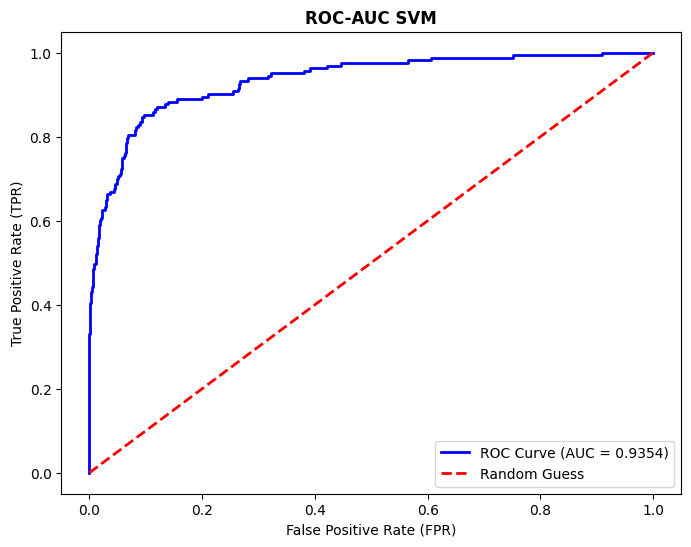
    


```python
from sklearn.inspection import permutation_importance
result_svm = permutation_importance(clf_svm, X_test, y_test, n_repeats=10, random_state=42)
importance_svm= result_svm.importances_mean
#visualisasi
import matplotlib.pyplot as plt
plt.barh(X_train.columns, importance_svm)
plt.xlabel("Feature Importance")
plt.ylabel("Features")
plt.show()
```


    
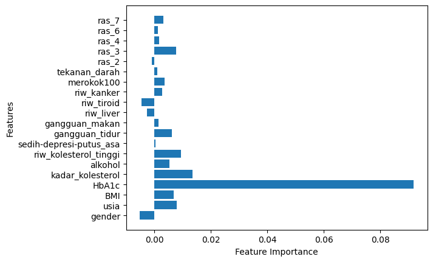
    


### 5.4 Random Forest


```python
hyp_rf_params = {
    'n_estimators': [100, 200, 300, 400],
    'max_depth': [None, 5, 10, 15],
    'min_samples_split': [2, 5, 10],
    'min_samples_leaf': [1, 2, 4],
    'max_features': ['sqrt', 'log2', 0.5],
}
```


```python
hyp_rf = RandomForestClassifier(random_state=42)
clf_rf = GridSearchCV(
    estimator=hyp_rf,
    param_grid=hyp_rf_params,
    scoring='f1_weighted',
    cv=stratified_cv,
    verbose=1,
    n_jobs=-2
)
```


```python
clf_rf.fit(X_train, y_train)
```

    Fitting 10 folds for each of 432 candidates, totalling 4320 fits
    


<style>#sk-container-id-8 {
  /* Definition of color scheme common for light and dark mode */
  --sklearn-color-text: #000;
  --sklearn-color-text-muted: #666;
  --sklearn-color-line: gray;
  /* Definition of color scheme for unfitted estimators */
  --sklearn-color-unfitted-level-0: #fff5e6;
  --sklearn-color-unfitted-level-1: #f6e4d2;
  --sklearn-color-unfitted-level-2: #ffe0b3;
  --sklearn-color-unfitted-level-3: chocolate;
  /* Definition of color scheme for fitted estimators */
  --sklearn-color-fitted-level-0: #f0f8ff;
  --sklearn-color-fitted-level-1: #d4ebff;
  --sklearn-color-fitted-level-2: #b3dbfd;
  --sklearn-color-fitted-level-3: cornflowerblue;

  /* Specific color for light theme */
  --sklearn-color-text-on-default-background: var(--sg-text-color, var(--theme-code-foreground, var(--jp-content-font-color1, black)));
  --sklearn-color-background: var(--sg-background-color, var(--theme-background, var(--jp-layout-color0, white)));
  --sklearn-color-border-box: var(--sg-text-color, var(--theme-code-foreground, var(--jp-content-font-color1, black)));
  --sklearn-color-icon: #696969;

  @media (prefers-color-scheme: dark) {
    /* Redefinition of color scheme for dark theme */
    --sklearn-color-text-on-default-background: var(--sg-text-color, var(--theme-code-foreground, var(--jp-content-font-color1, white)));
    --sklearn-color-background: var(--sg-background-color, var(--theme-background, var(--jp-layout-color0, #111)));
    --sklearn-color-border-box: var(--sg-text-color, var(--theme-code-foreground, var(--jp-content-font-color1, white)));
    --sklearn-color-icon: #878787;
  }
}

#sk-container-id-8 {
  color: var(--sklearn-color-text);
}

#sk-container-id-8 pre {
  padding: 0;
}

#sk-container-id-8 input.sk-hidden--visually {
  border: 0;
  clip: rect(1px 1px 1px 1px);
  clip: rect(1px, 1px, 1px, 1px);
  height: 1px;
  margin: -1px;
  overflow: hidden;
  padding: 0;
  position: absolute;
  width: 1px;
}

#sk-container-id-8 div.sk-dashed-wrapped {
  border: 1px dashed var(--sklearn-color-line);
  margin: 0 0.4em 0.5em 0.4em;
  box-sizing: border-box;
  padding-bottom: 0.4em;
  background-color: var(--sklearn-color-background);
}

#sk-container-id-8 div.sk-container {
  /* jupyter's `normalize.less` sets `[hidden] { display: none; }`
     but bootstrap.min.css set `[hidden] { display: none !important; }`
     so we also need the `!important` here to be able to override the
     default hidden behavior on the sphinx rendered scikit-learn.org.
     See: https://github.com/scikit-learn/scikit-learn/issues/21755 */
  display: inline-block !important;
  position: relative;
}

#sk-container-id-8 div.sk-text-repr-fallback {
  display: none;
}

div.sk-parallel-item,
div.sk-serial,
div.sk-item {
  /* draw centered vertical line to link estimators */
  background-image: linear-gradient(var(--sklearn-color-text-on-default-background), var(--sklearn-color-text-on-default-background));
  background-size: 2px 100%;
  background-repeat: no-repeat;
  background-position: center center;
}

/* Parallel-specific style estimator block */

#sk-container-id-8 div.sk-parallel-item::after {
  content: "";
  width: 100%;
  border-bottom: 2px solid var(--sklearn-color-text-on-default-background);
  flex-grow: 1;
}

#sk-container-id-8 div.sk-parallel {
  display: flex;
  align-items: stretch;
  justify-content: center;
  background-color: var(--sklearn-color-background);
  position: relative;
}

#sk-container-id-8 div.sk-parallel-item {
  display: flex;
  flex-direction: column;
}

#sk-container-id-8 div.sk-parallel-item:first-child::after {
  align-self: flex-end;
  width: 50%;
}

#sk-container-id-8 div.sk-parallel-item:last-child::after {
  align-self: flex-start;
  width: 50%;
}

#sk-container-id-8 div.sk-parallel-item:only-child::after {
  width: 0;
}

/* Serial-specific style estimator block */

#sk-container-id-8 div.sk-serial {
  display: flex;
  flex-direction: column;
  align-items: center;
  background-color: var(--sklearn-color-background);
  padding-right: 1em;
  padding-left: 1em;
}


/* Toggleable style: style used for estimator/Pipeline/ColumnTransformer box that is
clickable and can be expanded/collapsed.
- Pipeline and ColumnTransformer use this feature and define the default style
- Estimators will overwrite some part of the style using the `sk-estimator` class
*/

/* Pipeline and ColumnTransformer style (default) */

#sk-container-id-8 div.sk-toggleable {
  /* Default theme specific background. It is overwritten whether we have a
  specific estimator or a Pipeline/ColumnTransformer */
  background-color: var(--sklearn-color-background);
}

/* Toggleable label */
#sk-container-id-8 label.sk-toggleable__label {
  cursor: pointer;
  display: flex;
  width: 100%;
  margin-bottom: 0;
  padding: 0.5em;
  box-sizing: border-box;
  text-align: center;
  align-items: start;
  justify-content: space-between;
  gap: 0.5em;
}

#sk-container-id-8 label.sk-toggleable__label .caption {
  font-size: 0.6rem;
  font-weight: lighter;
  color: var(--sklearn-color-text-muted);
}

#sk-container-id-8 label.sk-toggleable__label-arrow:before {
  /* Arrow on the left of the label */
  content: "▸";
  float: left;
  margin-right: 0.25em;
  color: var(--sklearn-color-icon);
}

#sk-container-id-8 label.sk-toggleable__label-arrow:hover:before {
  color: var(--sklearn-color-text);
}

/* Toggleable content - dropdown */

#sk-container-id-8 div.sk-toggleable__content {
  max-height: 0;
  max-width: 0;
  overflow: hidden;
  text-align: left;
  /* unfitted */
  background-color: var(--sklearn-color-unfitted-level-0);
}

#sk-container-id-8 div.sk-toggleable__content.fitted {
  /* fitted */
  background-color: var(--sklearn-color-fitted-level-0);
}

#sk-container-id-8 div.sk-toggleable__content pre {
  margin: 0.2em;
  border-radius: 0.25em;
  color: var(--sklearn-color-text);
  /* unfitted */
  background-color: var(--sklearn-color-unfitted-level-0);
}

#sk-container-id-8 div.sk-toggleable__content.fitted pre {
  /* unfitted */
  background-color: var(--sklearn-color-fitted-level-0);
}

#sk-container-id-8 input.sk-toggleable__control:checked~div.sk-toggleable__content {
  /* Expand drop-down */
  max-height: 200px;
  max-width: 100%;
  overflow: auto;
}

#sk-container-id-8 input.sk-toggleable__control:checked~label.sk-toggleable__label-arrow:before {
  content: "▾";
}

/* Pipeline/ColumnTransformer-specific style */

#sk-container-id-8 div.sk-label input.sk-toggleable__control:checked~label.sk-toggleable__label {
  color: var(--sklearn-color-text);
  background-color: var(--sklearn-color-unfitted-level-2);
}

#sk-container-id-8 div.sk-label.fitted input.sk-toggleable__control:checked~label.sk-toggleable__label {
  background-color: var(--sklearn-color-fitted-level-2);
}

/* Estimator-specific style */

/* Colorize estimator box */
#sk-container-id-8 div.sk-estimator input.sk-toggleable__control:checked~label.sk-toggleable__label {
  /* unfitted */
  background-color: var(--sklearn-color-unfitted-level-2);
}

#sk-container-id-8 div.sk-estimator.fitted input.sk-toggleable__control:checked~label.sk-toggleable__label {
  /* fitted */
  background-color: var(--sklearn-color-fitted-level-2);
}

#sk-container-id-8 div.sk-label label.sk-toggleable__label,
#sk-container-id-8 div.sk-label label {
  /* The background is the default theme color */
  color: var(--sklearn-color-text-on-default-background);
}

/* On hover, darken the color of the background */
#sk-container-id-8 div.sk-label:hover label.sk-toggleable__label {
  color: var(--sklearn-color-text);
  background-color: var(--sklearn-color-unfitted-level-2);
}

/* Label box, darken color on hover, fitted */
#sk-container-id-8 div.sk-label.fitted:hover label.sk-toggleable__label.fitted {
  color: var(--sklearn-color-text);
  background-color: var(--sklearn-color-fitted-level-2);
}

/* Estimator label */

#sk-container-id-8 div.sk-label label {
  font-family: monospace;
  font-weight: bold;
  display: inline-block;
  line-height: 1.2em;
}

#sk-container-id-8 div.sk-label-container {
  text-align: center;
}

/* Estimator-specific */
#sk-container-id-8 div.sk-estimator {
  font-family: monospace;
  border: 1px dotted var(--sklearn-color-border-box);
  border-radius: 0.25em;
  box-sizing: border-box;
  margin-bottom: 0.5em;
  /* unfitted */
  background-color: var(--sklearn-color-unfitted-level-0);
}

#sk-container-id-8 div.sk-estimator.fitted {
  /* fitted */
  background-color: var(--sklearn-color-fitted-level-0);
}

/* on hover */
#sk-container-id-8 div.sk-estimator:hover {
  /* unfitted */
  background-color: var(--sklearn-color-unfitted-level-2);
}

#sk-container-id-8 div.sk-estimator.fitted:hover {
  /* fitted */
  background-color: var(--sklearn-color-fitted-level-2);
}

/* Specification for estimator info (e.g. "i" and "?") */

/* Common style for "i" and "?" */

.sk-estimator-doc-link,
a:link.sk-estimator-doc-link,
a:visited.sk-estimator-doc-link {
  float: right;
  font-size: smaller;
  line-height: 1em;
  font-family: monospace;
  background-color: var(--sklearn-color-background);
  border-radius: 1em;
  height: 1em;
  width: 1em;
  text-decoration: none !important;
  margin-left: 0.5em;
  text-align: center;
  /* unfitted */
  border: var(--sklearn-color-unfitted-level-1) 1pt solid;
  color: var(--sklearn-color-unfitted-level-1);
}

.sk-estimator-doc-link.fitted,
a:link.sk-estimator-doc-link.fitted,
a:visited.sk-estimator-doc-link.fitted {
  /* fitted */
  border: var(--sklearn-color-fitted-level-1) 1pt solid;
  color: var(--sklearn-color-fitted-level-1);
}

/* On hover */
div.sk-estimator:hover .sk-estimator-doc-link:hover,
.sk-estimator-doc-link:hover,
div.sk-label-container:hover .sk-estimator-doc-link:hover,
.sk-estimator-doc-link:hover {
  /* unfitted */
  background-color: var(--sklearn-color-unfitted-level-3);
  color: var(--sklearn-color-background);
  text-decoration: none;
}

div.sk-estimator.fitted:hover .sk-estimator-doc-link.fitted:hover,
.sk-estimator-doc-link.fitted:hover,
div.sk-label-container:hover .sk-estimator-doc-link.fitted:hover,
.sk-estimator-doc-link.fitted:hover {
  /* fitted */
  background-color: var(--sklearn-color-fitted-level-3);
  color: var(--sklearn-color-background);
  text-decoration: none;
}

/* Span, style for the box shown on hovering the info icon */
.sk-estimator-doc-link span {
  display: none;
  z-index: 9999;
  position: relative;
  font-weight: normal;
  right: .2ex;
  padding: .5ex;
  margin: .5ex;
  width: min-content;
  min-width: 20ex;
  max-width: 50ex;
  color: var(--sklearn-color-text);
  box-shadow: 2pt 2pt 4pt #999;
  /* unfitted */
  background: var(--sklearn-color-unfitted-level-0);
  border: .5pt solid var(--sklearn-color-unfitted-level-3);
}

.sk-estimator-doc-link.fitted span {
  /* fitted */
  background: var(--sklearn-color-fitted-level-0);
  border: var(--sklearn-color-fitted-level-3);
}

.sk-estimator-doc-link:hover span {
  display: block;
}

/* "?"-specific style due to the `<a>` HTML tag */

#sk-container-id-8 a.estimator_doc_link {
  float: right;
  font-size: 1rem;
  line-height: 1em;
  font-family: monospace;
  background-color: var(--sklearn-color-background);
  border-radius: 1rem;
  height: 1rem;
  width: 1rem;
  text-decoration: none;
  /* unfitted */
  color: var(--sklearn-color-unfitted-level-1);
  border: var(--sklearn-color-unfitted-level-1) 1pt solid;
}

#sk-container-id-8 a.estimator_doc_link.fitted {
  /* fitted */
  border: var(--sklearn-color-fitted-level-1) 1pt solid;
  color: var(--sklearn-color-fitted-level-1);
}

/* On hover */
#sk-container-id-8 a.estimator_doc_link:hover {
  /* unfitted */
  background-color: var(--sklearn-color-unfitted-level-3);
  color: var(--sklearn-color-background);
  text-decoration: none;
}

#sk-container-id-8 a.estimator_doc_link.fitted:hover {
  /* fitted */
  background-color: var(--sklearn-color-fitted-level-3);
}
</style><div id="sk-container-id-8" class="sk-top-container"><div class="sk-text-repr-fallback"><pre>GridSearchCV(cv=StratifiedKFold(n_splits=10, random_state=42, shuffle=True),
             estimator=RandomForestClassifier(random_state=42), n_jobs=-2,
             param_grid={&#x27;max_depth&#x27;: [None, 5, 10, 15],
                         &#x27;max_features&#x27;: [&#x27;sqrt&#x27;, &#x27;log2&#x27;, 0.5],
                         &#x27;min_samples_leaf&#x27;: [1, 2, 4],
                         &#x27;min_samples_split&#x27;: [2, 5, 10],
                         &#x27;n_estimators&#x27;: [100, 200, 300, 400]},
             scoring=&#x27;f1_weighted&#x27;, verbose=1)</pre><b>In a Jupyter environment, please rerun this cell to show the HTML representation or trust the notebook. <br />On GitHub, the HTML representation is unable to render, please try loading this page with nbviewer.org.</b></div><div class="sk-container" hidden><div class="sk-item sk-dashed-wrapped"><div class="sk-label-container"><div class="sk-label fitted sk-toggleable"><input class="sk-toggleable__control sk-hidden--visually" id="sk-estimator-id-14" type="checkbox" ><label for="sk-estimator-id-14" class="sk-toggleable__label fitted sk-toggleable__label-arrow"><div><div>GridSearchCV</div></div><div><a class="sk-estimator-doc-link fitted" rel="noreferrer" target="_blank" href="https://scikit-learn.org/1.6/modules/generated/sklearn.model_selection.GridSearchCV.html">?<span>Documentation for GridSearchCV</span></a><span class="sk-estimator-doc-link fitted">i<span>Fitted</span></span></div></label><div class="sk-toggleable__content fitted"><pre>GridSearchCV(cv=StratifiedKFold(n_splits=10, random_state=42, shuffle=True),
             estimator=RandomForestClassifier(random_state=42), n_jobs=-2,
             param_grid={&#x27;max_depth&#x27;: [None, 5, 10, 15],
                         &#x27;max_features&#x27;: [&#x27;sqrt&#x27;, &#x27;log2&#x27;, 0.5],
                         &#x27;min_samples_leaf&#x27;: [1, 2, 4],
                         &#x27;min_samples_split&#x27;: [2, 5, 10],
                         &#x27;n_estimators&#x27;: [100, 200, 300, 400]},
             scoring=&#x27;f1_weighted&#x27;, verbose=1)</pre></div> </div></div><div class="sk-parallel"><div class="sk-parallel-item"><div class="sk-item"><div class="sk-label-container"><div class="sk-label fitted sk-toggleable"><input class="sk-toggleable__control sk-hidden--visually" id="sk-estimator-id-15" type="checkbox" ><label for="sk-estimator-id-15" class="sk-toggleable__label fitted sk-toggleable__label-arrow"><div><div>best_estimator_: RandomForestClassifier</div></div></label><div class="sk-toggleable__content fitted"><pre>RandomForestClassifier(n_estimators=300, random_state=42)</pre></div> </div></div><div class="sk-serial"><div class="sk-item"><div class="sk-estimator fitted sk-toggleable"><input class="sk-toggleable__control sk-hidden--visually" id="sk-estimator-id-16" type="checkbox" ><label for="sk-estimator-id-16" class="sk-toggleable__label fitted sk-toggleable__label-arrow"><div><div>RandomForestClassifier</div></div><div><a class="sk-estimator-doc-link fitted" rel="noreferrer" target="_blank" href="https://scikit-learn.org/1.6/modules/generated/sklearn.ensemble.RandomForestClassifier.html">?<span>Documentation for RandomForestClassifier</span></a></div></label><div class="sk-toggleable__content fitted"><pre>RandomForestClassifier(n_estimators=300, random_state=42)</pre></div> </div></div></div></div></div></div></div></div></div>


```python
best_comb_rf = clf_rf.best_params_
best_comb_rf
```


    {'max_depth': None,
     'max_features': 'sqrt',
     'min_samples_leaf': 1,
     'min_samples_split': 2,
     'n_estimators': 300}


```python
clf_rf_pred = clf_rf.predict(X_test)
print("Akurasi HYPER Random Forest: ", accuracy_score(y_test, clf_rf_pred))
```

    Akurasi HYPER Random Forest:  0.9321895424836601
    


```python
accuracy_clf_rf = accuracy_score(y_test, clf_rf_pred)
precision_clf_rf = precision_score(y_test, clf_rf_pred)
recall_clf_rf = recall_score(y_test, clf_rf_pred)
f1_clf_rf = f1_score(y_test, clf_rf_pred)
roc_auc_clf_rf = roc_auc_score(y_test, clf_rf_pred)

print(f"Accuracy: {accuracy_clf_rf:.4f}")
print(f"Recall: {recall_clf_rf:.4f}")
print(f"Precision: {precision_clf_rf:.4f}")
print(f"F1-Score: {f1_clf_rf:.4f}")
```

    Accuracy: 0.9322
    Recall: 0.8773
    Precision: 0.6942
    F1-Score: 0.7751
    


```python
print(classification_report(y_test, clf_rf_pred))
```

                  precision    recall  f1-score   support
    
               0       0.98      0.94      0.96      1061
               1       0.69      0.88      0.78       163
    
        accuracy                           0.93      1224
       macro avg       0.84      0.91      0.87      1224
    weighted avg       0.94      0.93      0.94      1224
    
    


```python
clf_rf.best_score_
```


    np.float64(0.9759194072818437)


```python
from sklearn.metrics import roc_auc_score, roc_curve
y_pred_proba_clf_rf = clf_rf.predict_proba(X_test)[:, 1]  # Probabilitas kelas positif
roc_auc_clf_rf = roc_auc_score(y_test, y_pred_proba_clf_rf)
pr_auc_clf_rf = average_precision_score(y_test, y_pred_proba_clf_rf)
print(f"ROC-AUC Score: {roc_auc_clf_rf:.4f}")
print(f"PR-AUC Score: {pr_auc_clf_rf:.4f}")
```

    ROC-AUC Score: 0.9599
    PR-AUC Score: 0.8570
    


```python
from sklearn.metrics import confusion_matrix
tn_clf_rf, fp_clf_rf, fn_clf_rf, tp_clf_rf = confusion_matrix(y_test, clf_rf_pred).ravel()

# Hitung spesifisitas
specificity_clf_rf = tn_clf_rf / (tn_clf_rf + fp_clf_rf)
sensitiviy_clf_rf = tp_clf_rf / (tp_clf_rf + fn_clf_rf)
```


```python
print(f"True Negative (TN): {tn_clf_rf}")
print(f"False Positive (FP): {fp_clf_rf}")
print(f"Spesifisitas: {specificity_clf_rf:.4f}")
```

    True Negative (TN): 998
    False Positive (FP): 63
    Spesifisitas: 0.9406
    


```python
print(f"True Positive (TN): {tp_clf_rf}")
print(f"False Negative (FP): {fn_clf_rf}")
print(f"Sensitivitas: {sensitiviy_clf_rf:.4f}")
```

    True Positive (TN): 143
    False Negative (FP): 20
    Sensitivitas: 0.8773
    


```python
fpr_clf_rf, tpr_clf_rf, thresholds_rf = roc_curve(y_test, y_pred_proba_clf_rf)

# Visualisasi kurva ROC
plt.figure(figsize=(8, 6))
plt.plot(fpr_clf_rf, tpr_clf_rf, color='blue', lw=2, label=f'ROC Curve (AUC = {roc_auc_clf_rf:.4f})')
plt.plot([0, 1], [0, 1], color='red', lw=2, linestyle='--', label='Random Guess')
plt.xlabel('False Positive Rate (FPR)')
plt.ylabel('True Positive Rate (TPR)')
plt.title('ROC-AUC Random Forest', fontweight='bold')
plt.legend(loc='lower right')
plt.savefig('ROC-AUC_RF_dengan_HYP.png', dpi=400)
plt.show()
```


    

    


```python
from sklearn.inspection import permutation_importance
result_rf = permutation_importance(clf_rf, X_test, y_test, n_repeats=10, random_state=42)
importance_rf = result_rf.importances_mean
#visualisasi
import matplotlib.pyplot as plt
plt.barh(X_train.columns, importance_rf)
plt.xlabel("Feature Importance")
plt.ylabel("Features")
plt.show()
```


    
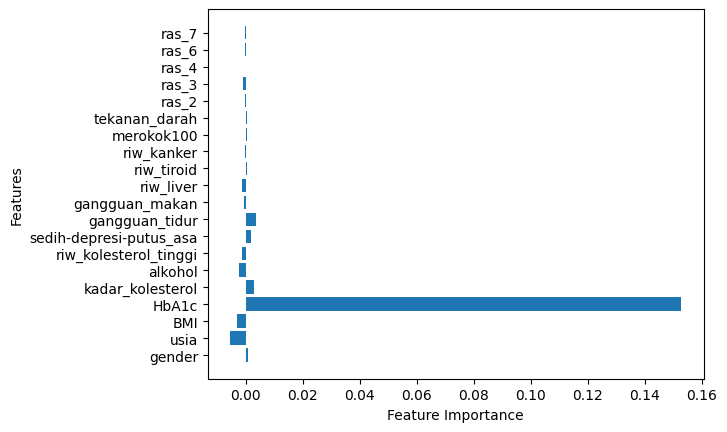
    


### Confusion Matrix


```python
# from sklearn.metrics import confusion_matrix
# models = {
#     'KNN': clf_knn_pred,
#     'XGBoost': clf_xgb_pred,
#     'SVM': clf_svm_pred,
#     'Random Forest': clf_rf_pred
# }

# # Membuat grid subplot 2x2 untuk menampung 4 confusion matrix
# fig, axes = plt.subplots(2, 2, figsize=(12, 10))
# # Meratakan array axes agar mudah di-loop
# axes = axes.flatten()
# # Loop melalui setiap model untuk membuat dan memvisualisasikan confusion matrix
# for i, (model_name, y_pred) in enumerate(models.items()):
#     # Hitung confusion matrix
#     cm = confusion_matrix(y_test, y_pred)
#     # Buat heatmap menggunakan Seaborn
#     sns.heatmap(cm, ax=axes[i], annot=True, fmt='d', cmap='Blues',
#                 xticklabels=['Negatif', 'Positif'],
#                 yticklabels=['Negatif', 'Positif'],
#                 annot_kws={"size": 14}) # Ukuran font untuk angka di dalam sel
#     # Atur judul dan label untuk setiap subplot
#     axes[i].set_title(f'{model_name}', fontsize=15, pad=10)
#     axes[i].set_xlabel('Predicted Label', fontsize=12)
#     axes[i].set_ylabel('True Label', fontsize=12)
# # Menyesuaikan layout agar tidak ada tumpang tindih dan menampilkan plot
# plt.tight_layout(pad=3.0)
# plt.show()
# # Anda dapat menyimpan gambar ini dengan menambahkan baris berikut sebelum plt.show()
# fig.savefig('confusion_matrix_dengan_HYP.png', dpi=400)
```

## 6. Feature Importance


```python
from eli5.sklearn import PermutationImportance
```

### 6.1 KNN


```python
# Untuk model KNN
perm_clf_knn = PermutationImportance(clf_knn, random_state=42).fit(X_test, y_test)
eli5.show_weights(perm_clf_knn, feature_names=X_test.columns.tolist())
```


    <style>
    table.eli5-weights tr:hover {
        filter: brightness(85%);
    }
</style>


        <table class="eli5-weights eli5-feature-importances" style="border-collapse: collapse; border: none; margin-top: 0em; table-layout: auto;">
    <thead>
    <tr style="border: none;">
        <th style="padding: 0 1em 0 0.5em; text-align: right; border: none;">Weight</th>
        <th style="padding: 0 0.5em 0 0.5em; text-align: left; border: none;">Feature</th>
    </tr>
    </thead>
    <tbody>

        <tr style="background-color: hsl(120, 100.00%, 80.00%); border: none;">
            <td style="padding: 0 1em 0 0.5em; text-align: right; border: none;">
                0.0297

                    &plusmn; 0.0185

            </td>
            <td style="padding: 0 0.5em 0 0.5em; text-align: left; border: none;">
                riw_kolesterol_tinggi
            </td>
        </tr>

        <tr style="background-color: hsl(120, 100.00%, 86.45%); border: none;">
            <td style="padding: 0 1em 0 0.5em; text-align: right; border: none;">
                0.0170

                    &plusmn; 0.0055

            </td>
            <td style="padding: 0 0.5em 0 0.5em; text-align: left; border: none;">
                HbA1c
            </td>
        </tr>

        <tr style="background-color: hsl(120, 100.00%, 86.57%); border: none;">
            <td style="padding: 0 1em 0 0.5em; text-align: right; border: none;">
                0.0168

                    &plusmn; 0.0071

            </td>
            <td style="padding: 0 0.5em 0 0.5em; text-align: left; border: none;">
                usia
            </td>
        </tr>

        <tr style="background-color: hsl(120, 100.00%, 86.93%); border: none;">
            <td style="padding: 0 1em 0 0.5em; text-align: right; border: none;">
                0.0162

                    &plusmn; 0.0091

            </td>
            <td style="padding: 0 0.5em 0 0.5em; text-align: left; border: none;">
                alkohol
            </td>
        </tr>

        <tr style="background-color: hsl(120, 100.00%, 89.91%); border: none;">
            <td style="padding: 0 1em 0 0.5em; text-align: right; border: none;">
                0.0112

                    &plusmn; 0.0064

            </td>
            <td style="padding: 0 0.5em 0 0.5em; text-align: left; border: none;">
                merokok100
            </td>
        </tr>

        <tr style="background-color: hsl(120, 100.00%, 92.38%); border: none;">
            <td style="padding: 0 1em 0 0.5em; text-align: right; border: none;">
                0.0075

                    &plusmn; 0.0047

            </td>
            <td style="padding: 0 0.5em 0 0.5em; text-align: left; border: none;">
                BMI
            </td>
        </tr>

        <tr style="background-color: hsl(120, 100.00%, 95.76%); border: none;">
            <td style="padding: 0 1em 0 0.5em; text-align: right; border: none;">
                0.0032

                    &plusmn; 0.0062

            </td>
            <td style="padding: 0 0.5em 0 0.5em; text-align: left; border: none;">
                gangguan_tidur
            </td>
        </tr>

        <tr style="background-color: hsl(120, 100.00%, 96.03%); border: none;">
            <td style="padding: 0 1em 0 0.5em; text-align: right; border: none;">
                0.0029

                    &plusmn; 0.0047

            </td>
            <td style="padding: 0 0.5em 0 0.5em; text-align: left; border: none;">
                sedih-depresi-putus_asa
            </td>
        </tr>

        <tr style="background-color: hsl(120, 100.00%, 96.06%); border: none;">
            <td style="padding: 0 1em 0 0.5em; text-align: right; border: none;">
                0.0029

                    &plusmn; 0.0070

            </td>
            <td style="padding: 0 0.5em 0 0.5em; text-align: left; border: none;">
                tekanan_darah
            </td>
        </tr>

        <tr style="background-color: hsl(120, 100.00%, 96.49%); border: none;">
            <td style="padding: 0 1em 0 0.5em; text-align: right; border: none;">
                0.0025

                    &plusmn; 0.0068

            </td>
            <td style="padding: 0 0.5em 0 0.5em; text-align: left; border: none;">
                gangguan_makan
            </td>
        </tr>

        <tr style="background-color: hsl(120, 100.00%, 97.03%); border: none;">
            <td style="padding: 0 1em 0 0.5em; text-align: right; border: none;">
                0.0019

                    &plusmn; 0.0030

            </td>
            <td style="padding: 0 0.5em 0 0.5em; text-align: left; border: none;">
                kadar_kolesterol
            </td>
        </tr>

        <tr style="background-color: hsl(120, 100.00%, 97.24%); border: none;">
            <td style="padding: 0 1em 0 0.5em; text-align: right; border: none;">
                0.0018

                    &plusmn; 0.0016

            </td>
            <td style="padding: 0 0.5em 0 0.5em; text-align: left; border: none;">
                ras_6
            </td>
        </tr>

        <tr style="background-color: hsl(120, 100.00%, 98.73%); border: none;">
            <td style="padding: 0 1em 0 0.5em; text-align: right; border: none;">
                0.0006

                    &plusmn; 0.0107

            </td>
            <td style="padding: 0 0.5em 0 0.5em; text-align: left; border: none;">
                ras_3
            </td>
        </tr>

        <tr style="background-color: hsl(0, 100.00%, 97.22%); border: none;">
            <td style="padding: 0 1em 0 0.5em; text-align: right; border: none;">
                -0.0018

                    &plusmn; 0.0032

            </td>
            <td style="padding: 0 0.5em 0 0.5em; text-align: left; border: none;">
                ras_2
            </td>
        </tr>

        <tr style="background-color: hsl(0, 100.00%, 96.65%); border: none;">
            <td style="padding: 0 1em 0 0.5em; text-align: right; border: none;">
                -0.0023

                    &plusmn; 0.0053

            </td>
            <td style="padding: 0 0.5em 0 0.5em; text-align: left; border: none;">
                riw_liver
            </td>
        </tr>

        <tr style="background-color: hsl(0, 100.00%, 95.00%); border: none;">
            <td style="padding: 0 1em 0 0.5em; text-align: right; border: none;">
                -0.0041

                    &plusmn; 0.0031

            </td>
            <td style="padding: 0 0.5em 0 0.5em; text-align: left; border: none;">
                ras_7
            </td>
        </tr>

        <tr style="background-color: hsl(0, 100.00%, 94.97%); border: none;">
            <td style="padding: 0 1em 0 0.5em; text-align: right; border: none;">
                -0.0041

                    &plusmn; 0.0115

            </td>
            <td style="padding: 0 0.5em 0 0.5em; text-align: left; border: none;">
                gender
            </td>
        </tr>

        <tr style="background-color: hsl(0, 100.00%, 94.08%); border: none;">
            <td style="padding: 0 1em 0 0.5em; text-align: right; border: none;">
                -0.0052

                    &plusmn; 0.0038

            </td>
            <td style="padding: 0 0.5em 0 0.5em; text-align: left; border: none;">
                riw_tiroid
            </td>
        </tr>

        <tr style="background-color: hsl(0, 100.00%, 92.22%); border: none;">
            <td style="padding: 0 1em 0 0.5em; text-align: right; border: none;">
                -0.0077

                    &plusmn; 0.0077

            </td>
            <td style="padding: 0 0.5em 0 0.5em; text-align: left; border: none;">
                riw_kanker
            </td>
        </tr>

        <tr style="background-color: hsl(0, 100.00%, 91.93%); border: none;">
            <td style="padding: 0 1em 0 0.5em; text-align: right; border: none;">
                -0.0081

                    &plusmn; 0.0026

            </td>
            <td style="padding: 0 0.5em 0 0.5em; text-align: left; border: none;">
                ras_4
            </td>
        </tr>


    </tbody>
</table>


```python
import matplotlib.pyplot as plt
import pandas as pd
import seaborn as sns

clf_knn_importance_values = perm_clf_knn.feature_importances_
feature_names = X_test.columns

clf_knn_importance_df = pd.DataFrame({'Feature': feature_names, 'Importance': clf_knn_importance_values})
clf_knn_importance_df = clf_knn_importance_df.sort_values(by='Importance', ascending=False)

plt.figure(figsize=(10, 6))
sns.barplot(x='Importance', y='Feature', hue='Feature', data=clf_knn_importance_df, palette='viridis')
plt.title('Feature Importance (Random Forest - ELI5 Permutation)')
# plt.tight_layout()
plt.show()
```


    
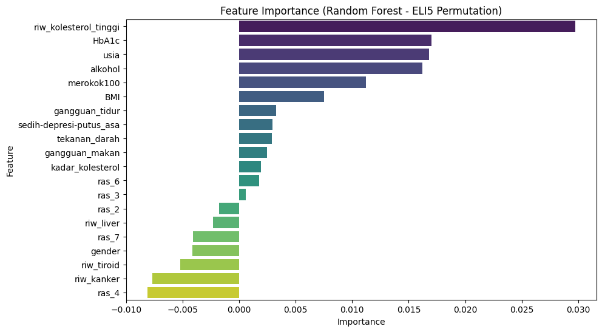
    


### 6.2 XGBoost


```python
# Untuk model SVM
perm_clf_xgb = PermutationImportance(clf_xgb, random_state=42).fit(X_test, y_test)
eli5.show_weights(perm_clf_xgb, feature_names=X_test.columns.tolist())
```


    <style>
    table.eli5-weights tr:hover {
        filter: brightness(85%);
    }
</style>


        <table class="eli5-weights eli5-feature-importances" style="border-collapse: collapse; border: none; margin-top: 0em; table-layout: auto;">
    <thead>
    <tr style="border: none;">
        <th style="padding: 0 1em 0 0.5em; text-align: right; border: none;">Weight</th>
        <th style="padding: 0 0.5em 0 0.5em; text-align: left; border: none;">Feature</th>
    </tr>
    </thead>
    <tbody>

        <tr style="background-color: hsl(120, 100.00%, 80.00%); border: none;">
            <td style="padding: 0 1em 0 0.5em; text-align: right; border: none;">
                0.1412

                    &plusmn; 0.0130

            </td>
            <td style="padding: 0 0.5em 0 0.5em; text-align: left; border: none;">
                HbA1c
            </td>
        </tr>

        <tr style="background-color: hsl(120, 100.00%, 96.39%); border: none;">
            <td style="padding: 0 1em 0 0.5em; text-align: right; border: none;">
                0.0122

                    &plusmn; 0.0052

            </td>
            <td style="padding: 0 0.5em 0 0.5em; text-align: left; border: none;">
                kadar_kolesterol
            </td>
        </tr>

        <tr style="background-color: hsl(120, 100.00%, 98.32%); border: none;">
            <td style="padding: 0 1em 0 0.5em; text-align: right; border: none;">
                0.0041

                    &plusmn; 0.0046

            </td>
            <td style="padding: 0 0.5em 0 0.5em; text-align: left; border: none;">
                merokok100
            </td>
        </tr>

        <tr style="background-color: hsl(120, 100.00%, 98.38%); border: none;">
            <td style="padding: 0 1em 0 0.5em; text-align: right; border: none;">
                0.0039

                    &plusmn; 0.0040

            </td>
            <td style="padding: 0 0.5em 0 0.5em; text-align: left; border: none;">
                ras_3
            </td>
        </tr>

        <tr style="background-color: hsl(120, 100.00%, 98.40%); border: none;">
            <td style="padding: 0 1em 0 0.5em; text-align: right; border: none;">
                0.0038

                    &plusmn; 0.0027

            </td>
            <td style="padding: 0 0.5em 0 0.5em; text-align: left; border: none;">
                riw_kolesterol_tinggi
            </td>
        </tr>

        <tr style="background-color: hsl(120, 100.00%, 98.46%); border: none;">
            <td style="padding: 0 1em 0 0.5em; text-align: right; border: none;">
                0.0036

                    &plusmn; 0.0045

            </td>
            <td style="padding: 0 0.5em 0 0.5em; text-align: left; border: none;">
                gangguan_tidur
            </td>
        </tr>

        <tr style="background-color: hsl(120, 100.00%, 98.99%); border: none;">
            <td style="padding: 0 1em 0 0.5em; text-align: right; border: none;">
                0.0020

                    &plusmn; 0.0023

            </td>
            <td style="padding: 0 0.5em 0 0.5em; text-align: left; border: none;">
                riw_kanker
            </td>
        </tr>

        <tr style="background-color: hsl(120, 100.00%, 99.02%); border: none;">
            <td style="padding: 0 1em 0 0.5em; text-align: right; border: none;">
                0.0019

                    &plusmn; 0.0026

            </td>
            <td style="padding: 0 0.5em 0 0.5em; text-align: left; border: none;">
                BMI
            </td>
        </tr>

        <tr style="background-color: hsl(120, 100.00%, 99.07%); border: none;">
            <td style="padding: 0 1em 0 0.5em; text-align: right; border: none;">
                0.0018

                    &plusmn; 0.0034

            </td>
            <td style="padding: 0 0.5em 0 0.5em; text-align: left; border: none;">
                alkohol
            </td>
        </tr>

        <tr style="background-color: hsl(120, 100.00%, 99.10%); border: none;">
            <td style="padding: 0 1em 0 0.5em; text-align: right; border: none;">
                0.0017

                    &plusmn; 0.0038

            </td>
            <td style="padding: 0 0.5em 0 0.5em; text-align: left; border: none;">
                tekanan_darah
            </td>
        </tr>

        <tr style="background-color: hsl(120, 100.00%, 99.52%); border: none;">
            <td style="padding: 0 1em 0 0.5em; text-align: right; border: none;">
                0.0007

                    &plusmn; 0.0014

            </td>
            <td style="padding: 0 0.5em 0 0.5em; text-align: left; border: none;">
                gangguan_makan
            </td>
        </tr>

        <tr style="background-color: hsl(120, 100.00%, 99.52%); border: none;">
            <td style="padding: 0 1em 0 0.5em; text-align: right; border: none;">
                0.0007

                    &plusmn; 0.0019

            </td>
            <td style="padding: 0 0.5em 0 0.5em; text-align: left; border: none;">
                ras_7
            </td>
        </tr>

        <tr style="background-color: hsl(120, 100.00%, 99.58%); border: none;">
            <td style="padding: 0 1em 0 0.5em; text-align: right; border: none;">
                0.0006

                    &plusmn; 0.0017

            </td>
            <td style="padding: 0 0.5em 0 0.5em; text-align: left; border: none;">
                ras_4
            </td>
        </tr>

        <tr style="background-color: hsl(120, 100.00%, 99.64%); border: none;">
            <td style="padding: 0 1em 0 0.5em; text-align: right; border: none;">
                0.0005

                    &plusmn; 0.0008

            </td>
            <td style="padding: 0 0.5em 0 0.5em; text-align: left; border: none;">
                sedih-depresi-putus_asa
            </td>
        </tr>

        <tr style="background-color: hsl(120, 100.00%, 99.82%); border: none;">
            <td style="padding: 0 1em 0 0.5em; text-align: right; border: none;">
                0.0002

                    &plusmn; 0.0007

            </td>
            <td style="padding: 0 0.5em 0 0.5em; text-align: left; border: none;">
                ras_6
            </td>
        </tr>

        <tr style="background-color: hsl(0, 100.00%, 100.00%); border: none;">
            <td style="padding: 0 1em 0 0.5em; text-align: right; border: none;">
                0

                    &plusmn; 0.0000

            </td>
            <td style="padding: 0 0.5em 0 0.5em; text-align: left; border: none;">
                ras_2
            </td>
        </tr>

        <tr style="background-color: hsl(0, 100.00%, 99.82%); border: none;">
            <td style="padding: 0 1em 0 0.5em; text-align: right; border: none;">
                -0.0002

                    &plusmn; 0.0015

            </td>
            <td style="padding: 0 0.5em 0 0.5em; text-align: left; border: none;">
                riw_tiroid
            </td>
        </tr>

        <tr style="background-color: hsl(0, 100.00%, 99.37%); border: none;">
            <td style="padding: 0 1em 0 0.5em; text-align: right; border: none;">
                -0.0010

                    &plusmn; 0.0012

            </td>
            <td style="padding: 0 0.5em 0 0.5em; text-align: left; border: none;">
                riw_liver
            </td>
        </tr>

        <tr style="background-color: hsl(0, 100.00%, 99.15%); border: none;">
            <td style="padding: 0 1em 0 0.5em; text-align: right; border: none;">
                -0.0015

                    &plusmn; 0.0027

            </td>
            <td style="padding: 0 0.5em 0 0.5em; text-align: left; border: none;">
                gender
            </td>
        </tr>

        <tr style="background-color: hsl(0, 100.00%, 99.03%); border: none;">
            <td style="padding: 0 1em 0 0.5em; text-align: right; border: none;">
                -0.0019

                    &plusmn; 0.0074

            </td>
            <td style="padding: 0 0.5em 0 0.5em; text-align: left; border: none;">
                usia
            </td>
        </tr>


    </tbody>
</table>


```python
clf_xgb_importance_values = perm_clf_xgb.feature_importances_
feature_names = X_test.columns

clf_xgb_importance_df = pd.DataFrame({'Feature': feature_names, 'Importance': clf_xgb_importance_values})
clf_xgb_importance_df = clf_xgb_importance_df.sort_values(by='Importance', ascending=False)

plt.figure(figsize=(10, 6))
sns.barplot(x='Importance', y='Feature', hue='Feature', data=clf_xgb_importance_df, palette='viridis')
plt.title('Feature Importance (Random Forest - ELI5 Permutation)')
# plt.tight_layout()
plt.show()
```


    
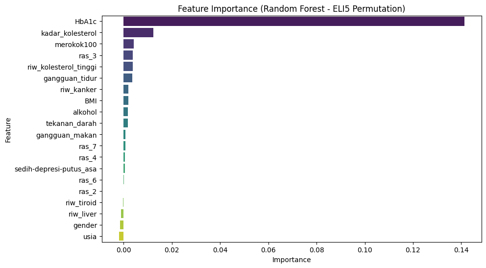
    


### 6.3 SVM


```python
# Untuk model Random Forest
perm_clf_svm = PermutationImportance(clf_svm, random_state=42).fit(X_test, y_test)
eli5.show_weights(perm_clf_svm, feature_names=X_test.columns.tolist())
```


    <style>
    table.eli5-weights tr:hover {
        filter: brightness(85%);
    }
</style>


        <table class="eli5-weights eli5-feature-importances" style="border-collapse: collapse; border: none; margin-top: 0em; table-layout: auto;">
    <thead>
    <tr style="border: none;">
        <th style="padding: 0 1em 0 0.5em; text-align: right; border: none;">Weight</th>
        <th style="padding: 0 0.5em 0 0.5em; text-align: left; border: none;">Feature</th>
    </tr>
    </thead>
    <tbody>

        <tr style="background-color: hsl(120, 100.00%, 80.00%); border: none;">
            <td style="padding: 0 1em 0 0.5em; text-align: right; border: none;">
                0.0915

                    &plusmn; 0.0157

            </td>
            <td style="padding: 0 0.5em 0 0.5em; text-align: left; border: none;">
                HbA1c
            </td>
        </tr>

        <tr style="background-color: hsl(120, 100.00%, 94.09%); border: none;">
            <td style="padding: 0 1em 0 0.5em; text-align: right; border: none;">
                0.0160

                    &plusmn; 0.0104

            </td>
            <td style="padding: 0 0.5em 0 0.5em; text-align: left; border: none;">
                kadar_kolesterol
            </td>
        </tr>

        <tr style="background-color: hsl(120, 100.00%, 95.55%); border: none;">
            <td style="padding: 0 1em 0 0.5em; text-align: right; border: none;">
                0.0107

                    &plusmn; 0.0118

            </td>
            <td style="padding: 0 0.5em 0 0.5em; text-align: left; border: none;">
                riw_kolesterol_tinggi
            </td>
        </tr>

        <tr style="background-color: hsl(120, 100.00%, 95.89%); border: none;">
            <td style="padding: 0 1em 0 0.5em; text-align: right; border: none;">
                0.0095

                    &plusmn; 0.0026

            </td>
            <td style="padding: 0 0.5em 0 0.5em; text-align: left; border: none;">
                usia
            </td>
        </tr>

        <tr style="background-color: hsl(120, 100.00%, 96.01%); border: none;">
            <td style="padding: 0 1em 0 0.5em; text-align: right; border: none;">
                0.0091

                    &plusmn; 0.0029

            </td>
            <td style="padding: 0 0.5em 0 0.5em; text-align: left; border: none;">
                ras_3
            </td>
        </tr>

        <tr style="background-color: hsl(120, 100.00%, 97.24%); border: none;">
            <td style="padding: 0 1em 0 0.5em; text-align: right; border: none;">
                0.0054

                    &plusmn; 0.0107

            </td>
            <td style="padding: 0 0.5em 0 0.5em; text-align: left; border: none;">
                merokok100
            </td>
        </tr>

        <tr style="background-color: hsl(120, 100.00%, 97.53%); border: none;">
            <td style="padding: 0 1em 0 0.5em; text-align: right; border: none;">
                0.0046

                    &plusmn; 0.0051

            </td>
            <td style="padding: 0 0.5em 0 0.5em; text-align: left; border: none;">
                ras_7
            </td>
        </tr>

        <tr style="background-color: hsl(120, 100.00%, 97.57%); border: none;">
            <td style="padding: 0 1em 0 0.5em; text-align: right; border: none;">
                0.0045

                    &plusmn; 0.0056

            </td>
            <td style="padding: 0 0.5em 0 0.5em; text-align: left; border: none;">
                gangguan_tidur
            </td>
        </tr>

        <tr style="background-color: hsl(120, 100.00%, 97.60%); border: none;">
            <td style="padding: 0 1em 0 0.5em; text-align: right; border: none;">
                0.0044

                    &plusmn; 0.0061

            </td>
            <td style="padding: 0 0.5em 0 0.5em; text-align: left; border: none;">
                BMI
            </td>
        </tr>

        <tr style="background-color: hsl(120, 100.00%, 97.62%); border: none;">
            <td style="padding: 0 1em 0 0.5em; text-align: right; border: none;">
                0.0044

                    &plusmn; 0.0064

            </td>
            <td style="padding: 0 0.5em 0 0.5em; text-align: left; border: none;">
                alkohol
            </td>
        </tr>

        <tr style="background-color: hsl(120, 100.00%, 98.41%); border: none;">
            <td style="padding: 0 1em 0 0.5em; text-align: right; border: none;">
                0.0025

                    &plusmn; 0.0014

            </td>
            <td style="padding: 0 0.5em 0 0.5em; text-align: left; border: none;">
                ras_4
            </td>
        </tr>

        <tr style="background-color: hsl(120, 100.00%, 98.56%); border: none;">
            <td style="padding: 0 1em 0 0.5em; text-align: right; border: none;">
                0.0021

                    &plusmn; 0.0058

            </td>
            <td style="padding: 0 0.5em 0 0.5em; text-align: left; border: none;">
                gangguan_makan
            </td>
        </tr>

        <tr style="background-color: hsl(120, 100.00%, 98.78%); border: none;">
            <td style="padding: 0 1em 0 0.5em; text-align: right; border: none;">
                0.0017

                    &plusmn; 0.0012

            </td>
            <td style="padding: 0 0.5em 0 0.5em; text-align: left; border: none;">
                ras_6
            </td>
        </tr>

        <tr style="background-color: hsl(120, 100.00%, 98.81%); border: none;">
            <td style="padding: 0 1em 0 0.5em; text-align: right; border: none;">
                0.0016

                    &plusmn; 0.0015

            </td>
            <td style="padding: 0 0.5em 0 0.5em; text-align: left; border: none;">
                tekanan_darah
            </td>
        </tr>

        <tr style="background-color: hsl(120, 100.00%, 98.90%); border: none;">
            <td style="padding: 0 1em 0 0.5em; text-align: right; border: none;">
                0.0015

                    &plusmn; 0.0060

            </td>
            <td style="padding: 0 0.5em 0 0.5em; text-align: left; border: none;">
                riw_kanker
            </td>
        </tr>

        <tr style="background-color: hsl(120, 100.00%, 99.21%); border: none;">
            <td style="padding: 0 1em 0 0.5em; text-align: right; border: none;">
                0.0009

                    &plusmn; 0.0044

            </td>
            <td style="padding: 0 0.5em 0 0.5em; text-align: left; border: none;">
                sedih-depresi-putus_asa
            </td>
        </tr>

        <tr style="background-color: hsl(120, 100.00%, 99.45%); border: none;">
            <td style="padding: 0 1em 0 0.5em; text-align: right; border: none;">
                0.0005

                    &plusmn; 0.0020

            </td>
            <td style="padding: 0 0.5em 0 0.5em; text-align: left; border: none;">
                ras_2
            </td>
        </tr>

        <tr style="background-color: hsl(0, 100.00%, 98.46%); border: none;">
            <td style="padding: 0 1em 0 0.5em; text-align: right; border: none;">
                -0.0023

                    &plusmn; 0.0028

            </td>
            <td style="padding: 0 0.5em 0 0.5em; text-align: left; border: none;">
                riw_liver
            </td>
        </tr>

        <tr style="background-color: hsl(0, 100.00%, 97.95%); border: none;">
            <td style="padding: 0 1em 0 0.5em; text-align: right; border: none;">
                -0.0035

                    &plusmn; 0.0153

            </td>
            <td style="padding: 0 0.5em 0 0.5em; text-align: left; border: none;">
                gender
            </td>
        </tr>

        <tr style="background-color: hsl(0, 100.00%, 97.75%); border: none;">
            <td style="padding: 0 1em 0 0.5em; text-align: right; border: none;">
                -0.0040

                    &plusmn; 0.0047

            </td>
            <td style="padding: 0 0.5em 0 0.5em; text-align: left; border: none;">
                riw_tiroid
            </td>
        </tr>


    </tbody>
</table>


```python
clf_svm_importance_values = perm_clf_svm.feature_importances_
feature_names = X_test.columns

clf_svm_importance_df = pd.DataFrame({'Feature': feature_names, 'Importance': clf_svm_importance_values})
clf_svm_importance_df = clf_svm_importance_df.sort_values(by='Importance', ascending=False)

plt.figure(figsize=(10, 6))
sns.barplot(x='Importance', y='Feature', hue='Feature', data=clf_svm_importance_df, palette='viridis')
plt.title('Feature Importance (Random Forest - ELI5 Permutation)')
# plt.tight_layout()
plt.show()
```


    
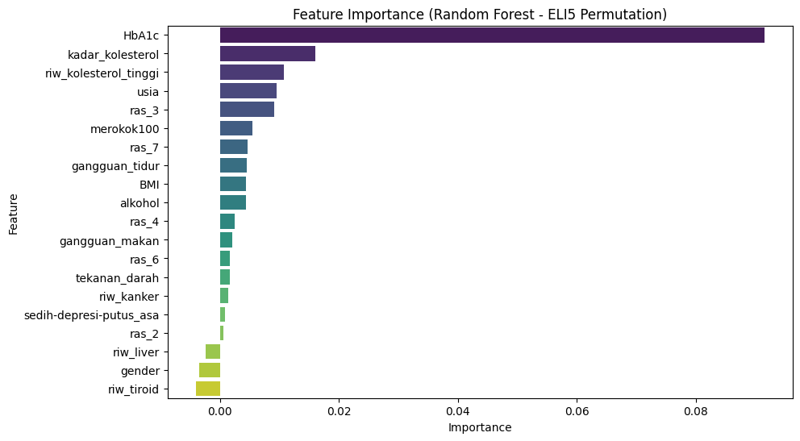
    


### 6.4 Random Forest


```python
# Untuk model XGBoost (pastikan input-nya sudah sesuai)
perm_clf_rf = PermutationImportance(clf_rf, random_state=42).fit(X_test, y_test)
eli5.show_weights(perm_clf_rf, feature_names=X_test.columns.tolist())
```


    <style>
    table.eli5-weights tr:hover {
        filter: brightness(85%);
    }
</style>


        <table class="eli5-weights eli5-feature-importances" style="border-collapse: collapse; border: none; margin-top: 0em; table-layout: auto;">
    <thead>
    <tr style="border: none;">
        <th style="padding: 0 1em 0 0.5em; text-align: right; border: none;">Weight</th>
        <th style="padding: 0 0.5em 0 0.5em; text-align: left; border: none;">Feature</th>
    </tr>
    </thead>
    <tbody>

        <tr style="background-color: hsl(120, 100.00%, 80.00%); border: none;">
            <td style="padding: 0 1em 0 0.5em; text-align: right; border: none;">
                0.1473

                    &plusmn; 0.0148

            </td>
            <td style="padding: 0 0.5em 0 0.5em; text-align: left; border: none;">
                HbA1c
            </td>
        </tr>

        <tr style="background-color: hsl(120, 100.00%, 98.13%); border: none;">
            <td style="padding: 0 1em 0 0.5em; text-align: right; border: none;">
                0.0050

                    &plusmn; 0.0046

            </td>
            <td style="padding: 0 0.5em 0 0.5em; text-align: left; border: none;">
                kadar_kolesterol
            </td>
        </tr>

        <tr style="background-color: hsl(120, 100.00%, 98.48%); border: none;">
            <td style="padding: 0 1em 0 0.5em; text-align: right; border: none;">
                0.0037

                    &plusmn; 0.0043

            </td>
            <td style="padding: 0 0.5em 0 0.5em; text-align: left; border: none;">
                gangguan_tidur
            </td>
        </tr>

        <tr style="background-color: hsl(120, 100.00%, 99.38%); border: none;">
            <td style="padding: 0 1em 0 0.5em; text-align: right; border: none;">
                0.0010

                    &plusmn; 0.0019

            </td>
            <td style="padding: 0 0.5em 0 0.5em; text-align: left; border: none;">
                sedih-depresi-putus_asa
            </td>
        </tr>

        <tr style="background-color: hsl(120, 100.00%, 99.43%); border: none;">
            <td style="padding: 0 1em 0 0.5em; text-align: right; border: none;">
                0.0009

                    &plusmn; 0.0014

            </td>
            <td style="padding: 0 0.5em 0 0.5em; text-align: left; border: none;">
                merokok100
            </td>
        </tr>

        <tr style="background-color: hsl(120, 100.00%, 99.44%); border: none;">
            <td style="padding: 0 1em 0 0.5em; text-align: right; border: none;">
                0.0009

                    &plusmn; 0.0018

            </td>
            <td style="padding: 0 0.5em 0 0.5em; text-align: left; border: none;">
                gender
            </td>
        </tr>

        <tr style="background-color: hsl(120, 100.00%, 99.52%); border: none;">
            <td style="padding: 0 1em 0 0.5em; text-align: right; border: none;">
                0.0007

                    &plusmn; 0.0019

            </td>
            <td style="padding: 0 0.5em 0 0.5em; text-align: left; border: none;">
                ras_4
            </td>
        </tr>

        <tr style="background-color: hsl(120, 100.00%, 99.69%); border: none;">
            <td style="padding: 0 1em 0 0.5em; text-align: right; border: none;">
                0.0004

                    &plusmn; 0.0020

            </td>
            <td style="padding: 0 0.5em 0 0.5em; text-align: left; border: none;">
                riw_tiroid
            </td>
        </tr>

        <tr style="background-color: hsl(120, 100.00%, 99.75%); border: none;">
            <td style="padding: 0 1em 0 0.5em; text-align: right; border: none;">
                0.0003

                    &plusmn; 0.0030

            </td>
            <td style="padding: 0 0.5em 0 0.5em; text-align: left; border: none;">
                riw_kolesterol_tinggi
            </td>
        </tr>

        <tr style="background-color: hsl(120, 100.00%, 99.81%); border: none;">
            <td style="padding: 0 1em 0 0.5em; text-align: right; border: none;">
                0.0002

                    &plusmn; 0.0012

            </td>
            <td style="padding: 0 0.5em 0 0.5em; text-align: left; border: none;">
                ras_6
            </td>
        </tr>

        <tr style="background-color: hsl(120, 100.00%, 99.87%); border: none;">
            <td style="padding: 0 1em 0 0.5em; text-align: right; border: none;">
                0.0001

                    &plusmn; 0.0021

            </td>
            <td style="padding: 0 0.5em 0 0.5em; text-align: left; border: none;">
                riw_kanker
            </td>
        </tr>

        <tr style="background-color: hsl(0, 100.00%, 99.84%); border: none;">
            <td style="padding: 0 1em 0 0.5em; text-align: right; border: none;">
                -0.0001

                    &plusmn; 0.0006

            </td>
            <td style="padding: 0 0.5em 0 0.5em; text-align: left; border: none;">
                ras_2
            </td>
        </tr>

        <tr style="background-color: hsl(0, 100.00%, 99.83%); border: none;">
            <td style="padding: 0 1em 0 0.5em; text-align: right; border: none;">
                -0.0002

                    &plusmn; 0.0015

            </td>
            <td style="padding: 0 0.5em 0 0.5em; text-align: left; border: none;">
                ras_7
            </td>
        </tr>

        <tr style="background-color: hsl(0, 100.00%, 99.83%); border: none;">
            <td style="padding: 0 1em 0 0.5em; text-align: right; border: none;">
                -0.0002

                    &plusmn; 0.0011

            </td>
            <td style="padding: 0 0.5em 0 0.5em; text-align: left; border: none;">
                ras_3
            </td>
        </tr>

        <tr style="background-color: hsl(0, 100.00%, 99.68%); border: none;">
            <td style="padding: 0 1em 0 0.5em; text-align: right; border: none;">
                -0.0004

                    &plusmn; 0.0028

            </td>
            <td style="padding: 0 0.5em 0 0.5em; text-align: left; border: none;">
                tekanan_darah
            </td>
        </tr>

        <tr style="background-color: hsl(0, 100.00%, 99.62%); border: none;">
            <td style="padding: 0 1em 0 0.5em; text-align: right; border: none;">
                -0.0005

                    &plusmn; 0.0017

            </td>
            <td style="padding: 0 0.5em 0 0.5em; text-align: left; border: none;">
                gangguan_makan
            </td>
        </tr>

        <tr style="background-color: hsl(0, 100.00%, 99.33%); border: none;">
            <td style="padding: 0 1em 0 0.5em; text-align: right; border: none;">
                -0.0011

                    &plusmn; 0.0011

            </td>
            <td style="padding: 0 0.5em 0 0.5em; text-align: left; border: none;">
                riw_liver
            </td>
        </tr>

        <tr style="background-color: hsl(0, 100.00%, 99.16%); border: none;">
            <td style="padding: 0 1em 0 0.5em; text-align: right; border: none;">
                -0.0016

                    &plusmn; 0.0044

            </td>
            <td style="padding: 0 0.5em 0 0.5em; text-align: left; border: none;">
                alkohol
            </td>
        </tr>

        <tr style="background-color: hsl(0, 100.00%, 98.58%); border: none;">
            <td style="padding: 0 1em 0 0.5em; text-align: right; border: none;">
                -0.0034

                    &plusmn; 0.0076

            </td>
            <td style="padding: 0 0.5em 0 0.5em; text-align: left; border: none;">
                BMI
            </td>
        </tr>

        <tr style="background-color: hsl(0, 100.00%, 97.81%); border: none;">
            <td style="padding: 0 1em 0 0.5em; text-align: right; border: none;">
                -0.0062

                    &plusmn; 0.0060

            </td>
            <td style="padding: 0 0.5em 0 0.5em; text-align: left; border: none;">
                usia
            </td>
        </tr>


    </tbody>
</table>


```python
clf_rf_importance_values = perm_clf_rf.feature_importances_
feature_names = X_test.columns

clf_rf_importance_df = pd.DataFrame({'Feature': feature_names, 'Importance': clf_rf_importance_values})
clf_rf_importance_df = clf_rf_importance_df.sort_values(by='Importance', ascending=False)

plt.figure(figsize=(10, 6))
sns.barplot(x='Importance', y='Feature', hue='Feature', data=clf_rf_importance_df, palette='viridis')
plt.title('Feature Importance (Random Forest - ELI5 Permutation)')
# plt.tight_layout()
plt.show()
```


    
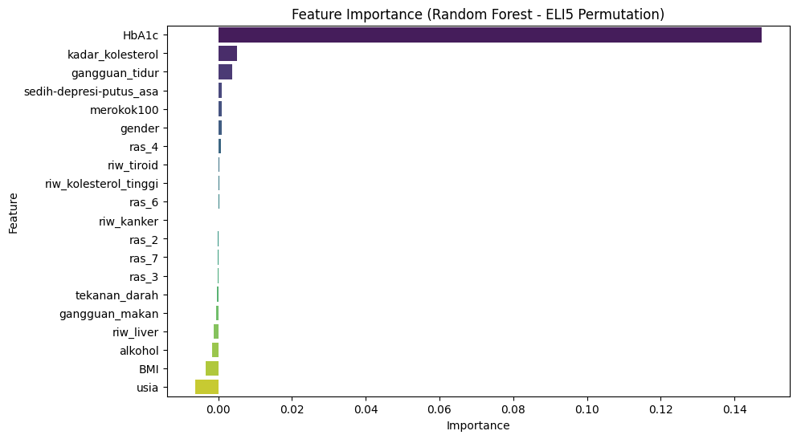
    


```python
import pickle
```


```python
with open('clf_xgb.pkl_OHE_drop_first', 'wb') as file:
    pickle.dump(clf_xgb, file)
```


```python
with open('clf_rf.pkl_OHE_drop_first', 'wb') as file:
    pickle.dump(clf_rf, file)
```


```python

```
